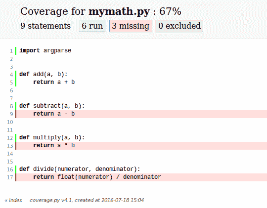

# coverage.py 简介

> 原文：<https://www.blog.pythonlibrary.org/2016/07/20/an-intro-to-coverage-py/>

**Coverage.py** 是 Python 的第三方工具，用于测量你的代码覆盖率。它最初是由内德·巴切尔德创作的。在编程界，术语“覆盖率”通常用于描述测试的有效性，以及测试实际覆盖了多少代码。您可以将 coverage.py 与 Python 2.6 以及 Python 3 的当前版本一起使用。

```py

pip install coverage

```

现在我们已经安装了 coverage.py，我们需要一些代码来使用它。让我们创建一个名为 **mymath.py** 的模块，代码如下:

```py

def add(a, b):
    return a + b

def subtract(a, b):
    return a - b

def multiply(a, b):
    return a * b

def divide(numerator, denominator):
    return float(numerator) / denominator

```

现在我们需要一个测试。让我们创建一个测试 **add** 函数的程序。让我们将我们的测试命名为: **test_mymath.py** 。继续操作，并将其保存在与上一模块相同的位置。然后将以下代码添加到我们的测试中:

```py

# test_mymath.py
import mymath
import unittest

class TestAdd(unittest.TestCase):
    """
    Test the add function from the mymath library
    """

    def test_add_integers(self):
        """
        Test that the addition of two integers returns the correct total
        """
        result = mymath.add(1, 2)
        self.assertEqual(result, 3)

    def test_add_floats(self):
        """
        Test that the addition of two floats returns the correct result
        """
        result = mymath.add(10.5, 2)
        self.assertEqual(result, 12.5)

    def test_add_strings(self):
        """
        Test the addition of two strings returns the two string as one
        concatenated string
        """
        result = mymath.add('abc', 'def')
        self.assertEqual(result, 'abcdef')

if __name__ == '__main__':
    unittest.main()

```

现在我们有了所有的片段，我们可以使用测试运行 coverage.py。打开一个终端，导航到包含 **mymath** 模块和我们编写的测试代码的文件夹。现在我们可以像这样调用 coverage.py:

```py

coverage run test_mymath.py

```

注意，我们需要调用 **run** 来获取 coverage.py 以运行该模块。如果您的模块接受参数，您可以像平常一样传递这些参数。当您这样做时，您将看到测试的输出，就像您自己运行它一样。你还会在目录中找到一个名为**的新文件。覆盖范围**(注意开头的句号)。要从该文件中获取信息，您需要运行以下命令:

```py

coverage report -m

```

执行此命令将产生以下输出:

```py

Name             Stmts   Miss  Cover   Missing
----------------------------------------------
mymath.py            9      3    67%   9, 13, 17
test_mymath.py      14      0   100%
----------------------------------------------
TOTAL     

```

**-m** 标志告诉 coverage.py 您希望它在输出中包含**缺失的**列。如果您省略了 **-m** ，那么您将只得到前四列。您在这里看到的是覆盖率运行了测试代码，并确定我的单元测试只覆盖了 67%的 mymath 模块。“缺失”栏告诉我哪些代码行仍然需要覆盖。如果您查看 coverage.py 指出的行，您会很快发现我的测试代码没有测试**减法**、**乘法**或**除法**函数。

在我们尝试添加更多的测试覆盖之前，让我们学习如何让 coverage.py 生成一个 HTML 报告。为此，您只需运行以下命令:

```py

coverage html

```

该命令将创建一个名为 **htmlcov** 的文件夹，其中包含各种文件。导航到那个文件夹，试着在你选择的浏览器中打开 index.html**。在我的机器上，它加载了这样一个页面:**

 **

你实际上可以点击列出的模块来加载一个带注释的网页，向你显示哪些代码部分没有被覆盖。因为 mymath.py 模块显然没有被很好地覆盖，所以让我们单击它。您最终应该会看到如下所示的内容:



这个截图清楚地显示了我们最初的单元测试中没有覆盖的代码部分。现在我们已经明确知道了我们的测试覆盖中缺少什么，让我们为我们的 **subtract** 函数添加一个单元测试，看看这是如何改变事情的！

打开您的 **test_mymath.py** 副本，并向其中添加以下类:

```py

class TestSubtract(unittest.TestCase):
    """
    Test the subtract function from the mymath library
    """

    def test_subtract_integers(self):
        """
        Test that subtracting integers returns the correct result
        """
        result = mymath.subtract(10, 8)
        self.assertEqual(result, 2)

```

现在我们需要根据更新的测试重新运行覆盖率。你需要做的就是重新运行这个命令:**覆盖率运行 test_mymath.py** 。输出将显示四个测试已经成功通过。现在重新运行**覆盖率 html** 并重新打开“index.html”文件。您现在应该看到我们的覆盖率达到了 78%:


这是 11%的进步！让我们继续为乘法和除法函数添加一个简单的测试，看看我们是否能达到 100%的覆盖率！

```py

class TestMultiply(unittest.TestCase):
    """
    Test the multiply function from the mymath library
    """

    def test_subtract_integers(self):
        """
        Test that multiplying integers returns the correct result
        """
        result = mymath.multiply(5, 50)
        self.assertEqual(result, 250)

class TestDivide(unittest.TestCase):
    """
    Test the divide function from the mymath library
    """

    def test_divide_by_zero(self):
        """
        Test that multiplying integers returns the correct result
        """
        with self.assertRaises(ZeroDivisionError):
            result = mymath.divide(8, 0)

```

现在，您可以像以前一样重新运行相同的命令，并重新加载“index.html”文件。当您这样做时，应该会看到如下所示的内容:


正如你所看到的，我们已经达到了完整的测试覆盖率！当然，在这种情况下，完全覆盖意味着每个功能都由我们的测试套件来执行。这样做的问题是，我们对加法函数的测试次数是其他函数的三倍，但是 coverage.py 没有给我们任何这方面的数据。然而，它会给我们一个基本覆盖的好主意，即使它不能告诉我们，我们是否已经测试了每一个可能的论点排列。

* * *

### 附加说明

我只是想提一下 coverage.py 的其他一些特性，而不想涉及太多细节。首先，coverage.py 支持配置文件。配置文件格式是你的经典”。ini”文件，文件的各个部分用方括号括起来(即[my_section])。您可以使用以下#或；将注释添加到配置文件中。(分号)。

Coverage.py 还允许您通过我们前面提到的配置文件来指定您希望它分析哪些源文件。一旦您按照您想要的方式设置了配置，那么您就可以运行 coverage.py 了。最后，您可以使用“- include”和“- omit”开关来包含或排除文件名模式列表。这些开关具有匹配的配置值，您也可以将其添加到您的配置文件中。

最后要提的一点是，coverage.py 支持插件。可以自己写或者下载安装别人的插件来增强覆盖率. py。

* * *

### 包扎

现在您已经了解了 coverage.py 的基础知识以及这个特殊包的用途。py 允许您检查您的测试，并在您的测试覆盖中找到漏洞。如果你不确定你的代码已经被正确测试了，这个包将帮助你确定漏洞在哪里，如果它们存在的话。当然，你仍然有责任写出好的测试。如果您的测试是无效的，但是它们还是通过了，那么 coverage.py 不会帮助您。**