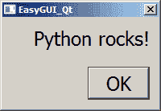
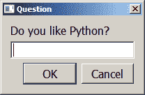
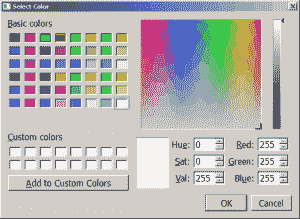
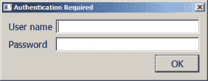
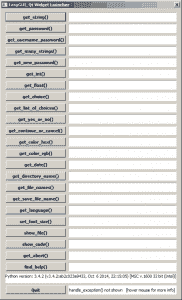

# EasyGUI_Qt 简介

> 原文：<https://www.blog.pythonlibrary.org/2015/02/18/an-intro-to-easygui_qt/>

最近偶然发现一个有趣的小项目，叫做 [EasyGUI_Qt](http://easygui-qt.readthedocs.org/en/latest/) 。除了使用 PyQt4 而不是 Tkinter 之外，它基本上和 EasyGUI 是一样的。这两个包背后的想法是允许开发者使用对话框向用户提出简单的问题。

在本文中，我们将通过几个例子花一些时间来学习如何使用这个包。注意，虽然 EasyGUI_Qt 的主要目标是 Python 3，但它可以与 Python 2 和 3 一起工作。[文档](http://easygui-qt.readthedocs.org/en/latest/readme.html)指出 Python 2 中的 unicode 可能存在一些问题，但除此之外，小部件应该工作正常。

* * *

### 入门指南

您需要确保您已经安装了一份 [PyQt4](http://www.riverbankcomputing.com/software/pyqt/download) 的副本，然后才能安装使用该模块。安装好之后，您可以使用 pip(或 easy_install)来安装 EasyGUI_Qt:

```py

pip install easygui_qt

```

现在你已经安装了，我们可以学习如何实际做一些事情！

* * *

### 创建消息框

[](https://www.blog.pythonlibrary.org/wp-content/uploads/2015/02/easy_qt_msg.png)

创建一个简单的消息框来告诉用户一些事情是非常容易的。让我们告诉他们一些关于 Python 的事情:

```py

import easygui_qt as easy
easy.set_font_size(18)
easy.show_message(message="Python rocks!", title="EasyGUI_Qt")

```

这里我们导入 **easygui_qt** ，设置字体为 18 磅并显示我们的消息。请注意，字体大小的更改将影响对话框中的文本和按钮上的文本。

* * *

### 获取字符串

[](https://www.blog.pythonlibrary.org/wp-content/uploads/2015/02/easy_qt_get_string.png)

问用户一个问题也很容易。让我们来看看:

```py

>>> import easygui_qt as easy
>>> answer = easy.get_string("Do you like Python?", title="Question")
>>> answer
'Yes!'

```

那也很简单。让我们看看如何从用户那里获得一种颜色。

* * *

### 获得颜色

[](https://www.blog.pythonlibrary.org/wp-content/uploads/2015/02/easy_qt_color.png)

EasyGUI_Qt 实际上提供了两种获取颜色的方法。您可以获得十六进制值或 rgb 值。这两种情况下的对话框看起来是一样的。它是这样工作的:

```py

>>> import easygui_qt as easy
>>> easy.get_color_hex()
'#ffffff'

```

如果你想得到 rgb 值，那么你可以调用 **get_color_rgb** 来代替。

* * *

### 获取用户名/密码

[](https://www.blog.pythonlibrary.org/wp-content/uploads/2015/02/easy_qt_user_pass.png)

这可能是从用户那里获得身份验证信息的最好方式之一。EasyGUI_Qt 允许我们显示一个对话框来获取用户的用户名和密码。代码如下:

```py

>>> import easygui_qt as easy
>>> easy.get_username_password(title="Authentication Required")
OrderedDict([('User name', ''), ('Password', '')])

```

请注意，它返回一个 OrderedDict。我们最后要看的是如何运行 EasyGUI_Qt 的演示。

* * *

### 运行 EasyGUI_Qt 演示

[](https://www.blog.pythonlibrary.org/wp-content/uploads/2015/02/easy_qt_demo.png)

我们将从运行主演示开始，它允许你看到你能向用户显示的所有对话框以及它们返回的内容。让我们来看看:

```py

>>> from easygui_qt.demos import launcher
>>> launcher.main()

```

EasyGUI_Qt 还提供了一点猜谜游戏演示。下面是运行它的方法:

```py

>>> from easygui_qt.demos.guessing_game import guessing_game
>>> guessing_game()

```

这将显示一系列对话框，演示包的一些对话框。有点意思，但是很短。

* * *

### 包扎

至此，您应该能够使用 EasyGUI_Qt 了。这个包对于控制台程序很有用，在这种程序中，您希望使用 GUI 而不仅仅是控制台提示符从用户那里获得信息。如果您想编写一个成熟的 GUI，那么您应该看看 PyQt 本身或 wxPython。

* * *

### 相关阅读

*   [EasyGUI_Qt 进展顺利](http://aroberge.blogspot.com/2014/12/easyguiqt-progressing-well.html)
*   EasyGUI_Qt [文件](http://easygui-qt.readthedocs.org/en/latest/index.html)
*   快速简易 Gui [教程](https://www.blog.pythonlibrary.org/2010/05/22/a-quick-easygui-tutorial/)