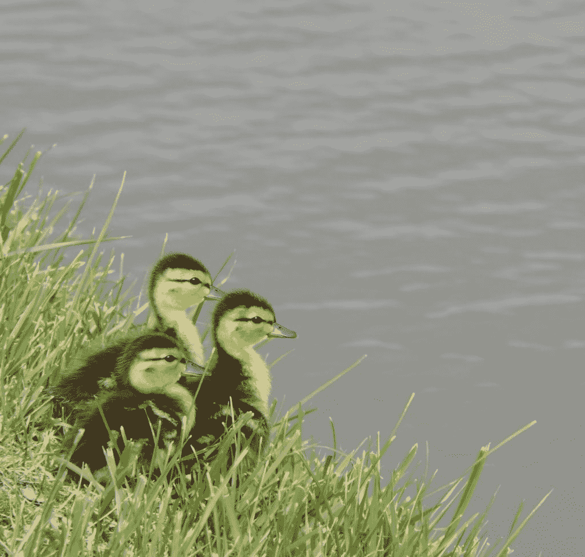
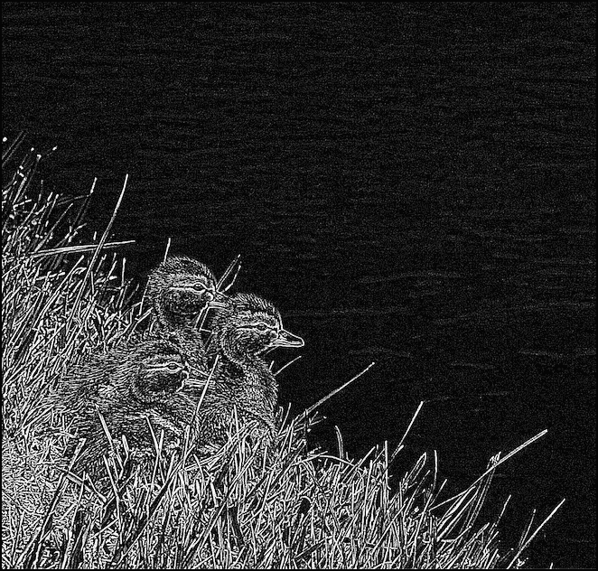
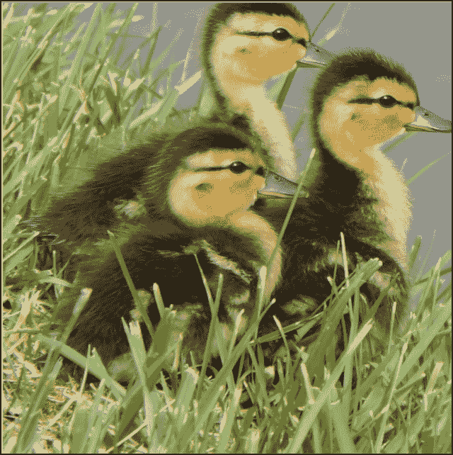

# Wand / ImageMagick 和 Python 图像处理简介

> 原文：<https://www.blog.pythonlibrary.org/2021/07/06/an-intro-to-image-processing-with-wand-imagemagick-and-python/>

ImageMagick 是一个开源工具，你可以用它来创建、编辑、合成或转换数字图像。它支持 200 多种图像格式。根据其网站，ImageMagick 可以调整大小，翻转，镜像，旋转，扭曲，剪切和变换图像，调整图像颜色，应用各种特殊效果，或绘制文本，线条，多边形，椭圆和贝塞尔曲线。

更多关于 ImageMagick 的信息，你应该去他们的[网站](https://imagemagick.org/index.php)。

**Wand** 是 ImageMagick 周围的 [Python 包装器。Wand 和 Pillow 有很多相似的功能，是最接近枕头的替代品。魔杖很容易与 pip 一起安装:](https://docs.wand-py.org)

```py
python3 -m pip install wand
```

你还必须安装 ImageMagick。根据您使用的操作系统，您可能还需要设置一个环境变量。如果您在安装或配置 Wand 时有任何问题，请参见 Wand 的[文档](https://docs.wand-py.org)。

Wand 可以完成许多不同的图像处理任务。在接下来的几节中，您将看到它的能力。您将从了解 Wand 的图像效果开始！

### 用魔杖应用图像效果

Wand 内置了几种不同的图像效果。以下是完整列表:

*   虚化
*   去除斑点
*   边缘
*   装饰
*   Kuwahara
*   阴影
*   尖锐
*   传播

这些影响有些存在于枕头中，有些不存在。例如，枕头没有斑点或 Kuwahara。

为了了解如何使用这些效果，您将使用这张小鸭子照片:



你将尝试 Wand 的`edge()`方法。创建一个新的 Python 文件，将其命名为`wand_edger.py`。然后输入以下代码:

```py
# wand_edger.py

from wand.image import Image

def edge(input_image_path, output_path):
    with Image(filename=input_image_path) as img:
        img.transform_colorspace("gray")
        img.edge(radius=3)
        img.save(filename=output_path)

if __name__ == "__main__":
    edge("ducklings.jpg", "edged.jpg")
```

这里的第一个新条目是 import: `from wand.image import Image`。`Image`类是你在 Wand 中处理照片的主要方法。接下来，创建一个`edge()`函数，打开小鸭子的照片。然后你把图像改成灰度。然后应用`edge()`，它接受一个`radius`参数。半径是一个类似光圈的设置。

当您运行此代码时，输出将如下所示:



您应该为`radius`尝试不同的值。它改变了结果。

现在我们来看看 Wand 提供的特效。

### 特殊效果

Wand 支持很多其他的特效，他们称之为“特效”。以下是当前支持的列表:

*   添加噪声
*   蓝移
*   木炭
*   彩色矩阵
*   使…变成彩色
*   效果
*   内向坍塌
*   偏振片
*   棕褐色调
*   素描
*   使…过度曝光
*   多边形
*   漩涡
*   色彩
*   小插图
*   波浪
*   小波去噪

其中一些很有趣。文档中有所有这些例子的前后照片。

您将尝试使用作者的照片在本节中使用**插图**:


迈克尔·德里斯科尔

创建一个名为`wand_vignette.py`的新文件，并将以下代码添加到其中:

```py
# wand_vignette.py

from wand.image import Image

def vignette(input_image_path, output_path):
    with Image(filename=input_image_path) as img:
        img.vignette(x=10, y=10)
        img.save(filename=output_path)

if __name__ == "__main__":
    vignette("author.jpg", "vignette.jpg")
```

在这个例子中，你调用`vignette()`。它需要几个不同的参数，但是你只需要提供`x`和`y`。这些参数控制要添加晕影的图像周围的边缘数量。

当您运行此代码时，您将获得以下输出:


看起来不错。这是一种有趣的方式，让你的照片看起来独特而优雅。用你的一些照片试试吧！

现在你已经准备好学习如何用魔杖修剪了。

## 用魔杖裁剪

用魔杖进行作物种植类似于枕头作物。可以传入四个坐标(左、上、右、下)或者(左、上、宽、高)。你将使用小鸭子的照片，并找出如何裁剪照片下来，只有鸟。

创建一个新文件，命名为`wand_crop.py`。然后添加以下代码:

```py
# wand_crop.py

from wand.image import Image

def crop(input_image_path, output_path, left, top, width, height):
    with Image(filename=input_image_path) as img:
        img.crop(left, top, width=width, height=height)
        img.save(filename=output_path)

if __name__ == "__main__":
    crop("ducklings.jpg", "cropped.jpg", 100, 800, 800, 800)
```

对于这个例子，您提供了`left`、`top`、`width`和`height`。当您运行此代码时，照片将被裁剪成如下所示:



您可以尝试不同的值，看看它如何影响作物。

Wand 能做的远不止这一节所展示的。它可以做和枕头一样的事情，甚至更多。Pillow 相对于 Wand 的主要优势是 Pillow 是用 Python 编写的，不像 Wand 那样需要外部二进制文件(即 ImageMagick)。

## 包扎

魔杖包相当厉害。它能做大多数和 T2 枕头包一样事情，也能做一些它不能做的事情。当然，Pillow 还有 Wand 没有的功能。你一定要看看这两个包，看看哪个更适合你正在做的事情。

这两个包都是用 Python 编辑和操作图像的好方法。给 Wand 一个尝试，并使用它的许多其他效果，看看它是多么强大！