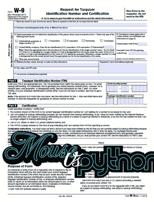

# PyPDF2 简介

> 原文：<https://www.blog.pythonlibrary.org/2018/06/07/an-intro-to-pypdf2/>

PyPDF2 包是一个纯 Python 的 PDF 库，你可以用它来分割、合并、裁剪和转换你的 PDF 文件中的页面。根据 PyPDF2 网站，你也可以使用 PyPDF2 添加数据，查看选项和密码。最后，您可以使用 PyPDF2 从 PDF 中提取文本和元数据。

PyPDF2 实际上是 Mathiew Fenniak 编写并于 2005 年发布的原始 PyPDF 的派生版本。然而，最初的 pyPdf 的最后一次发布是在 2014 年。一家名为 Phaseit，Inc .的公司与 Mathieu 进行了对话，并最终赞助 PyPDF2 作为 PyPDF 的一个分支

在撰写本书时，PyPDF2 包自 2016 年以来一直没有发布。然而，它仍然是一个可靠而有用的包，值得你花时间去学习。

下面列出了我们将在本文中学到的内容:

*   提取元数据
*   拆分文档
*   将 2 个 PDF 文件合并为 1 个
*   旋转页面
*   覆盖/水印页面
*   加密/解密

让我们从学习如何安装 PyPDF2 开始！

* * *

### 装置

PyPDF2 是一个纯 Python 包，所以您可以使用 pip 安装它(假设 pip 在您的系统路径中):

```py

python -m pip install pypdf2

```

通常，您应该将第三方 Python 包安装到 Python 虚拟环境中，以确保它按照您想要的方式工作。

* * *

### 从 pdf 中提取元数据

您可以使用 PyPDF2 从任何 PDF 中提取大量有用的数据。例如，您可以了解文档的作者、标题和主题以及有多少页。让我们从 [Leanpub](https://leanpub.com/reportlab) 下载这本书的样本来找出答案。我下载的样本名为“reportlab-sample.pdf”。我将把这个 PDF 文件包含在 Github 源代码中，供您使用。

代码如下:

```py

# get_doc_info.py

from PyPDF2 import PdfFileReader

def get_info(path):
    with open(path, 'rb') as f:
        pdf = PdfFileReader(f)
        info = pdf.getDocumentInfo()
        number_of_pages = pdf.getNumPages()

    print(info)

    author = info.author
    creator = info.creator
    producer = info.producer
    subject = info.subject
    title = info.title

if __name__ == '__main__':
    path = 'reportlab-sample.pdf'
    get_info(path)

```

这里我们从 **PyPDF2** 导入 **PdfFileReader** 类。这个类让我们能够使用各种访问器方法读取 PDF 并从中提取数据。我们做的第一件事是创建我们自己的 **get_info** 函数，它接受 PDF 文件路径作为唯一的参数。然后，我们以只读二进制模式打开文件。接下来，我们将该文件处理程序传递给 PdfFileReader，并创建它的一个实例。

现在我们可以通过使用 **getDocumentInfo** 方法从 PDF 中提取一些信息。这将返回一个**pypdf 2 . pdf . document information**的实例，它具有以下有用的属性:

*   作者
*   创造者
*   生产者
*   科目
*   标题

如果打印出 DocumentInformation 对象，您将看到以下内容:

```py

{'/Author': 'Michael Driscoll',
 '/CreationDate': "D:20180331023901-00'00'",
 '/Creator': 'LaTeX with hyperref package',
 '/Producer': 'XeTeX 0.99998',
 '/Title': 'ReportLab - PDF Processing with Python'}

```

我们还可以通过调用 **getNumPages** 方法来获得 PDF 中的页数。

* * *

### 从 pdf 中提取文本

PyPDF2 对从 PDF 中提取文本的支持有限。不幸的是，它没有提取图像的内置支持。我在 StackOverflow 上看到过一些使用 PyPDF2 提取图像的菜谱，但是代码示例似乎很随意。

让我们尝试从上一节下载的 PDF 的第一页中提取文本:

```py

# extracting_text.py

from PyPDF2 import PdfFileReader

def text_extractor(path):
    with open(path, 'rb') as f:
        pdf = PdfFileReader(f)

        # get the first page
        page = pdf.getPage(1)
        print(page)
        print('Page type: {}'.format(str(type(page))))

        text = page.extractText()
        print(text)

if __name__ == '__main__':
    path = 'reportlab-sample.pdf'
    text_extractor(path)

```

您会注意到，这段代码的开始方式与我们之前的示例非常相似。我们仍然需要创建一个 **PdfFileReader** 的实例。但是这一次，我们使用 **getPage** 方法抓取页面。PyPDF2 是从零开始的，很像 Python 中的大多数东西，所以当你给它传递一个 1 时，它实际上抓取了第二页。在这种情况下，第一页只是一个图像，所以它不会有任何文本。

有趣的是，如果你运行这个例子，你会发现它没有返回任何文本。相反，我得到的是一系列换行符。不幸的是，PyPDF2 对提取文本的支持非常有限。即使它能够提取文本，它也可能不会按照您期望的顺序排列，并且间距也可能不同。

要让这个示例代码工作，您需要尝试在不同的 PDF 上运行它。我在美国国税局的网站上找到了一个:[https://www.irs.gov/pub/irs-pdf/fw9.pdf](https://www.irs.gov/pub/irs-pdf/fw9.pdf)

这是为个体经营者或合同工准备的 W9 表格。它也可以用在其他场合。无论如何，我下载了它作为**w9.pdf**。如果您使用 PDF 文件而不是示例文件，它会很高兴地从第 2 页中提取一些文本。我不会在这里复制输出，因为它有点长。

* * *

### 分割 pdf

PyPDF2 包让您能够将一个 PDF 分割成多个 PDF。你只需要告诉它你想要多少页。在这个例子中，我们将打开上一个例子中的 W9 PDF，并遍历它的所有六个页面。我们将分裂出每一页，把它变成自己的独立的 PDF 文件。

让我们来看看如何实现:

```py

# pdf_splitter.py

import os
from PyPDF2 import PdfFileReader, PdfFileWriter

def pdf_splitter(path):
    fname = os.path.splitext(os.path.basename(path))[0]

    pdf = PdfFileReader(path)
    for page in range(pdf.getNumPages()):
        pdf_writer = PdfFileWriter()
        pdf_writer.addPage(pdf.getPage(page))

        output_filename = '{}_page_{}.pdf'.format(
            fname, page+1)

        with open(output_filename, 'wb') as out:
            pdf_writer.write(out)

        print('Created: {}'.format(output_filename))

if __name__ == '__main__':
    path = 'w9.pdf'
    pdf_splitter(path)

```

对于这个例子，我们需要导入 **PdfFileReader** 和**pdffilerwriter**。然后我们创建一个有趣的小函数，叫做 **pdf_splitter** 。它接受输入 PDF 的路径。这个函数的第一行将获取输入文件的名称，减去扩展名。接下来，我们打开 PDF 并创建一个 reader 对象。然后我们使用 reader 对象的 **getNumPages** 方法遍历所有页面。

在循环的**内部，我们创建了一个 **PdfFileWriter** 的实例。然后，我们使用其 **addPage** 方法向 writer 对象添加一个页面。这个方法接受一个 page 对象，所以为了获取 page 对象，我们调用 reader 对象的 **getPage** 方法。现在我们已经向 writer 对象添加了一个页面。下一步是创建一个唯一的文件名，我们使用原始文件名加上单词“page”加上页码+ 1。我们添加 1 是因为 PyPDF2 的页码是从零开始的，所以第 0 页实际上是第 1 页。**

最后，我们以写入二进制模式打开新文件名，并使用 PDF writer 对象的 **write** 方法将对象的内容写入磁盘。

* * *

### 将多个 pdf 合并在一起

现在我们有了一堆 pdf 文件，让我们学习如何把它们合并在一起。这样做的一个有用的用例是企业将他们的日报合并成一个 PDF。为了工作和娱乐，我需要合并 pdf。我脑海中浮现的一个项目是扫描文档。根据您使用的扫描仪，您可能最终会将一个文档扫描成多个 pdf，因此能够将它们再次合并在一起会非常棒。

当最初的 PyPdf 问世时，让它将多个 Pdf 合并在一起的唯一方法是这样的:

```py

# pdf_merger.py

import glob
from PyPDF2 import PdfFileWriter, PdfFileReader

def merger(output_path, input_paths):
    pdf_writer = PdfFileWriter()

    for path in input_paths:
        pdf_reader = PdfFileReader(path)
        for page in range(pdf_reader.getNumPages()):
            pdf_writer.addPage(pdf_reader.getPage(page))

    with open(output_path, 'wb') as fh:
        pdf_writer.write(fh)

if __name__ == '__main__':
    paths = glob.glob('w9_*.pdf')
    paths.sort()
    merger('pdf_merger.pdf', paths)

```

这里我们创建了一个 **PdfFileWriter** 对象和几个 **PdfFileReader** 对象。对于每个 PDF 路径，我们创建一个 **PdfFileReader** 对象，然后遍历它的页面，将每个页面添加到我们的 writer 对象中。然后，我们将 writer 对象的内容写到磁盘上。

PyPDF2 通过创建一个 **PdfFileMerger** 类使这变得简单了一点:

```py

# pdf_merger2.py

import glob
from PyPDF2 import PdfFileMerger

def merger(output_path, input_paths):
    pdf_merger = PdfFileMerger()
    file_handles = []

    for path in input_paths:
        pdf_merger.append(path)

    with open(output_path, 'wb') as fileobj:
        pdf_merger.write(fileobj)

if __name__ == '__main__':
    paths = glob.glob('fw9_*.pdf')
    paths.sort()
    merger('pdf_merger2.pdf', paths)

```

这里我们只需要创建 **PdfFileMerger** 对象，然后遍历 PDF 路径，将它们添加到我们的合并对象中。PyPDF2 将自动追加整个文档，因此您不需要自己遍历每个文档的所有页面。然后我们把它写到磁盘上。

**PdfFileMerger** 类也有一个可以使用的**合并**方法。它的代码定义如下:

```py

def merge(self, position, fileobj, bookmark=None, pages=None, 
          import_bookmarks=True):
        """
        Merges the pages from the given file into the output file at the
        specified page number.

        :param int position: The *page number* to insert this file. File will
            be inserted after the given number.

        :param fileobj: A File Object or an object that supports the standard 
            read and seek methods similar to a File Object. Could also be a
            string representing a path to a PDF file.

        :param str bookmark: Optionally, you may specify a bookmark to be 
            applied at the beginning of the included file by supplying the 
            text of the bookmark.

        :param pages: can be a :ref:`Page Range ` or a 
        ``(start, stop[, step])`` tuple
            to merge only the specified range of pages from the source
            document into the output document.

        :param bool import_bookmarks: You may prevent the source 
        document's bookmarks from being imported by specifying this as 
        ``False``.
        """ 
```

基本上，merge 方法允许您通过页码告诉 PyPDF 将页面合并到哪里。因此，如果您已经创建了一个包含 3 页的合并对象，您可以告诉合并对象在特定位置合并下一个文档。这允许开发者做一些非常复杂的合并操作。试试看，看看你能做什么！

* * *

### 旋转页面

PyPDF2 让您能够旋转页面。但是，您必须以 90 度的增量旋转。您可以顺时针或逆时针旋转 PDF 页面。这里有一个简单的例子:

```py

# pdf_rotator.py

from PyPDF2 import PdfFileWriter, PdfFileReader

def rotator(path):
    pdf_writer = PdfFileWriter()
    pdf_reader = PdfFileReader(path)

    page1 = pdf_reader.getPage(0).rotateClockwise(90)
    pdf_writer.addPage(page1)
    page2 = pdf_reader.getPage(1).rotateCounterClockwise(90)
    pdf_writer.addPage(page2)
    pdf_writer.addPage(pdf_reader.getPage(2))

    with open('pdf_rotator.pdf', 'wb') as fh:
        pdf_writer.write(fh)

if __name__ == '__main__':
    rotator('reportlab-sample.pdf')

```

这里，我们像以前一样创建 PDF 阅读器和编写器对象。然后我们得到传入的 PDF 的第一页和第二页。然后我们将第一页顺时针或向右旋转 90 度。然后我们将第二页逆时针旋转 90 度。最后，我们将第三页以正常方向添加到 writer 对象中，并写出新的 3 页 PDF 文件。

如果您打开 PDF，您会发现前两页现在以彼此相反的方向旋转，第三页以正常方向旋转。

* * *

### 覆盖/水印页面

PyPDF2 还支持将 PDF 页面合并在一起，或者将页面相互叠加。如果您想要为 PDF 中的页面添加水印，这将非常有用。例如，我使用的一个电子书分销商会在我的书的 PDF 版本上“水印”购买者的电子邮件地址。我见过的另一个用例是在页面边缘添加打印机控制标记，以告知打印机某个文档何时到达其结尾。

对于这个例子，我们将采用我在博客中使用的一个徽标“鼠标与 Python”，并将其覆盖在前面的 W9 表单之上:

```py

# watermarker.py

from PyPDF2 import PdfFileWriter, PdfFileReader

def watermark(input_pdf, output_pdf, watermark_pdf):
    watermark = PdfFileReader(watermark_pdf)
    watermark_page = watermark.getPage(0)

    pdf = PdfFileReader(input_pdf)
    pdf_writer = PdfFileWriter()

    for page in range(pdf.getNumPages()):
        pdf_page = pdf.getPage(page)
        pdf_page.mergePage(watermark_page)
        pdf_writer.addPage(pdf_page)

    with open(output_pdf, 'wb') as fh:
        pdf_writer.write(fh)

if __name__ == '__main__':
    watermark(input_pdf='w9.pdf', 
              output_pdf='watermarked_w9.pdf',
              watermark_pdf='watermark.pdf')

```

我们在这里做的第一件事是从 PDF 中提取水印页面。然后，我们打开要应用水印的 PDF。我们使用一个 **for** 循环来遍历它的每个页面，并调用页面对象的 **mergePage** 方法来应用水印。接下来，我们将水印页面添加到 PDF writer 对象中。一旦循环结束，我们就把新的水印版本写到磁盘上。

这是第一页的样子:

[](https://www.blog.pythonlibrary.org/wp-content/uploads/2018/06/watermark.png)

这很简单。

* * *

### PDF 加密

PyPDF2 包还支持向现有 PDF 添加密码和加密。你可能还记得第 10 章，pdf 支持用户密码和所有者密码。用户密码仅允许用户打开和阅读 PDF，但可能会对 PDF 应用一些限制，例如，可能会阻止用户打印。据我所知，您实际上不能使用 PyPDF2 应用任何限制，或者它只是没有被很好地记录。

以下是如何使用 PyPDF2 向 PDF 添加密码:

```py

# pdf_encryption.py

from PyPDF2 import PdfFileWriter, PdfFileReader

def encrypt(input_pdf, output_pdf, password):
    pdf_writer = PdfFileWriter()
    pdf_reader = PdfFileReader(input_pdf)

    for page in range(pdf_reader.getNumPages()):
        pdf_writer.addPage(pdf_reader.getPage(page))

    pdf_writer.encrypt(user_pwd=password, owner_pwd=None, 
                       use_128bit=True)
    with open(output_pdf, 'wb') as fh:
        pdf_writer.write(fh)

if __name__ == '__main__':
    encrypt(input_pdf='reportlab-sample.pdf',
            output_pdf='encrypted.pdf',
            password='blowfish')

```

我们在这里所做的只是创建了一组 PDF 阅读器，编写对象并用阅读器阅读所有页面。然后，我们将这些页面添加到指定的 writer 对象中，并添加了指定的密码。如果只设置用户密码，则所有者密码会自动设置为用户密码。无论何时添加密码，默认情况下都会应用 128 位加密。如果您将该参数设置为 False，则 PDF 将以 40 位加密进行加密。

* * *

### 包扎

在本文中，我们涵盖了许多有用的信息。您学习了如何从 pdf 中提取元数据和文本。我们发现了如何分割和合并 pdf。您还学习了如何在 PDF 中旋转页面和应用水印。最后，我们发现 PyPDF2 可以为我们的 PDF 添加加密和密码。

* * *

### 相关阅读

*   PyPDF2 [文档](https://pythonhosted.org/PyPDF2/)
*   PyPDF2 [Github page](https://github.com/mstamy2/PyPDF2)
*   自动化枯燥的东西- [第 13 章:使用 PDF 和 Word 文档](https://automatetheboringstuff.com/chapter13/)