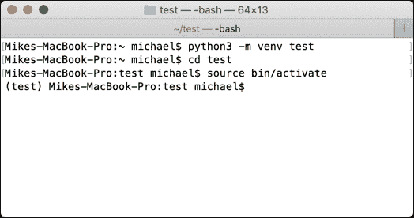

# Python 虚拟环境简介

> 原文：<https://www.blog.pythonlibrary.org/2021/01/27/an-intro-to-python-virtual-environments/>

Python 语言内置了虚拟环境的概念。Python 虚拟环境是一个可以安装第三方包进行测试而不影响系统 Python 安装的环境。每个虚拟环境都有自己的一组安装包，并且根据虚拟环境及其设置方式，可能还有自己的 Python 二进制和标准库副本。

有几种不同的方法来创建 Python 虚拟环境。您将关注以下两种方法:

*   内置`venv`模块
*   `virtualenv`套餐

您还可以使用其他工具来创建虚拟 Python 环境。在本章的最后一节，你会学到一些关于它们的知识。

现在，让我们从查看`venv`库开始吧！

#### Python 的`venv`库

Python 在 3.3 版本中增加了`venv`模块。你可以在这里阅读所有相关内容:

*   [https://docs.python.org/3/library/venv.html](https://docs.python.org/3/library/venv.html)

要使用`venv`，您可以使用`-m`标志运行 Python。`-m`标志告诉 Python 运行跟在`-m`后面的指定模块。

让我们试一试。在 Windows 上打开一个**cmd.exe**或者在 Mac 或 Linux 上打开一个终端。然后键入以下内容:

```py
python -m venv test 
```

这将在终端会话中打开的任何目录下创建一个名为 **test** 的文件夹。

要激活虚拟环境，您需要将目录切换到 **test** 文件夹，并在 Linux/Mac 上运行:

```py
source bin/activate 
```

如果你是 Windows 用户，你可以通过运行**脚本**子文件夹中的 bat 文件来激活它，你可以在你的**测试**文件夹中找到这个子文件夹。

现在，您应该会看到类似这样的内容:



请注意，提示的名称现在是“test”。这表明虚拟环境已经被激活，可以使用了。

您现在可以安装新的包，它们将安装到您的虚拟环境中，而不是您的系统 Python 中。

完成后，您可以通过在终端或命令提示符下运行 **deactivate** 来停用虚拟环境。`deactivate`的确切性质是依赖于实现的:它可能是一个脚本或批处理文件或其他东西。

PyCharm、WingIDE 和 VS 代码都支持使用 Python 虚拟环境。事实上，您通常可以在 IDE 中创建和激活它们，而不是在命令行中。

#### `virtualenv`套餐

`virtualenv`包是创建 Python 虚拟环境的原始方法。你可以在这里阅读`virtualenv`包的文档:

*   [https://virtualenv . pypa . io/en/latest/](https://virtualenv.pypa.io/en/latest/)

`virtualenv`的一个子集最终被集成到 Python 自己的`venv`模块中。实际的`virtualenv`包在以下几个方面比`venv`好:

*   这样更快
*   更易于扩展
*   可以为多个 Python 版本创建虚拟环境
*   可以通过`pip`升级
*   拥有丰富的编程 API

您可以使用`pip`安装`virtualenv`:

```py
pip install virtualenv 
```

安装后，您可以使用您的终端或**cmd.exe**创建一个虚拟环境，如下所示:

```py
virtualenv FOLDER_NAME 
```

激活和停用虚拟环境的工作方式与您使用 Python 的`venv`模块创建虚拟环境时完全一样。

有相当多的命令行参数可以和`virtualenv`一起使用。你可以在这里阅读完整的列表:

[https://virtualenv.pypa.io/en/latest/cli_interface.html](https://virtualenv.pypa.io/en/latest/cli_interface.html)

大多数情况下，您可以使用默认值。但是有时候配置您的虚拟环境来使用其他的`pip`版本，或者让它访问您系统的 site-packages 文件夹也是不错的。点击上面的链接，看看你能用`virtualenv`做些什么。

#### 其他工具

您还可以使用其他工具来处理 Python 虚拟环境。以下是几个例子:

*   蟒蛇-[https://www.anaconda.com/](https://www.anaconda.com/)
*   https://pypi.org/project/pipx/
*   pipenv-https://github . com/pypa/pipenv

Anaconda 有自己的创建虚拟环境的工具。

另外两个是用于创建和管理虚拟环境的流行包。`pipx`和`pipenv`都挺受欢迎的。您应该仔细阅读它们，并确定它们是否对您自己的项目有用。

#### 总结

Python 虚拟环境是隔离您的系统 Python 的好方法，同时允许您测试新的包。您可以通过使用多个虚拟环境来测试一个包的多个版本。完成后，您只需删除虚拟环境的文件夹。

这允许快速迭代以验证您的包装堆中没有任何东西导致破损。标准的实践是，每当您测试一个新的包时，总是使用虚拟 Python 环境。

去试一试吧。你很快就会发现这已经成为你的第二天性，而且超级有用！