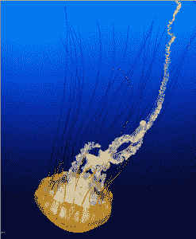
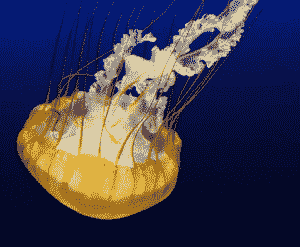
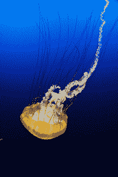

# Python 图像库/ Pillow 简介

> 原文：<https://www.blog.pythonlibrary.org/2016/10/07/an-intro-to-the-python-imaging-library-pillow/>

Python 图像库或 PIL 允许您用 Python 进行图像处理。最初的作者 Fredrik Lundh 在我刚开始学习 Python 时写了我最喜欢的 Python 博客之一。然而，PIL 最后一次发布是在 2009 年，博客也停止更新。幸运的是，有其他一些 Python 爱好者来了，他们分叉了 PIL，并把他们的项目叫做 Pillow。Pillow 项目是 PIL 的替代项目，它也支持 Python 3，这是 PIL 从来没有做过的事情。

请注意，您不能同时安装 PIL 和枕头。在他们的[文档](http://pillow.readthedocs.io/en/3.4.x/installation.html)中有一些警告，列出了 PIL 和 Pillow 之间的一些差异，这些差异会不时更新，所以我只是将您引导到那里，而不是在这里重复它们，因为它们可能会过时。

* * *

### 安装枕头

您可以使用 pip 或 easy_install 安装 Pillow。下面是一个使用画中画的例子:

```py

pip install Pillow

```

注意，如果您在 Linux 或 Mac 上，您可能需要使用 sudo 运行该命令。

* * *

### 打开图像



Pillow 使打开和显示图像文件变得很容易。让我们来看看:

```py

from PIL import Image

image = Image.open('/path/to/photos/jelly.jpg')
image.show()

```

在这里，我们只是导入图像模块，并要求它打开我们的文件。如果您去阅读源代码，您会看到在 Unix 上， **open** 方法将图像保存到一个临时的 PPM 文件中，并用 xv 实用程序打开它。例如，在我的 Linux 机器上，它用 ImageMagick 打开了它。在 Windows 上，它会将图像保存为一个临时 BMP，并在类似画图的东西中打开它。

* * *

### 获取图像信息

使用 Pillow，您也可以获得关于图像的大量信息。让我们看几个小例子，看看我们能从中提取什么:

```py

>>> from PIL import Image
>>> image = Image.open('/path/to/photos/jelly.jpg')
>>> r, g, b = image.split()
>>> histogram = image.histogram()
[384761, 489777, 557209, 405004, 220701, 154786, 55807, 35806, 21901, 16242]
>>> exif = image._getexif()
exif
{256: 1935,
 257: 3411,
 271: u'Panasonic',
 272: u'DMC-LX7',
 274: 1,
 282: (180, 1),
 283: (180, 1),
 296: 2,
 305: u'PaintShop Pro 14.00\x00\x00\x00\x00\x00\x00\x00\x00\x00\x00\x00\x00\x00\x00\x00\x00\x00\x00\x00\x00',
 306: u'2016:08:21 07:54:57',
 36867: u'2016:08:21 07:54:57',
 36868: u'2016:08:21 07:54:57',
 37121: '\x01\x02\x03\x00',
 37122: (4, 1),
 37381: (124, 128),
 37383: 5,
 37384: 0,
 37385: 16,
 37386: (47, 10),
 40960: '0100',
 40961: 1,
 40962: 3968,
 40963: 2232,
 41495: 2,
 41728: '\x03',
 41729: '\x01',
 41985: 0,
 41986: 0,
 41987: 0,
 41988: (0, 10),
 41989: 24,
 41990: 0,
 41991: 0,
 41992: 0,
 41993: 0,
 41994: 0}

```

在这个例子中，我们展示了如何从图像中提取 RGB(红、绿、蓝)值。我们还学习了如何从图像中获取历史程序。请注意，由于直方图的输出要大得多，我对输出进行了一点截断。您可以使用另一个 Python 包(如 matplotlib)来绘制历史程序。最后，上面的例子演示了如何从图像中提取 EXIF 信息。同样，我稍微缩短了这个方法的输出，因为它包含的信息对于本文来说太多了。

* * *

### 裁剪图像

您也可以用 Pillow 裁剪图像。这实际上很容易，尽管你可能需要一点尝试和错误才能弄明白。让我们尝试裁剪我们的水母照片:

```py

>>> from PIL import Image
>>> image = Image.open('/path/to/photos/jelly.jpg')
>>> cropped = image.crop((0, 80, 200, 400))
>>> cropped.save('/path/to/photos/cropped_jelly.png')

```

你会注意到我们需要做的就是打开图像，然后调用它的 **crop** 方法。您还需要传入想要裁剪的 x/y 坐标，即(x1，y1，x2，y2)。在 Pillow 中，0 像素是左上角的像素。随着 x 值的增加，它会向右移动。随着 y 值的增加，图像向下移动。当您运行上面的代码时，您将得到下图:


那是一种相当无聊的作物。我想把水母的“头”剪掉。为了快速获得正确的坐标，我使用 Gimp 来帮助我确定下一次裁剪使用什么坐标。

```py

>>> from PIL import Image
>>> image = Image.open('/path/to/photos/jelly.jpg')
>>> cropped = image.crop((177, 882, 1179, 1707))
>>> cropped.save('/path/to/photos/cropped_jelly2.png')

```

如果我们运行这段代码，我们将得到如下裁剪后的版本:



那就好多了！

* * *

### 使用过滤器


原始水母

在 Pillow 中，您可以使用各种滤镜来应用到您的图像。它们包含在**图像过滤器**模块中。让我们来看看其中的几个:

```py

>>> from PIL import ImageFilter
>>> from PIL import Image
>>> image = Image.open('/path/to/photos/jelly.jpg')
>>> blurred_jelly = image.filter(ImageFilter.BLUR)
>>> blurred_jelly.save('/path/to/photos/blurry_jelly.png')

```

这将使水母照片稍微模糊。这是我得到的结果:


模糊的水母

当然，大多数人喜欢他们的图像更清晰而不是更模糊。枕头支持你。以下是锐化图像的一种方法:

```py

>>> from PIL import ImageFilter
>>> from PIL import Image
>>> image = Image.open('/path/to/photos/jelly.jpg')
>>> blurred_jelly = image.filter(ImageFilter.SHARPEN)
>>> blurred_jelly.save('/path/to/photos/sharper_jelly.png')

```

当您运行这段代码时，您将得到以下结果:



更锋利的水母

您还可以使用 ImageEnhance 模块来锐化照片等。

还有其他过滤器，你可以应用，如细节，边缘增强，浮雕，平滑等。您也可以用这样的方式编写代码，将多个滤镜应用于您的图像。

您可能需要下载上面的图像，以便真正能够比较过滤器的差异。

* * *

### 包扎

除了这篇短文中介绍的内容之外，您还可以使用枕头套装做更多的事情。Pillow 支持图像转换、处理带、图像增强、打印图像的能力等等。我强烈推荐阅读枕头文档，以便很好地掌握你能做的一切。

* * *

### 相关阅读

*   蟒蛇枕[官网](https://python-pillow.org/)
*   枕头[文档](http://pillow.readthedocs.io/en/3.4.x/index.html)
*   [维基百科](https://en.wikipedia.org/wiki/Python_Imaging_Library)关于 Python 图像库的文章
*   pypi:「t0」箭「T1」