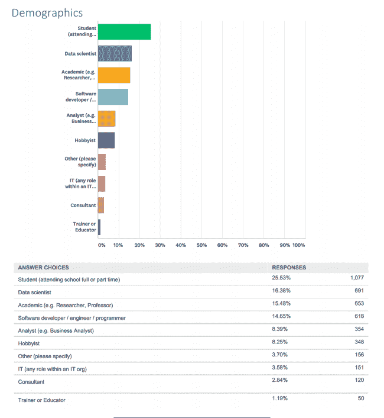

# Anaconda 数据科学调查结果

> 原文：<https://www.blog.pythonlibrary.org/2018/06/13/anaconda-data-science-survey-results/>

Anaconda 今天宣布了他们第一次“数据科学状态”调查的结果。在 4，218 份回复中，26%来自学生，16%来自数据科学家，15%来自学者，15%来自软件开发人员。

根据 Anaconda，关键要点如下:

*   99%的受访者将 Anaconda 用于 Python
*   Docker 和 Kubernetes 正在击败 Hadoop / Spark。
*   谷歌云数据服务击败了亚马逊网络服务和微软的 Azure
*   Matplotlib 仍然是可视化的顶级包。然而，“Plotly、Tableau、微软 Power BI 和 Tibco Spotfire 都是 Matplotlib 和其他开源项目(如 ggplot、Bokeh、D3 和 Altair)的强大商业竞争对手。”
*   14%的受访者使用 Anaconda 进行机器学习
*   Anaconda 是免费的这一事实被列为其最重要的属性，而它拥有开源许可的事实则是倒数第二。

最后一点有点困扰我，但是我想学生们不理解开源的重要性。不管怎样，这是一个关于 Python 发行版的顶级替代版本的非常有趣的调查。你可以在这里阅读完整的[公告。](https://www.anaconda.com/blog/developer-blog/anaconda-2018-state-of-data-science-report-released/)