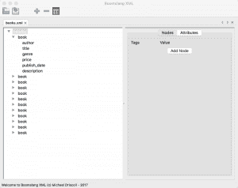

# 安:树蛇 XML

> 原文：<https://www.blog.pythonlibrary.org/2017/06/12/ann-boomslang-xml/>

最近，我决定开始使用 Python 编写一些有趣的桌面应用程序示例。我一直使用 wxPython 来创建跨平台的应用程序。我的第一个叫做 [Boomslang XML](https://github.com/driscollis/boomslang) ，是一个基本的 XML 编辑器。

Boomslang 这个名字来自一种巨大的毒蛇。它的名字基本上是“树蛇”的意思，我认为这很恰当，因为用户界面使用一个树部件来表示 XML 文档的结构。

Boomslang 的当前功能包括:

*   打开/编辑多个 XML 文件
*   编辑 XML 时自动保存
*   最近文件支持
*   一些键盘快捷键(加速器)
*   添加新的 XML 节点或属性
*   编辑节点和属性
*   删除节点

目前这是相当测试，但我想其他人可能会觉得有趣。我知道它目前有几个问题，比如不能删除属性或者不能添加包含空格的 XML 节点，但是我会尽快解决这些问题。与此同时，你可以随时在 Github 上查看这个项目。

注意:这个项目已经在 Python 2 和 3、wxPython 2.9、3.0 和 4.0 上使用 lxml 包在 Windows 7、Xubuntu 16.04 和 Mac OSX Sierra 上进行了测试。