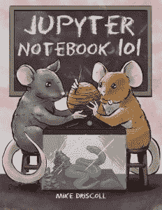

# 安:朱庇特笔记本 101 Kickstarter

> 原文：<https://www.blog.pythonlibrary.org/2018/07/16/ann-jupyter-notebook-101-kickstarter/>

我很高兴地宣布我最新的 [Kickstarter](https://www.kickstarter.com/projects/34257246/jupyter-notebook-101) 是筹集资金在 Jupyter 笔记本上创作一本书！

Jupyter Notebook 101 将教你有效创建和使用笔记本所需的所有知识。您可以使用 Jupyter Notebook 来帮助您学习编码、创建演示文稿、制作精美的文档等等！

Jupyter 笔记本也被科学界用来以一种易于复制的方式展示研究。

你将在 **Jupyter 笔记本 101** 中学到以下内容:

*   如何创建和编辑笔记本
*   如何添加样式、图像、图表等
*   如何配置笔记本
*   如何将您的笔记本导出为其他格式
*   笔记本扩展
*   使用笔记本进行演示
*   还有更多！

### 出厂日期

我计划在 2018 年 11 月**日**发行这本书

可以在 [Kickstarter](https://www.kickstarter.com/projects/34257246/jupyter-notebook-101) 上了解更多！