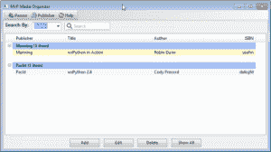

# 安:Media locker——一个 wxPython 应用程序来跟踪你的媒体

> 原文：<https://www.blog.pythonlibrary.org/2011/12/09/ann-medialocker-%e2%80%93-a-wxpython-app-to-track-your-media/>

背景
= = = = = = = = = = = = = = = = =

这是我参与的真实项目的第一次发布。上个月我写了一篇文章，这篇文章启发了 Werner Bruhin，他想把它变成一个演示程序，让 wxPython 的新程序员了解如何在与数据库交互的同时进行 MVC 和 CRUD。于是，MediaLocker 诞生了。我们希望你喜欢它。

描述
= = = = = = = = = = = = = = = = =

一个 wxPython 数据库应用程序，可以帮助您跟踪您的媒体。目前，它只跟踪你的图书图书馆。您可以在以下两篇文章中了解有关该项目的更多信息:

*   [改进 MediaLocker: wxPython、SQLAlchemy 和 MVC](https://www.blog.pythonlibrary.org/2011/11/30/improving-medialocker-wxpython-sqlalchemy-and-mvc/)
*   [wxPython 和 SQLAlchemy:MVC 和 CRUD 简介](https://www.blog.pythonlibrary.org/2011/11/10/wxpython-and-sqlalchemy-an-intro-to-mvc-and-crud/)

需求
= = = = = = = = = = = = = = = = =

-Python 2.6+
-wxPython 2 . 8 . 11+带新的 pubsub(此处下载)或 wxPython 2 . 9 . 3
-[SQLAlchemy](http://www.sqlalchemy.org)0 . 7 . 3+
-[object listview](http://pypi.python.org/pypi/ObjectListView)1.2

配置
= = = = = = = = = = = = = = = = =

下载完源代码后，在尝试运行“mediaLocker.py”之前，运行主文件夹中的“python setup_lib.py develop”。如果您使用的是 wxPython 2.8，请下载 pubsub 路径(如上)，并将其解压缩到“C:\ python 27 \ Lib \ site-packages \ wx-2 . 9 . 2-MSW \ wx \ Lib”(或安装 wxPython 的任何位置)。

来源
= = = = = = = = = = = = = = = = =

可以从 Github 下载源码:[https://github.com/driscollis/MediaLocker
](https://github.com/driscollis/MediaLocker)

你也可以在这里下载当前文件的快照(上传于 2011.12.09 @ 1138 hrs CST):

*   [介质阻挡子. zip](https://www.blog.pythonlibrary.org/wp-content/uploads/2011/12/medialocker.zip)
*   [介质阻挡器。取](https://www.blog.pythonlibrary.org/wp-content/uploads/2011/12/medialocker.tar)
*   或者直接从 Github 上的提示下载

你能如何帮助
================

下载软件，在 Github 上报告 bug。我们也很乐意接受功能请求，尤其是如果它们包含补丁或代码。

*注意:这仅在 Windows XP 和 7 上测试过*