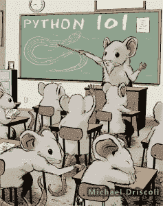

# 安:Python 101 -那本书！

> 原文：<https://www.blog.pythonlibrary.org/2014/02/19/ann-python-101-the-book/>

几年来，我的读者一直要求我写一本书，现在我终于决定硬着头皮试一试。对于我的第一本书，我决定为初学者和中级程序员写一些东西。这本书将有四个部分，第一部分直接面向初学程序员。接下来的 3 个部分将遵循更像烹饪书的风格，因为它们将包含大量的教程。我会把我博客上的一些文章放进书里，如果合适的话会更新它们，但是会有很多新的内容。

为了让事情继续下去，我正在 Kickstarter 上运行一个活动。筹集一些资金来帮助这本书的发展。如果你觉得这个博客有用，请考虑资助我的书。

为了您的方便，我在这里复制了 Kickstarter 活动的大部分文本:

### 第一部分

第一部分是初学者部分。在这里你将学到 Python 的所有基础知识。从 Python 类型(字符串、列表、字典)到条件语句再到循环。你还将学习理解、函数和类以及它们之间的一切！**注:** *本节已完成，正处于编辑阶段。*

### 第二部分

这一部分将是 Python 标准库的一次策划之旅。其目的并不是涵盖其中的所有内容，而是向读者展示开箱即用的 Python 可以做很多事情。我们将讨论我认为在日常编程任务中最有用的模块，比如 os、sys、日志、线程等等。

### 第三部分

现在事情变得非常有趣！在第三部分，我们将学习如何从 Python 包索引和其他位置安装第三方库(即包)。我们将介绍简易安装和 pip。这一节也将是一系列的教程，在这里你将学习如何使用你下载的软件包。例如，您将学习如何下载文件、解析 XML、使用对象关系映射器处理数据库等。

### 第四部分

这本书的最后一部分将介绍如何与你的朋友和全世界分享你的代码！您将了解如何将其打包并在 Python 包索引上共享(例如，如何创建一个鸡蛋或轮子)。您还将学习如何使用 py2exe、bb_freeze、cx_freeze 和 PyInstaller 创建可执行文件。最后，您将学习如何使用 Inno Setup 创建安装程序。

### 写作风格

这本书将使用我最初的博客风格来写。这意味着章节会比你通常的编程教科书要短。大多数章节将很可能少于 10 页！这里的想法是让读者快速了解这个主题，而不是用它来打击他们。谁应该读这本书？

这本书是给初学者看的，但我相信有中级技能的人也会觉得它的内容很有价值。

### 这些钱是干什么用的？

我需要为这本书的每个版本购买一个 ISBN，所以如果我有不同的电子书格式，钱就开始增加了。我有一个志愿编辑，我想支付。我还打算雇一个插图画家给这本书添加一些插图。我期待着与我的支持者合作，尽可能做出最好的 Python 书籍！