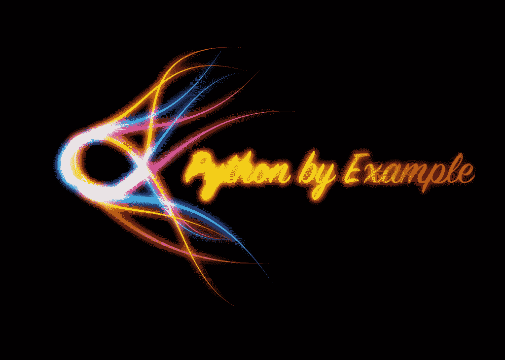

# 安:我的课程中的 Python 实例

> 原文：<https://www.blog.pythonlibrary.org/2016/07/12/ann-the-python-by-example-udemy-course/>

我很高兴地宣布我的第一个关于 Python 编程语言的 Udemy 课程。它被称为 **Python 的例子**，是我的 [Python 101 Screencast](https://gum.co/kaKNo) 系列的重新命名。我原本希望在 Udemy 上保留 Python 101 这个名字，但是当我在 Udemy 上开始我的课程时，已经有人取了这个名字。不管怎样，这门课程是用 Python 101 截屏的前 35 个视频制作的。我计划在今年晚些时候添加其余的。

### 你有什么

写作时，你会收到 35 节课或 6.5 小时的内容。我还包括了 Python 101 中与每个讲座相对应的章节。

### 如何购买

购买 Python 的例子，只需进入以下链接:[https://www.udemy.com/python-by-example/?couponCode=py25](https://www.udemy.com/python-by-example/?couponCode=py25)。优惠券代码会给你 25%的折扣。