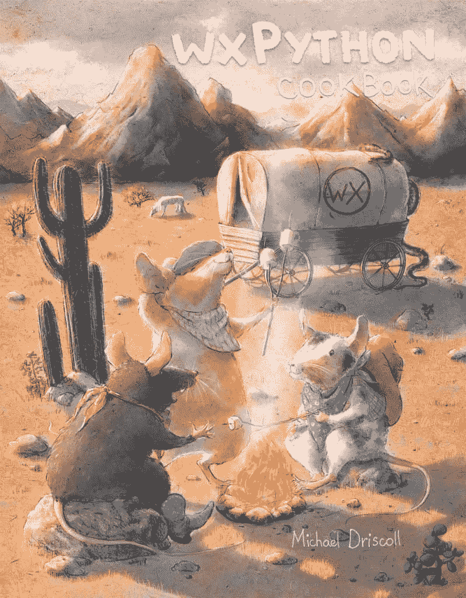

# wxPython 烹饪书 Kickstarter

> 原文：<https://www.blog.pythonlibrary.org/2016/08/22/ann-the-wxpython-cookbook-kickstarter/>

几年前，这个博客的读者要求我把我的一些文章变成一本关于 wxPython 的食谱。我终于决定这么做了。我收录了 50 多个食谱，我目前正在编辑它们以使它们更加一致，并更新它们以兼容 wxPython 的最新版本。我目前有将近 300 页的内容！

为了资助这本书的最初制作，我正在为这个项目做一个有趣的小活动。筹集的资金将用于该活动中提供的独特津贴以及与该书相关的各种制作成本，如 ISBN 采购、插图、软件费用、广告等。

如果您不知道 wxPython 是什么，那么, [wxPython](https://wxpython.org/) 包是一个用于创建跨平台桌面用户界面的流行工具包。它可以在 Windows、Mac 和 Linux 上运行，几乎不需要修改你的代码。

我书中的例子将同时适用于 **wxPython 3.0.2 Classic** 和 **wxPython Phoenix，**，后者是支持 **Python 3** 的 wxPython 的前沿技术。如果我发现任何不适合凤凰城的食谱，它们会被清楚地标记出来，或者会有一个可行的替代例子。

以下是当前食谱的列表，排名不分先后:

*   动态添加/移除小部件
*   如何在面板上放置背景图像
*   将多个小部件绑定到同一个处理程序
*   从任何地方捕捉异常
*   wxPython 的上下文管理器
*   转换 wx。日期时间到 Python 日期时间
*   创建“关于”框
*   如何创建登录对话框
*   如何创建“黑暗模式”
*   从配置文件生成对话框
*   如何禁用向导的“下一步”按钮
*   如何使用拖放
*   如何将文件从应用程序拖放到操作系统
*   如何使用 reload()交互式编辑您的 GUI
*   如何在标题栏中嵌入图像
*   从 RichTextCtrl 中提取 XML
*   如何淡入一个框架/对话框
*   如何触发多个事件处理程序
*   使您的框架最大化或全屏
*   使用 wx。框架样式
*   获取事件名称而不是整数
*   如何从 Sizer 中获取子部件
*   如何使用剪贴板
*   捕捉按键和字符事件
*   了解 wxPython 中焦点的工作方式
*   让您的文本闪烁
*   最小化到系统托盘
*   使用 ObjectListView 而不是 ListCtrl
*   让面板自毁
*   如何在面板之间切换
*   wxPython:使用 PyDispatcher 而不是 Pubsub
*   使用 PyPlot 创建图表
*   将 Python 的日志模块重定向到 TextCtrl
*   重定向标准输出/标准错误
*   重置背景颜色
*   将数据保存到配置文件
*   如何截图并打印你的 wxPython 应用程序
*   创建一个简单的笔记本
*   确保每帧只有一个实例
*   在组合框或列表框小工具中存储对象
*   同步两个网格之间的滚动
*   创建任务栏图标
*   一个 wx。定时器教程
*   如何从线程更新进度条
*   用 Esky 更新应用程序
*   创建 URL 缩写
*   在 wxPython 中使用线程
*   如何在 XRC 创建网格
*   XRC 简介

**注:配方名称和顺序可能会改变**

