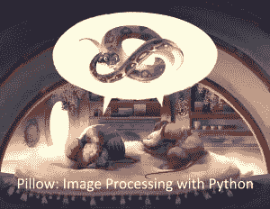

# 宣布:使用 Python Kickstarter 进行图像处理

> 原文：<https://www.blog.pythonlibrary.org/2021/01/04/announcing-image-processing-with-python-kickstarter/>

我很高兴地宣布我的最新图书项目， **Pillow:用 Python 进行图像处理**。这本书将教你如何使用[枕头](https://pillow.readthedocs.io/en/stable/)、 **Python 影像库(PIL)** 的“友好”叉子。你可以在 Kickstarter 上提前购买这本书，还可以在那里获得额外的优惠，比如 t 恤、签名的平装本，以及我其他一些书的打折本。

**Pillow:使用 Python 进行图像处理**将涵盖以下主题:

*   访问图像元数据
*   使用图像颜色
*   使用 Python 打开/查看图像
*   将滤镜应用于图像
*   裁剪、旋转和调整照片大小
*   使用 Python 增强照片
*   组合图像
*   还有更多！

本书重点介绍[枕包](https://pillow.readthedocs.io/en/stable/)。您在这里不会学到图像识别，因为那是其他 Python 包的领域，如 OpenCV 或 Scikit-image。相反，您将学习如何使用 Pillow 通过小代码示例进行许多不同类型的图像操作。这些可以用来批量处理您的图像。

您还将学习如何使用 Python 创建小型的跨平台 GUI，让您可以在图像上实时试用 Pillow。

现在查看 Kickstarter 来支持这本书。将于 2021 年 4 月在各大平台发布，不过现在就可以提前获取啦！