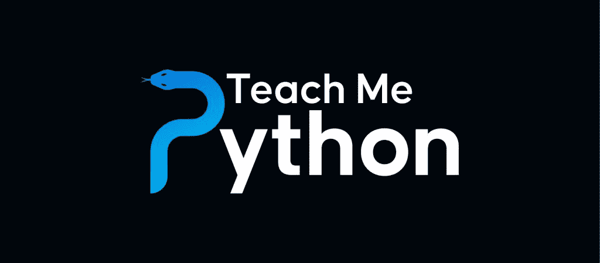

# 宣布:教我 Python

> 原文：<https://www.blog.pythonlibrary.org/2022/09/12/announcing-teach-me-python/>

[教我 Python](https://www.teachmepython.com/) 是一个关于 Python 编程语言的全新网站。“教我 Python”是一项基于订阅的服务，它将使用课程、电子书、教程和视频来教你 Python。教程和课程将包括**现场代码**的例子，如果可能的话，你可以在你的浏览器中运行。

课程会跟踪你的进度，这样你就可以知道你在学习过程中走了多远。

## 你有什么

购买“教我 Python”订阅后，您将收到以下内容:

*   访问所有迈克·德里斯科尔自助出版的电子书
*   访问 Mike Driscoll 的所有视频课程
*   访问专门用于教授我 Python 的额外 Python 课程
*   订阅期间出版的任何新 Python 书籍
*   提前获得新的 Python 教程，这些教程可能会也可能不会出现在 Mouse vs Python 上

当您终止订阅时，您将能够保留您订阅时可用的任何电子书和视频课程。但是,“教我 Python”独家课程仅面向订户。

## 未来课程

[教我 Python](https://www.teachmepython.com/) 根据迈克·德里斯科尔的畅销书 [Python 101 -第二版](https://leanpub.com/py101)推出了两个初学者课程。本月晚些时候或 2022 年 10 月初将增加第三个中级课程。

Python 测验课程也将在 10 月或 11 月初发布，然后用新测验更新，直到完成。最终也会有配套的书出售。

其他额外的中级课程正在规划阶段。

## 订阅类型

[教我 Python](https://www.teachmepython.com/subscriptions/) 有三种订阅类型:

*   每月 10 美元
*   每年 99 美元
*   终身-250 美元(一次性付款)

## 查看网站

通过观看此视频，您可以了解该网站提供了哪些服务:

[https://www.youtube.com/embed/lUR-fZR67-A?feature=oembed](https://www.youtube.com/embed/lUR-fZR67-A?feature=oembed)

今天就开始学习 Python 编程语言吧！