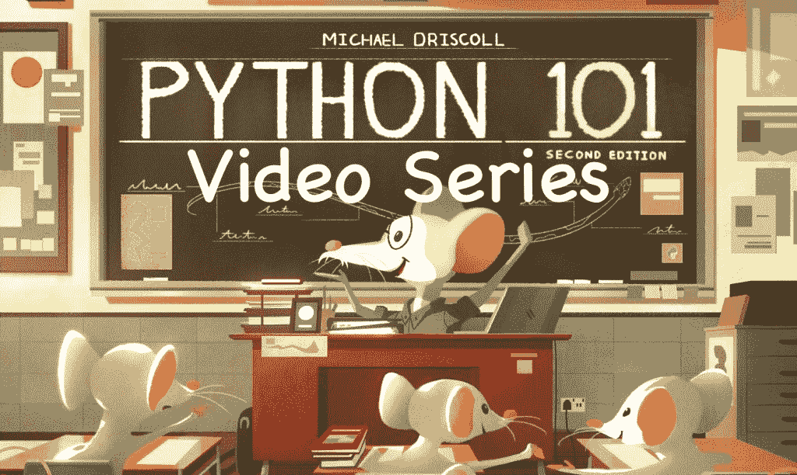

# 宣布:Python 101 视频课程

> 原文：<https://www.blog.pythonlibrary.org/2022/05/03/announcing-the-python-101-video-course/>

我很高兴地宣布，我正在创建一个 Python 101 视频课程，它基于 [Python 101:第二版](https://leanpub.com/py101)。

这门课程最终将包括涵盖书中章节的视频。它将与运行 **168 分钟以上的 **13 个视频**一起发布！**

以下链接将给您 10 美元的折扣！

### [立即购买](https://driscollis.gumroad.com/l/pyvideo101/tenoff)

## 你有什么

*   13 个视频(还有更多)
*   同伴 Jupyter 笔记本文件
*   Python 101:第二版(PDF，epub，mobi)

### [立即购买](https://driscollis.gumroad.com/l/pyvideo101/tenoff)