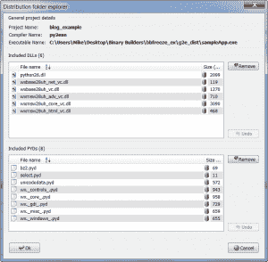

# 另一个 GUI2Exe 教程——构建二进制系列！

> 原文：<https://www.blog.pythonlibrary.org/2010/08/31/another-gui2exe-tutorial-build-a-binary-series/>

这是我的“构建二进制系列”的最后一篇文章。如果你还没有这样做，一定要看看其他的。最后，我们来看看 Andrea Gavana 的基于 wxPython 的 GUI2Exe，这是一个很好的 py2exe、bbfreeze、cx_Freeze、PyInstaller 和 py2app 的图形用户界面。GUI2Exe 的最新版本是 0.5.0，虽然源代码可能稍新。也可以从顶端自由运行。我们将使用前几篇文章中使用的示例脚本:一个控制台和一个 GUI 脚本，这两个脚本都没做什么。

## GUI2Exe 入门

很久以前，我写了另一篇关于这个很酷的工具的文章。然而，应用程序的外观已经发生了很大的变化，所以我觉得我应该在本系列的背景下重新编写那篇文章。要继续阅读这篇文章，你需要点击 [Google Code](http://code.google.com/p/gui2exe/) 来查找出处。我们开始吧，好吗？以下是通过 GUI2Exe 使用 py2exe 制作控制台脚本的一些分步指导:

1.  下载源代码并在一个方便的位置解压缩
2.  运行“GUI2Exe.py”文件(您可以使用您最喜欢的编辑器，通过命令行或其他方式打开它)
3.  转到文件，新建项目。将出现一个对话框，要求您命名项目。给它起个好名字！然后点击确定。
4.  单击“Exe 种类”列，将其更改为“控制台”
5.  点击“Python 主脚本”栏，你会看到一个按钮出现。
6.  按下按钮，使用文件对话框找到您的主脚本
7.  随意填写其他可选字段
8.  点击右下角的编译按钮
9.  试试结果，看看有没有效果！

如果您按照上面的说明做了，现在您应该在主脚本位置的“dist”文件夹中有一个可执行文件(和一些依赖项)。正如您在上面的截图中看到的，在 setup.py 文件中有您可以设置的所有典型选项。您可以设置您的排除列表，包括，优化和压缩设置，是否包括一个 zip，包和更多！当你准备好看到结果时，你可以调整你的心的内容并点击“编译”按钮。如果我在做实验，我通常会更改输出目录的名称，这样我就可以比较结果，看看哪个是最紧凑的。

如果你想使用 bbfreeze、cx_freeze、PyInstaller 或 py2app，只需点击右边栏中各自的名称。这将导致屏幕的中间部分根据您的选择而改变，并显示所述选择的相应选项。让我们来一个快速的视觉游览！

## 图片中的 GUI2Exe！

以下是 py2app 选项的快照:

接下来是 cx_Freeze 选项的一个镜头:

下面是 PyInstaller 的设置:

最后，我们有 bbfreeze 的选项:

还有一个 VendorId 屏幕，但我不太了解那个，所以我们将跳过它。

## GUI2Exe 的菜单选项

正如您可能猜到的那样，所有这些选项的工作方式都与您自己用代码完成时一样。如果你需要检查 GUI2Exe 为你制作的 setup.py 文件，只需进入 **Builds** 菜单并选择 **View Setup Script** 。如果您想查看它输出的文件列表以及输出文件的位置，请转到 Build，Explorer，您应该会看到类似下面的截图:

构建菜单中的其他便利选项包括任务模块和二进制依赖菜单项。这些向你展示了在分发你的杰作时，你可能需要包括的 dist 文件夹中可能缺少的东西。

**Options** 菜单控制 GUI2Exe 本身的选项和构建过程的一些自定义项目，如设置 Python 版本、删除构建和/或 dist 文件夹、设置 PyInstaller 路径等等。其他菜单非常简单明了，我把它们留给喜欢冒险的读者。

## 包扎

如果您已经阅读了我在“构建二进制系列”中的其他教程，那么您应该能够掌握这些知识，并将其有效地用于 GUI2Exe。当我构建可执行文件时，我发现 GUI2Exe 非常有用，我用它来帮助我找出本系列中其他二进制构建器的选项。我希望您喜欢这个系列，并发现它很有帮助。下次见！

## 进一步阅读

*   GUI2Exe 官方[网站](http://code.google.com/p/gui2exe/)
*   安德里亚·加瓦娜的[网站](http://xoomer.virgilio.it/infinity77/)和[博客](http://thedoomedcity.blogspot.com/)
*   [建立二元数列](https://www.blog.pythonlibrary.org/tag/binaries/)
*   另 [GUI2Exe](https://www.blog.pythonlibrary.org/2008/08/27/packaging-wxpymail-for-distribution/) 教程