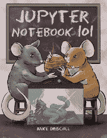

# 2018 年黑色星期五/网络星期一特卖

> 原文：<https://www.blog.pythonlibrary.org/2018/11/21/black-friday-cyber-monday-sale-2018/>

本周，我将从今天开始发售我最近的两本自助出版的书，时间是从 11 月 26 日**到 11 月 26 日**。

使用 Python 处理 ReportLab - PDF 的价格为 9.99 美元:

*   [Leanpub](http://leanpub.com/reportlab/c/black18)
*   [Gumroad](https://gumroad.com/l/reportlab) -使用优惠代码 **black18**

JupyterLab 101 售价 9.99 美元:

*   [Leanpub](http://leanpub.com/jupyternotebook101/c/black18)
*   [Gumroad](https://gum.co/jupyter101) -使用优惠代码 **black18**

你也可以用下面的优惠券代码，在限定时间内以 7 美元的价格从 Apress 获得我的书[wxPython Recipes](https://t.co/3T6igFzOSB):**cyber week 18**。

[Python 访谈](https://www.packtpub.com/web-development/python-interviews)现在也是 10 美元！