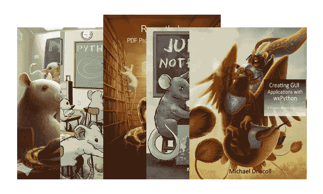

# Python 书籍的黑色星期五交易

> 原文：<https://www.blog.pythonlibrary.org/2019/11/26/black-friday-deals-on-python-books/>

对学习 Python 感兴趣？好吧，你会很高兴地知道，我正在运行一个黑色星期五/网络星期一销售我的 Python 书籍。但是我会提前开始销售，这样你就有足够的时间来决定是否要买我的书。下面就来看看吧！

**注意 [Python 101](https://leanpub.com/python_101) 是免费的。如果你想要一份免费的拷贝，你可以把支付的金额一路降到 0 美元。**

也请注意，我所有的书都有免费的样本章节，所以你可以在购买前检查一下。

* * *

### 用 wxPython 创建 GUI 应用程序

用 wxPython 创建 GUI 应用程序是我最近的一本书。在这篇文章中，您将学习如何使用 wxPython 创建跨平台的桌面应用程序。使用此[链接](http://leanpub.com/creatingapplicationswithwxpython/c/winter19)或点击上面的图片获得折扣。

* * *

### Jupyter 笔记型电脑 101

Jupyter Notebook 是一个很好的教学工具，也是使用和学习 Python 和数据科学的有趣方式。我写了一本关于这个主题的很好的入门书，叫做《Jupyter 笔记本 101 。

* * *

### 使用 Python 处理 ReportLab - PDF

用 Python 创建和操作 pdf 很有趣！在[使用 Python 的 ReportLab - PDF 处理](http://leanpub.com/reportlab/c/winter19)中，您将了解如何使用 ReportLab 包创建 PDF。您还将学习如何使用 PyPDF2 和 pdfrw 以及其他一些方便的 PDF 相关 Python 包来操作预先存在的 PDF。

* * *

### Python 201:中级 Python

[Python 201:中级 Python](http://leanpub.com/python201/c/winter19) 是我的第一本书 [Python 101](https://python101.pythonlibrary.org/) 的续集，向读者讲授 Python 中的中级到高级主题。