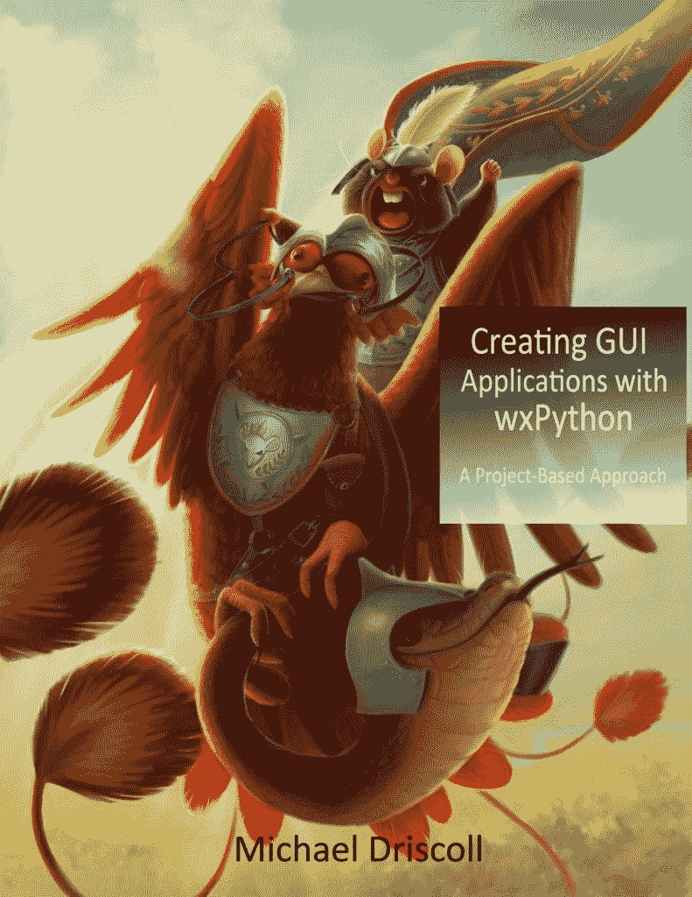

# 图书竞赛:用 wxPython 创建 GUI 应用程序

> 原文：<https://www.blog.pythonlibrary.org/2019/06/19/book-contest-creating-gui-applications-with-wxpython/>

上个月，我发布了一本名为[用 wxPython](https://leanpub.com/creatingapplicationswithwxpython/) 创建 GUI 应用程序的新书。为了庆祝一次成功的发射，我决定做一个小竞赛。

### 规则

*   发关于比赛的微博，并附上我的名字: **@driscollis**
*   在 [Twitter](https://twitter.com/driscollis) 上或通过我的[联系表格](https://www.blog.pythonlibrary.org/contact/)给我发送一条直接消息，并附上你的推文链接
*   如果你没有 Twitter，请随时通过网站给我发消息，我会帮你报名的

比赛将从现在开始持续到 6 月 21 日星期五晚上 11:59 分。

亚军将获得一本免费的电子书。**大奖**将是签名平装本+电子书版本！