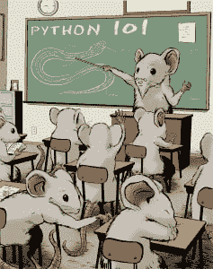

# 图书竞赛:赢得一本 Python 101

> 原文：<https://www.blog.pythonlibrary.org/2014/06/20/book-contest-win-a-copy-of-python-101/>

## 这场比赛现在结束了

我已经决定赞助我的第一本书《Python 101》的竞赛。我将送出 3 本电子书包(PDF、EPUB 和 MOBI)和 1 本平装本，我将把它们运往世界各地。如果你没听说过我的书，你可能想看看这篇[其他帖子](https://www.blog.pythonlibrary.org/2014/06/03/python-101-book-published-today/)。

### 你如何能赢

要赢得这本书，你需要做的就是在下面提出评论，强调“你为什么想赢得这本书”的原因。

### 竞赛持续时间和获胜者的选择

比赛有效期为两周，对所有人开放。获胜者将根据他们发表的评论选出。比赛将于 2014 年 4 月 7 日上午 9 点(美国中部时间)结束。

