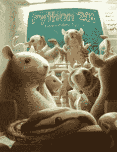

# 图书竞赛:赢得一本 Python 201

> 原文：<https://www.blog.pythonlibrary.org/2016/09/12/book-contest-win-a-copy-of-python-201/>

我已经决定为我的第二本书 **Python 201:中级 Python** 赞助一个竞赛。我将送出 3 本电子书包(PDF、EPUB 和 MOBI)和 2 本平装本，我将把它们发往世界各地。如果你没听说过我的书，你可能想在这里[读到它。](https://gum.co/py201)

### 你如何能赢

要赢得这本书，您只需在下面发表评论，强调“您为什么想赢得这本书”的原因。

### 竞赛持续时间和获胜者的选择

竞赛有效期至 9 月 16 日星期五美国中部时间晚上 11:59，对所有人开放。获胜者将根据他们发表的评论选出。比赛将于 2016 年 9 月 17 日美国中部时间上午 12 点结束。

