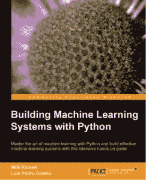

# 图书预览:用 Python 构建机器学习系统

> 原文：<https://www.blog.pythonlibrary.org/2013/08/21/book-preview-building-machine-learning-systems-with-python/>

今年早些时候，Packt Publishing 邀请我担任他们即将出版的新书《用 Python 构建机器学习系统》的技术评论员，该书作者是威利·里歇特和路易斯·佩德罗·科埃略。现在这本书可以买到了，他们让我写一点关于它的东西。我自己没有通读过成品，所以我不知道作者是否采纳了我的任何建议，但我应该注意到，英语似乎是他们的第二语言，所以这本书可能会有点粗糙。

然而，内容很有趣，我认为它相当全面。他们似乎知道他们在谈论什么。这本书的很多内容都超出了我的理解范围，因为我不是这本书所涉及主题的科学家或工程师。基本上，这本书是关于使用 scikit-learn、mahotas 和 jug 进行数据挖掘的。你将学习诸如计算机视觉、篮子分析、如何分类数据等令人兴奋的话题。

你可以在 Packt 的[网站](http://www.packtpub.com/building-machine-learning-systems-with-python/book?utm_source=blog&utm_medium=link&utm_campaign=bookmention)或[亚马逊](http://www.amazon.com/gp/product/1782161406/ref=as_li_ss_tl?ie=UTF8&camp=1789&creative=390957&creativeASIN=1782161406&linkCode=as2&tag=thmovsthpy-20)上查阅这本书。

**更新(2013-08-22)** -其中一位作者在这篇文章上发表了评论，让我知道他们已经清理了文字。