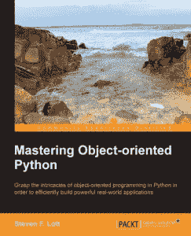

# 书评:掌握面向对象的 Python

> 原文：<https://www.blog.pythonlibrary.org/2014/05/02/book-review-mastering-object-oriented-python/>

Packt Publishing 邀请我担任他们最新的 Python 书籍之一的技术评论员，Steven Lott 的《掌握面向对象的 Python》。这本书是他们 2010 年版本的续篇，由 Dusty Phillips 写的 [Python 3 面向对象编程](http://www.amazon.com/exec/obidos/ASIN/1849511268/thmovsthpy-20/)，我在这里评论了[。](https://www.blog.pythonlibrary.org/2010/08/22/book-review-python-3-object-oriented-programming/)

*注意:这本书显然是给 **Python 3** 开发者看的，而**而**根本没怎么谈论 Python 2。*

* * *

### 快速回顾

*   我选择它的原因:出版商邀请我参与编辑这本书，但这正是我喜欢读的书
*   我完成它的原因:它写得很好，你可以学到很多关于类内部是如何工作的
*   **我想把它给:**一个想学习新事物的中级 Python 程序员

* * *

### 图书格式

你可以得到这本书的平装本、epub、mobi 或 PDF。

* * *

### 书籍内容

这本书分成 3 部分或 18 章。

* * *

### 全面审查

这是 Packt 最好的书之一，也是我读过的最好的高级 Python 书籍之一。让我们花点时间来讨论一下这些章节。这本书是基于赌场 21 点的概念，这是一个奇怪的编程书籍的主题。无论如何，作者使用它和其他几个例子来帮助演示 Python 中一些相当高级的主题。第一章都是关于 Python **__init__()** 方法。它向读者展示了如何在超类和工厂函数中使用 __init__。第二章跳转到 Python 的所有基本的特殊方法，比如 __repr__，__format__，__hash__，等等。在前几章中，你会学到很多关于元编程的知识。

第 3 章深入探讨了属性、特性和描述符。您将学习如何使用 __slots__，创建不可变的对象，以及使用“热切的计算机属性”。第 4-6 章是关于创建和使用可调用、上下文和容器的。有关于内存化、创建自定义可调用程序、如何使用 __enter__ / __exit__、使用集合模块(deque、ChainMap、OrderedDict 等)的信息，还有更多！第 7 章谈到创建你自己的号码，这是我从未考虑过的事情。作者承认你通常也不会这样做，但是他确实教了读者一些有趣的概念(数字散列和就地操作符)。第 8 章以装饰者和混合者的信息结束了第 1 部分。

第 2 部分是关于持久性和序列化的。第九章重点介绍 JSON、YAML 和 Pickle。作者倾向于 YAML，所以在这一节你会看到很多使用它的例子。第 10 章深入探讨了使用 Python shelve 对象和使用与复杂对象相关的 CRUD 操作。第 11 章是关于 SQLite 的。第 12 章将详细介绍如何使用 Python 创建 REST 服务器和 WSGI 应用程序。第 13 章涵盖了使用 Python、JSON、YAML 和 PLIST 的配置文件，从而完成了第 2 部分。

本书的最后一部分涵盖了测试、调试、部署和维护。它直接跳到了第 14 章关于日志和警告模块的主题。第 15 章详细介绍了如何用 Python 创建单元测试和文档测试。第 16 章讲述了通过 argparse 使用命令行选项和创建 main()函数。在第 17 章，我们学习如何设计模块和包。这本书的最后一章讲述了质量保证和文档。您将学习一些关于 RST 标记语言和 Sphinx 的知识，用于创建文档。

我发现第一部分是这本书最有趣的部分。我学到了很多关于类如何工作、元编程技术以及可调用函数和函数之间的区别的知识。我认为这本书就这一部分而言值得购买！第 2 部分也有很多有趣的内容，尽管我质疑作者坚持使用 YAML 而不是 JSON。我也不明白为什么 PLIST 会被包含在配置文件类型中。第三部分对我来说有点仓促。章节不够详细，例子也不够有趣。另一方面，我可能有点厌倦了，因为这部分主要是我已经知道的材料。总的来说，我发现这是我在过去几年中读过的最好的 Python 书籍之一。我肯定会把它推荐给任何想了解 Python 内部，尤其是 Python 的“神奇方法”的人。

|  | 

### 掌握面向对象的 Python

史蒂文·f·洛特**[亚马逊](http://www.amazon.com/gp/product/1783280972/ref=as_li_tl?ie=UTF8&camp=1789&creative=390957&creativeASIN=1783280972&linkCode=as2&tag=thmovsthpy-20&linkId=C535EKMPDQIEEOS4 target=)**[打包发布](http://www.packtpub.com/mastering-object-oriented-python/book) |

* * *

### 其他书评

*   达斯丁·菲利普斯用 Kivy 语言创建应用程序
*   Roberto Ulloa 的 Python 交互式应用
*   Ron DuPlain 开发的
*   弗莱彻·海斯勒的《真正的蟒蛇》
*   达斯丁·菲利普斯的 Python 3 面向对象编程