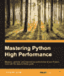

# 书评:掌握 Python 高性能

> 原文：<https://www.blog.pythonlibrary.org/2015/10/15/book-review-mastering-python-high-performance/>

Packt Publishing 最近发给我一本 Fernando Doglio 的《掌握 Python 高性能》。他们还让我在这本书出版前担任技术审查。无论如何，让我们做一个快速回顾，如果你认为这听起来很有趣，你也可以看看我的完整评论！

* * *

### 快速回顾

*   **拿起它的原因:**我是免费得到的，但我确实觉得这个标题耐人寻味。
*   **为什么读完:**作为这本书的技术审稿人，我必须从头到尾读完。然而，它有许多有趣的概念，而且很短。
*   **我想把它给:**需要学习如何提高 Python 代码效率的人。

* * *

### 图书格式

你可以得到一个电子书(PDF、EPUB 或 MOBI)版本或一个软封面。

* * *

### 书籍内容

这本书分为 8 章 235 页。

* * *

### 全面审查

当我最初读这本书的时候，我对作者如何加速他们的代码很感兴趣。他涵盖了各种各样的主题，这很好，但这也妨碍了这本书，因为没有一个主题是深入的。他使用了许多小例子，并展示了如何在继续优化它们之前进行概要分析。让我们把每一章都过一遍，这样你就能对这本书的内容有所了解。

第一章是关于剖析你的代码。它涵盖了统计分析和基于事件的分析之间的区别，什么是分析，为什么它很重要，瓶颈和内存泄漏。它还介绍了运行时间复杂性(线性、阶乘、二次等)和最佳实践分析。

然后我们顺理成章地进入第二章，在那里我们学习一些可以和 Python 一起使用的分析器。这两个工具是 cProfile(包含在 Python 中)和 [line_profiler](https://pypi.python.org/pypi/line_profiler/) 。作者演示了使用 cProfile 测量代码的各种方法，以及如何使用 Python 的 pstats 模块，该模块用于分析从 cProfile 收到的结果。然后作者继续使用 line_profiler 和 kernprof 来分析与 cProfile 相同(或相似)的例子。我认为这是书中最平衡的章节之一，本身就非常有趣。

第三章介绍了如何使用可视化工具来帮助您理解分析器的输出。在本章中，您将了解 KCacheGrind / pyprof2calltree 和 RunSnakeRun。在大多数情况下，您只需学习如何使用这些工具来弄清楚您的数据意味着什么。

在第四章，我们学习优化你的代码。涵盖的主题有记忆化、列表理解、生成器、类型、加载自己的自定义 C 库，以及其他一些技巧和窍门。虽然这一章很短，但它有一些好的想法，值得一读或至少略读。

第五章深入探讨多线程和多重处理。你会了解到每种方法的优缺点。您还将了解全局解释器锁，以及当您选择其中一种技术时，它会如何影响您。

第六章介绍了 PyPy 和 Cython 的使用，以及它们如何对你的代码进行额外的优化。我很喜欢这一章，虽然我觉得 PyPy 没有 Cython 得到那么多的关注。也没有太多的编码例子。

如果你喜欢数字运算，那么第七章适合你。它讲述了如何使用 Numba，鹦鹉和熊猫。坦白地说，在这三个图书馆中，我只听说过熊猫。就我个人而言，在我的工作中不需要做大量的数字运算，但是看看每个库是如何工作的并大致了解它们的用途是很有趣的。

最后，在第八章，作者试图把这一切联系起来。这一章可能应该有两倍的长度，这样他就可以涵盖所有的内容。但是最后，它仅仅覆盖了很少的内容，你可以看到一个完整的例子从头到尾都得到了优化。

总的来说，我喜欢这本书。我将把它推荐给任何需要优化 Python 代码的想法或者只是学习概要分析的人。

|  | 

### 掌握 Python 高性能

费尔南多·多利奥[亚马逊](http://www.amazon.com/gp/product/B00YSILEJQ/ref=as_li_tl?ie=UTF8&camp=1789&creative=390957&creativeASIN=B00YSILEJQ&linkCode=as2&tag=thmovsthpy-20&linkId=ZUWNOM24BJDALNXJ) |

* * *

### 其他书评

*   [中级蟒蛇皮](https://www.blog.pythonlibrary.org/2015/09/02/ebook-review-intermediate-python/)作者:Muhammad Yasoob Ullah Khalid
*   L. Felipe Martins 著
*   达斯丁·菲利普斯用 Kivy 语言创建应用程序
*   Roberto Ulloa 的 Python 交互式应用
*   Ron DuPlain 开发的
*   弗莱彻·海斯勒的《真正的蟒蛇》
*   达斯丁·菲利普斯的 Python 3 面向对象编程