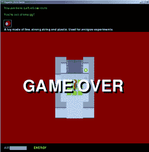
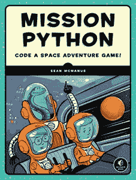

# 书评:任务 Python

> 原文：<https://www.blog.pythonlibrary.org/2019/03/20/book-review-mission-python/>

几个月前，No Starch 出版社问我是否有兴趣阅读他们的新书《任务 Python:编码太空冒险游戏》!肖恩·麦克马纳斯。我喜欢阅读新的科技书籍，但当我过去一年如此忙碌时，很难将它们融入进去。然而，我 2019 年的一个决议是通读我积压的技术书籍，所以我决定接下来处理这本书！

* * *

### 快速回顾

*   **为什么我会选择这本书:**最初，出版商让我看看这本书，但我也很感兴趣，因为我认为游戏编程很有趣
*   我为什么要完成它:我基本上浏览了这本书，但它绝对值得一读，看看如何把一个游戏放在一起
*   **我想把它给:**想了解用 Python 写一个 2D 游戏有多简单快捷的开发人员

* * *

### 图书格式

你可以得到这本书的平装本、PDF、Mobi 或 ePub。

* * *

### 书籍内容

这本书包含 12 章和 3 个附录，共 280 页。本书中的代码是针对 Windows 或 Raspberry Pi 的。这本书还需要 Python 3，因为它使用 PyGame Zero，而 PyGame Zero 需要 Python 3。

* * *

### 全面审查

任务 Python 试图教你 Python 编程语言，同时也用 [PyGame Zero](https://pygame-zero.readthedocs.io/en/stable/) 构建一个 2D 视频游戏。简介很有帮助地解释了如何在 Windows 和 Raspberry Pi 上安装 Python 和游戏所需的依赖项。如果你碰巧在 Linux 或 Mac 上，你将不得不弄清楚如何自己安装它。

这本书的第一章指导读者使用 Python 的空闲应用程序来开发代码。这一章的其余部分将向你介绍如何编写游戏的一些内容。基本上，你创建游戏的背景，并了解 blitting。您还将学习如何使用键盘移动游戏中的角色。

第 2 章深入探讨了 Python 列表以及如何在游戏中使用它们。作者使用列表构建和访问列表中的元素来帮助读者创建与空间相关的清单，并最终创建排序图。这是一个相当有创意的方式来同时整合 Python 列表和视频游戏。

读者旅程的下一步是在第 3 章学习 Python 循环。循环用于将“地图”打印到屏幕上。地图基本上是一个数字矩阵。在描述了如何进行嵌套循环之后，作者使用新发现的知识来帮助用户使用 PyGame Zero 的绘图能力创建一个房间图像。

对于第四章，作者教读者如何创建地图和自动地图生成器。在这里，您将学习如何使用 PyGame Zero 在屏幕上绘制地图，并在不可避免地遇到问题时调试代码。

第 5 章和第 6 章是关于空间站的设备，重点是 Python 字典。在这里，读者将学习如何在 Python 中混合数据类型，比如向字典中添加列表。你还将学习如何在游戏中加载场景到房间里。

第七章的目的是教你如何在游戏中移动精灵。在这个任务中，读者将学习如何将键盘连接到游戏中，以及如何使用不同版本的精灵来让动作看起来自然。

本书的其余部分构建了游戏本身的各个部分。你会学到如何使用函数，整本书都有练习。本书的其余部分主要关注 PyGame 特定的函数和方法，以及如何有效地使用它们。

这本书似乎组织得很好，写得也很好。我个人觉得章节的标题有点混乱，因为你不能仅仅从标题上判断出这一章实际上是关于什么的。章节名有时也写得很笨拙。然而，这本书的内容很有趣，学习如何用 Python 写游戏也很有趣。我会把这本书给那些想学习用 Python 写游戏的所有活动部分的人。你不会学习游戏理论，但它仍然是一个很好的游戏开发入门，代码很少。

你可以访问作者的[网站](https://www.sean.co.uk/books/mission-python/index.shtm)获得这本书的免费样本，并了解更多相关信息。

|  | 

### 任务 Python

肖恩·麦克马纳斯**[亚马逊](https://amzn.to/2TkH1F4)，[无淀粉](https://nostarch.com/missionpython)，** |

* * *

### 其他书评

*   Julien Danjou 的《严肃的 Python:关于部署、可伸缩性、测试等的黑带建议》
*   Brian Okken 的 pytestPython 测试
*   Erik Westra 的 Python 模块编程
*   [Python Playground——好奇的程序员的极客项目](https://www.blog.pythonlibrary.org/2015/12/11/book-review-python-playground-geeky-projects-for-the-curious-programmer/)Mahesh Venkitachalam 著
*   L. Felipe Martins 著
*   达斯丁·菲利普斯用 Kivy 语言创建应用程序