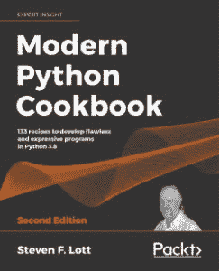

# 书评:现代 Python 食谱

> 原文：<https://www.blog.pythonlibrary.org/2020/09/03/book-review-modern-python-cookbook/>

Packt Publishing 最近发布了一本新书，书名为[现代 Python 食谱](https://www.amazon.com/Modern-Python-Cookbook-flawless-expressive/dp/180020745X)，作者是 Steven Lott。它的副标题是“在 Python 3.8 第二版中开发完美且富于表现力的程序的 133 种方法”，这可能会给你一些暗示，这是一本大书。事实上，它长达 822 页！

我第一次看 Lott 的[掌握面向对象 Python](https://www.blog.pythonlibrary.org/2014/05/02/book-review-mastering-object-oriented-python/) ，这是一本很优秀的书。他是一个优秀的作家，可以很容易地钻研 Python 中任何主题的技术细节。

O'Reilly 是第一家出版 Python 食谱的公司。那本书也不错，几乎和洛特的最新作品一样大。烹饪书不是用来从头到尾读的。但是他们对学习新的信息很有帮助。洛特的书是按食谱分组排列的。有趣的是，Packt 能够让第一本 Python 食谱的作者 Alex Martelli 成为这本书的技术评审之一。

共有 15 章，每一章都有不同数量的食谱。你会惊讶于食谱有多详细。例如，有一个名为“处理大整数和小整数”的食谱，乍一看似乎很琐碎。但是通读之后，你会学到很多关于 Python 如何不同于其他编程语言地表示整数。

它还解释了 sys.maxsize()是如何发挥作用的，这实际上比我预期的要有趣得多。我很欣赏食谱有一个“另见”部分，告诉你下一步去哪里学习书中或 URL 上的相关内容。

我喜欢有解释如何使用 walrus 操作符的方法，强制只使用关键字参数和只使用位置参数。这里有很多关于 Python 最新版本中新特性的精彩报道。

在这本书里，你还会学到类、对象和函数式编程。

令人惊讶的是，作者还涵盖了 web 服务、配置、组合应用程序、统计编程和线性回归。

你应该去看看这本书。这真的很有趣，会是一本很棒的参考书。