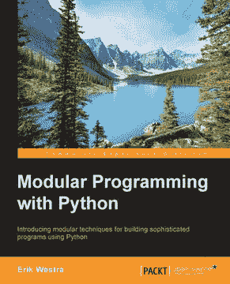

# 书评:用 Python 进行模块化编程

> 原文：<https://www.blog.pythonlibrary.org/2016/06/15/book-review-modular-programming-with-python/>

今年早些时候或 2015 年末，Packt Publishing 邀请我担任 Erik Westra 所著的《Python 模块化编程》一书的技术评审。这听起来真的很有趣，最终成为我读过的 Packt 的最好的书之一。请注意，我是这本书的唯一技术评论家。我不知道为什么 Packt 为这本书走这条路，因为他们通常有 2-3 个评论家，但也许他们试图加快他们的写作过程。

* * *

### 快速回顾

*   为什么我要拿起它:主要是因为 Packt 要求我这么做。然而，这确实是一本有趣的书
*   **为什么我要完成它:因为这本书很短，写得很好**
*   我会把它给:一个需要提高代码组织技能的中级开发人员

* * *

### 图书格式

你可以得到一个电子书(PDF、EPUB 或 MOBI)版本或一个软封面。

* * *

### 书籍内容

这本书只有 9 章，长达 228 页。

* * *

### 全面审查

用 Python 进行模块化编程，读起来其实挺好玩的。它旨在帮助您学习如何使您的代码更加模块化，并提供了一些非常好的示例。第一章从 Python 本身组织其模块和包的方式开始。它继续解释为什么模块化编程是重要的，并且有一个创建你自己的模块的简单例子，这个模块恰好是一个缓存模块。

第二章是关于创建你的第一个模块化程序。它将带你经历以模块化的方式设计程序的各个步骤，然后实际实现它。在设计阶段，作者只是把界面截出来。然后在实现阶段，我们开始实际添加代码。

对于第三章，我们学习模块和包是如何初始化的。作者还介绍了 Python 的导入系统。我们学习进口如何工作，什么是相对进口，控制进口什么，循环进口等等。

第四章是关于创建一个模块化的图表包。我们学习如何使用 pillow 包制作图表，pillow 包是 Python 图像库(PIL)的一个分支。然后作者谈到了项目的需求是如何变化的，以及我们必须如何应对它们。在这个例子中，我们需要一种 pillow 不支持的方法来制作矢量图像。因此，作者展示了如何添加使用 Reportlab 或 pillow 创建图表的功能。这也是真正伟大的一章。

第五章着眼于模块化模式，如封装、包装器等。我认为我发现最有趣的部分是关于动态导入、插件和钩子的章节。

在第六章中，我们学习了可重用模块。作者首先描述了什么是可重用模块，然后给出了一些例子。本章的其余部分将致力于创建一个可重用的模块，它恰好是一个单位转换模块。

第七章深入探讨了 Python 的导入系统。它涵盖了可选导入、本地导入、将包添加到 sys.path、各种导入“陷阱”、处理全局等等。这实际上是我最喜欢的章节之一。

第八章，我们改变了节奏。这都是关于测试和部署我们的模块。本章只给出了单元测试、代码覆盖和测试驱动开发的基础知识。这一章的大部分是关于准备发布到 Github 或 Python 包索引的模块。

最后一章旨在展示模块化编程技术如何使编程过程更加有效。它给出了一个非常简短的例子，结束了这本书。

总的来说，我发现这本书很好地传达了它的信息。代码示例简单易懂。文笔很好。比我通常在 Packt 出版物上看到的好多了。我喜欢阅读简洁或有趣的代码，这本书有几个很好的例子。我确实觉得这本书的结尾有点突然。虽然我不知道应该添加什么，但我只是觉得它可以再有一两章。不管怎样，我向那些在组织代码方面有困难的人推荐这本书。

|  | 

### 用 Python 进行模块化编程

埃里克·韦斯特拉**[亚马逊](http://amzn.to/1U7p41q)** |

* * *

### 其他书评

*   [Python Playground——好奇的程序员的极客项目](https://www.blog.pythonlibrary.org/2015/12/11/book-review-python-playground-geeky-projects-for-the-curious-programmer/)Mahesh Venkitachalam 著
*   L. Felipe Martins 著
*   达斯丁·菲利普斯用 Kivy 语言创建应用程序
*   Roberto Ulloa 的 Python 交互式应用
*   Ron DuPlain 开发的
*   弗莱彻·海斯勒的《真正的蟒蛇》
*   达斯丁·菲利普斯的 Python 3 面向对象编程