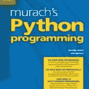

# 书评:穆拉希的 Python 编程

> 原文：<https://www.blog.pythonlibrary.org/2017/02/10/book-review-murachs-python-programming/>

我不时为 i-programmer 网站书评，他们最近给了我一本迈克尔·厄本和乔尔·穆拉希写的 T2·穆拉希的 Python 编程。这本书长达近 600 页，对于平装本来说相当昂贵。对于那些注意力持续时间短的人，我给你们快速回顾一下。对于那些想要更深入一点的人来说，你需要点击查看剩下的内容。

* * *

### 快速回顾

*   **为什么我拿起它:**在这种情况下，因为我-编程要求我
*   我为什么要读完它:因为这本书写得很好，而且相当有趣
*   **我会把它给:**想学 Python 的人

* * *

### 图书格式

你可以在穆拉希买到 DRM 电子书，或者在你附近的网上商店买到平装本。

* * *

### 书籍内容

这本书有 4 节，18 章，576 页长。

* * *

### 全面审查

穆拉希不是我熟悉的出版商，所以当我开始阅读他们的 Python 编程书籍并发现其质量如此之高时，我感到很惊讶。这本书是迈克尔·厄本和乔尔·穆拉希写的。它基于 Python 3，本质上是一本入门书。这本书分为 4 个部分，共 18 章。让我们花些时间一章一章地看这本书。

第一部分包括 8 章。第 1 章是一个非常基础的介绍性章节，旨在向您展示 Python 和其他语言之间的区别。它还介绍了如何使用 IDLE (Python 包含的 IDE)并运行“Hello，World”类型的程序。作者还解释了 Python 如何在运行之前将源代码“编译”成字节码。最后，本章给出了一些关于如何修复语法和运行时错误的提示。

第 2 章介绍了 Python 中的编码。您将了解注释、使用内置函数、Python 的一些数据类型、算术表达式、字符串连接和许多其他主题。还有两个小程序，作者在这一章的最后用你到目前为止学到的概念实现了它们。

第 3 章深入研究控制语句。在这种情况下，我们将讨论 Python 的 if/elif/else 语句，以及关系和逻辑操作符在 Python 中是如何工作的。本章还介绍了 Python 的循环结构(while 和 for 循环)，以及 break 和 continue 语句。我没有看到任何关于在你的循环中使用“else”语句的内容，但是我不确定我以前是否在书上看到过。不管怎样，他们更新了前一章的程序，并用第三章的新概念演示了几个新程序。

第 4 章介绍了功能和模块的定义和使用。这是一个有趣的小章节，你会学到默认值，以及局部和全局变量。您还将创建一个模块，记录它并学习如何导入它。他们还提到了 Python 的标准库，并描述了如何从中导入模块。最后，我们学习如何设计一个程序，然后编写代码。

第 5 章是我们学习如何测试和调试程序的地方。您将了解常见的 Python 错误以及一些测试和调试软件的技术。正如所料，他们使用 IDLE 的调试器以及 print()语句来帮助调试代码。有趣的是，我们直到第 8 章才学到异常处理。

第 6 章是关于 Python 的列表和元组数据类型。在这一章中，你将学习使用列表的基本知识，并且你将在这一章中编写另外三个程序。由于元组是不可变的，所以它们的覆盖面要小得多，但是我认为您学到的足够多，可以正确地使用它们。

第 7 章是关于如何使用 Python 来处理文件。在本章中，你将学习如何打开、创建、读取和写入文件。您还将了解如何处理二进制文件和 CSV 文件。

第 8 章是异常处理章节。它描述了异常如何工作，如何处理单个和多个异常，以及如何从异常对象中提取信息。您还将了解 finally 子句以及如何自己引发异常。这一章结束了第一部分。

第 2 部分被描述为涵盖“其他概念和技能”，只有 5 章长。我会说得很简短:

在第九章，我们学习了数字的一般知识。以下是一些例子:浮点数、格式化数字、使用区域设置模块、舍入和小数模块。

第 10 章是关于字符串的。我们将学习一些关于 Unicode、切片、索引、分割和连接字符串的知识。我们还将创建或增强 4 个程序。最复杂的是一个刽子手游戏，非常值得一读，因为它将游戏的功能分成了多个模块。

第 11 章的主题是使用日期和时间。在本章中，你将学习 Python 的时间和日期时间模块的基础知识，并使用它们创建一些程序。

在第 12 章，我们终于了解了 Python 最重要的数据类型之一:字典(或 dict)。在这里，您将学习如何创建字典以及获取、设置、添加和删除条目。还有一些关于将字典转换成列表以及向字典中添加更复杂的值的信息。像往常一样，在本章中你将创建一些简单的程序。

这一部分将在第 13 章结束，在那里我们将学习递归和算法。这一章大约有一半的篇幅是用来学习递归的工作原理以及它在 Python 中是如何工作的。其余部分涵盖了一些常见的算法，如阶乘，斐波纳契数列和汉诺塔。

第 3 节是关于 Python 中的面向对象编程(OOP)。它只有三章。基本上这三章涵盖了定义和使用你的类，继承和设计方面，当你做面向对象编程时需要用到。在这一章中，你将创建更多有趣的小程序，并学习许多有用的信息，如多态如何工作、重写方法、创建自定义异常等。

最后两章在第四节。第 17 章介绍数据库，然后深入使用 Python 的 SQLite 模块 sqlite3。但是，它没有谈到任何可以用来连接到企业级数据库的第三方模块。学完本章后，你应该知道如何创建数据库，以及如何在 SQL 中使用 SELECT 语句、INSERT 语句、UPDATE 语句和 DELETE 语句。

最后一章是第 18 章。这是使用 tkinter 创建 GUI 程序的介绍。tkinter 模块有基于它的整本书，所以不要期望这一章涵盖所有的内容。你将学到的是如何编写一个简单的未来值计算器应用程序，这很好。但你不会学到比这更多的东西。

总的来说，我认为这本书是经过深思熟虑和执行的。这本书使用了“成对页面”的方法，在右页有语法、指南和例子，在左页有额外的解释信息。我敢肯定这在书的形式下很好，但在他们的电子书版本中有点尴尬。事实上，我真的不能推荐你直接从穆拉希得到的电子书。它使用一个名为 LockLizard Safeguard 的 DRM 应用程序，你必须下载。您将获得一个许可证文件，您需要在打开图书之前运行该文件，该文件为. pdc 格式。该应用程序目前只支持 Windows 和 Mac，所以对于 Linux 来说，你只是运气不好。该应用程序看起来像 Adobe 的 Reader 应用程序，但它非常有限。您不能突出显示或添加注释。我在 Windows 中使用它，发现如果你有书签窗格，那么你只能在其中滚动。您需要在图书窗格中单击后退才能滚动到那里。

无论如何，除了令人讨厌的电子书客户端，这本书其实很好。我觉得它很好地涵盖了主题，并且包括了一些在 Python 入门书籍中不经常看到的内容，比如 CSV、数据库和 GUI 示例。这本书的其余部分对于初学者来说是相当标准的，但是文本清晰，例子有趣。我真的很喜欢你在几乎所有的章节里写小程序，它们除了打印出一个字符串之外，几乎总是做一些事情。我相信对于想要学习 Python 的人来说，这是一本值得一读的书，但如果你已经了解 Python，那么这本书很可能不会有你感兴趣的东西。

|  | 

### 穆拉希的 Python 编程

迈克尔·厄本和乔尔·穆拉希**[亚马逊](http://amzn.to/2kbuzpv)** |

* * *

### 其他书评

*   Erik Westra 的 Python 模块编程
*   [Python Playground——好奇的程序员的极客项目](https://www.blog.pythonlibrary.org/2015/12/11/book-review-python-playground-geeky-projects-for-the-curious-programmer/)Mahesh Venkitachalam 著
*   L. Felipe Martins 著
*   达斯丁·菲利普斯用 Kivy 语言创建应用程序
*   Roberto Ulloa 的 Python 交互式应用
*   Ron DuPlain 开发的
*   弗莱彻·海斯勒的《真正的蟒蛇》
*   达斯丁·菲利普斯的 Python 3 面向对象编程