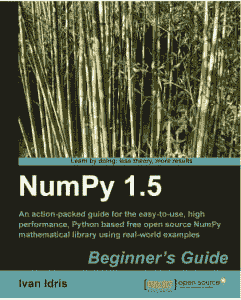

# 书评:Numpy 1.5 初学者指南

> 原文：<https://www.blog.pythonlibrary.org/2011/12/15/book-review-numpy-1-5-beginners-guide/>

这是一篇由[伊万·伊德里斯](http://ivanidris.net/wordpress/)撰写的 *Numpy 1.5 初学者指南*的非正统评论。在我们开始评论之前，我必须说两件事:

*   这本书是直接从 Packt 出版社以电子书和实物形式给我的
*   实际上，我认为我没有足够的数学知识来复习这个

关于第二个问题，我学了大学微积分，但是这本书讲的术语我要么不记得了，要么就是没讲过。我也学过统计学 I 和 II，但是作者更多的是处理矩阵操作和线性代数。我认为我以前的金融和会计课程帮助最大，但那是在书的结尾。

## 这本书的读者

那么这本书到底是针对谁的呢？我认为它的目标是高水平的数学家、科学家和股票市场的数据分析者。这篇散文相当不错，只是有点枯燥。书的大部分都是由一个小节介绍，一个问题，如何用 NumPy / Matplotlib 解决，以及一些代码示例组成。代码示例是片段，而不是完整的可运行代码，但是您应该能够轻松地拼凑出大部分代码。作者没有花时间导入库或创建奇特的类，所以所有的例子都非常简单，尤其是如果你已经理解了数学方程。注意方程没有解释，所以如果你不知道，你就要自己去挖掘了。

## 涵盖哪些内容

大量的方程式和数学术语。例如，你将学习如何做各种移动平均线，布林线，趋势线，阶乘，矩阵(很多很多)，汉宁，汉明，ufuncs，李萨如曲线，行列式，傅立叶变换，各种对数，矩阵排序等等。所有这些都在 NumPy 的范围内，偶尔会有一些敏感的东西出现。这些例子侧重于股票市场和金融，在这种情况下似乎效果不错。

在这本书的最后，在第 9 章，作者稍微改变了思路，更深入地讨论了 Matplotlib。在前几章中，他已经断断续续地使用过它，但在这一章中，他涵盖了更多的基本功能。然后在第十章也是最后一章，他深入研究了 SciPy，甚至设法提到了 SciKits。

我注意到一些小的语法或句子结构问题，但这是一本写得较好的 Packt 书。

## 包扎

正如我提到的，由于高水平的数学，我并不真正理解这本书的很多内容。令我难过的是，我要么在高中或大学时没有涉及到这一点，要么我已经设法忘记了这么多。然而，虽然作者没有花太多的时间来解释这些例子，但我认为这种快速的写作方式是有效的。欢迎下载第三章来体验一下。如果你对这类东西感兴趣，或者想学习如何在 Python 中应用这类东西，那么我认为这本书可能正合你的胃口。

|  | 

### Numpy 1.5 初学者指南

伊万·伊德里斯**[从亚马逊](http://www.amazon.com/gp/product/1849515301/ref=as_li_ss_tl?ie=UTF8&tag=thmovsthpy-20&linkCode=as2&camp=217145&creative=399373&creativeASIN=1849515301)购买****[打包](http://www.packtpub.com/numpy-1-5-using-real-world-examples-beginners-guide/book)** |