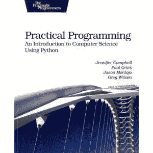

# 书评:实用编程:使用 Python 的计算机科学导论

> 原文：<https://www.blog.pythonlibrary.org/2010/08/14/book-review-practical-programming-an-introduction-to-computer-science-using-python/>

|  | 

### 实用编程:使用 Python 的计算机科学导论

詹妮弗·坎贝尔、保罗·格里斯、杰森·蒙托霍和格雷格·威尔逊**[亚马逊](http://www.amazon.com/exec/obidos/ASIN/1934356271/thmovsthpy-20/7)** |

上个月，我收到了一个家庭成员送给我的礼物,《实用编程:使用 Python 的计算机科学入门》。这本书是由四个作者:詹妮弗坎贝尔，保罗格里斯，贾森蒙托霍和格雷格威尔逊。我对阅读另一本与 Python 相关的教科书感兴趣已经有一段时间了，而这恰好是为数不多的几本之一。我唯一读过的另外一本 Python 教材是约翰·泽尔的 *[Python 编程:计算机科学导论](http://www.amazon.com/exec/obidos/ASIN/1590282418/thmovsthpy-20/)* 。我知道还有一两本书，但这些书超出了我的支付能力。

通常情况下，当我看到需要多个作者的东西时，结果不会很好。然而，这本书在使用 Python 向学生介绍计算机科学方面做得很好。当然，当我在计算机科学课上的时候，我们花了很多时间在理论上。这本书的大部分内容是关于学习 Python 的基础知识，比如如何使用字符串、列表、字典、元组等。因此，如果你希望用 Python 学习算法和数据结构，你在这里找不到太多。其中有一章是关于算法的，涵盖了排序和搜索算法，我认为这是这本书的亮点之一。

另一方面，你将会很好地了解到有史以来最简单、最有趣的编程语言之一。你不仅会得到一个很好的介绍，而且每章都以一系列基于该章内容的练习结束。我喜欢让复习题或要解决的问题让我学到的东西留在脑子里。我主要浏览了练习，因为这些章节是为没有编程经验的大学新生设计的。

这本书在两个地方涵盖了基本测试。它并不全面，但它确实让读者尝到了甜头，我认为它很好地传达了测试背后的推理。在书的结尾，他们对我们有了更多的关注。这本书概述了以下主题:调试、面向对象的哲学(类、继承、多态)、使用 Tkinter 的图形用户界面和数据库(sqlite)。

在读了 Dusty Phillips 关于 Python 面向对象编程的书之后，我发现这本书缺少了一章。但是，它是典型的介绍，所以我不能过多地敲打它。Tkinter 这一章很有趣，因为我一直计划在这个博客的其他文章中重温这一章。作者甚至花了一些时间在模型-查看器-控制器范例上。尽管我不太喜欢他们布置代码的方式，因为很难判断哪个代码适合整个 MVC 模式。数据库部分几乎是使用 Python 2.5 的 sqlite 模块的简单 SQL 代码。虽然这种方法没有什么特别糟糕的地方，但我知道我会被它弄得有点困惑，因为所有的新语法都与我之前在书中学到的不匹配。

有一些奇怪或糟糕的语法实例，但我没有发现任何明显的故意不在那里的编码错误。这本书定价合理，尤其是考虑到它应该是一本大学教材。如果你是计算机科学或 Python 的新手，我想你会发现这本书很有帮助。如果你是一个有经验的程序员，或者你已经上过几门计算机科学的课程，那么你可能会想跳过这本书(除非你想学习 Python)。