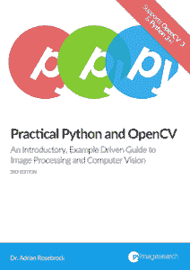

# 书评:实用 Python 和 OpenCV

> 原文：<https://www.blog.pythonlibrary.org/2019/06/06/book-review-practical-python-and-opencv/>

几年前，我在一个作者的 Kickstarters 上买了实用的 Python 和 OpenCV。开始看了，然后就忙别的了。在过去的几周里，我决定再试一次这本书，并且完成了它。请注意，我开始读这本书的第三版时并没有意识到还有第四版。完成第三版后，我把它和第四版并列比较，看起来它们几乎是一样的，所以我不认为这有多大关系。

* * *

### 快速回顾

*   **我选择它的原因:**计算机视觉/机器学习听起来很有趣，作者有一个有趣的博客
*   我完成它的原因:它很短，写作风格很吸引人
*   **我想把它送给:**任何希望开始使用 Python 中的 OpenCV 的人

* * *

### 图书格式

你可以得到这本书的精装本、PDF 或 Mobi。

* * *

### 书籍内容

这本书包含 11 章，共 169 页。它涵盖了第 4 版中的 Python 3 和 OpenCV 4。

* * *

### 全面审查

[实用 Python 和 OpenCV](https://www.pyimagesearch.com/practical-python-opencv/) 是一本有趣的书。它比普通的技术书籍要短，但是它涵盖了很多领域。这是一种异常现象，因为许多技术书籍看起来要长得多。不管怎样，让我们把这本书一篇一篇地过一遍。

第一章只是一个介绍。它描述了什么是计算机视觉，并给出了一些例子。然后第二章跳出来，教你如何安装你需要的软件包来有效地使用这本书。我个人认为这两章可以合并在一起，或者安装一章可以作为附录。但是没关系。

第三章是你最终进入代码的地方。在这里，您将学习如何将图像加载到 OpenCV 中并显示给用户。您还将学习如何保存图像。这对于不同图像格式之间的转换很有用，但更重要的是，它有助于在需要时保存数据。

在第四章中，你将从 OpenCV 的角度学习图像的基础知识。您将学习它的坐标系统，以及如何访问和操作图像中的单个像素。

然后在第五章，你会发现如何画直线、矩形和圆形。您可以更改每个形状的宽度、位置和颜色。您也可以将形状堆叠在一起。

第六章讨论了图像处理的主题。在这里，您将学习所有关于图像转换(平移、旋转、调整大小等)、图像算术、位运算、蒙版、分割、合并和色彩空间的重要性(RGB 与 BGR 和 HSV)。

对于第七章，您将学习如何在 OpenCV 中有效地使用直方图。直方图将帮助您确定正在处理的图像的对比度、亮度和强度分布。OpenCV 支持处理灰度和彩色直方图。您还将了解直方图均衡化和遮罩。

第八章解释了 OpenCV 可以实现的不同类型的模糊和平滑。在这里，您将了解高斯模糊、中间模糊和双边模糊。Adrian 没有深入解释这些话题。相反，他选择用小代码片段向读者展示如何完成每一项。

第九章介绍了阈值处理的主题，即图像的二值化。阈值是用于描述聚焦在图像中感兴趣的对象或区域上的术语。阿德里安在本章和书的其余部分使用了一些硬币的照片。你最终使用阈值来找到照片中的硬币。

然后在第十章中，你将学习如何使用渐变和边缘检测来提炼你在第九章中学到的东西。这可以让你找到照片中硬币的边缘。这一章集中在使用拉普拉斯和索贝尔方法的梯度。然后，您将了解如何使用 Canny 边缘检测技术。

为了包装这本书，Adrian 使用 OpenCV 找到硬币的轮廓，以便他可以计算图像中的硬币。他还谈到了在寻找轮廓时 OpenCV 版本之间存在的差异。

这本书很快涵盖了许多不同的主题。在我看来，有些布局上的小问题，因为有时他指的是一张没有很快出现或者在这一章的前面莫名其妙地出现过的图片。也有几次，他在解释一些页面上没有的代码。然而，这些事情不会影响代码示例本身的质量。您还可以获得一个包含更多信息的案例研究 PDF。

总的来说，我认为这是一本相当好的书。这些例子很有趣，节奏很快，在 Python 书籍中看到恐龙总是很有趣。这本书有点贵。

|  | 

### 实用 Python 和 OpenCV

阿德里安·罗斯布鲁克博士**[PyImagesearch](https://www.pyimagesearch.com/practical-python-opencv/)** |

* * *

### 其他书评

*   肖恩·麦克马纳斯的任务 Python
*   Julien Danjou 的《严肃的 Python:关于部署、可伸缩性、测试等的黑带建议》
*   Brian Okken 的 pytestPython 测试
*   Erik Westra 的 Python 模块编程
*   [Python Playground——好奇的程序员的极客项目](https://www.blog.pythonlibrary.org/2015/12/11/book-review-python-playground-geeky-projects-for-the-curious-programmer/)Mahesh Venkitachalam 著
*   L. Felipe Martins 著