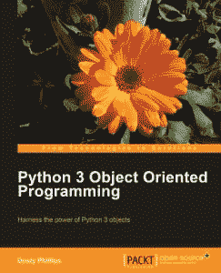

# 书评:Python 3 面向对象编程

> 原文：<https://www.blog.pythonlibrary.org/2010/08/22/book-review-python-3-object-oriented-programming/>

|  | 

### Python 3 面向对象编程

达斯丁·菲利普斯**[亚马逊](http://www.amazon.com/exec/obidos/ASIN/1849511268/thmovsthpy-20/)****[打包](http://www.packtpub.com/python-3-object-oriented-programming/book?utm_source=blog.pythonlibrary.org&utm_medium=bookrev&utm_content=blog&utm_campaign=mdb_004190)** |

 几个月前，我写了这本书的[预览](https://www.blog.pythonlibrary.org/2010/05/20/book-preview-python-3-object-oriented-programming/)。一周前，我收到了这本书。不过，在我们开始评论之前，我想充分披露:去年 12 月，Packt 联系我成为这本书的“评论者”(阅读:技术编辑)。报酬呢？他们给了我一本书，一本我想要的他们目录中的任何一本书，我的名字出现在书里。如果你认为报酬会使我产生偏见，那就这样吧。每个人都有这样或那样的偏见。不过，我倾向于对我参与的事情更加苛刻。

好吧，我的灵魂暴露得够多了。让我们看看这本书。这本书的作者非常喜欢统一建模语言(UML)类图，所以如果你发现那些对学习有帮助，那么你会喜欢这本书。毕竟，整个第一章是由文本和 UML 图组成的，它简要介绍了面向对象的哲学。第 2 章跳到 Python 对象、模块和包。第 3 章深入探讨了继承(基本的和多重的)和多态。第 4 章是关于 Python 中的异常。第五章试图解释什么时候使用面向对象编程。我认为这是一个有趣的章节，因为在我看来，大学恐吓他们的学生，让他们认为应该对所有事情都使用 OOP。第 6 章和第 7 章通过覆盖元组、列表、字典、集合、各种理解、生成器和函数来深入 Python 标准库。从这些章节中我学到了很多关于理解的东西，这让我希望我能更多地使用 Python 3。第 8 章和第 9 章涵盖了 Python 设计模式。我发现这些章节是这本书的亮点，非常有趣。他涵盖了以下模式:装饰者、观察者、策略、状态、单例、模板、适配器、门面、flyweight、命令、抽象工厂和复合。

第 10 章涵盖了文件和字符串的基础知识；第 11 章介绍了单元测试和 py.test 测试。最后，第 12 章简要介绍了常见的 Python 3 库，如 SqlAlchemy、Tkinter、PyQt、lxml 和 CherryPy。

当我回顾这本书时，第 5 章和第 8 章有一些 Python 图像库的例子。作者注意到 PIL 当时还没有移植到 Python 3，但他认为通过发布会实现。唉，PIL 背后的人仍然没有 Python 3 端口。所以我很好奇作者是如何处理这个难题的。原来他最终用 pygame 代替了 PIL。这是一个有趣的选择，看起来对这些例子都适用。我没有重读这本书(尽管我打算在某个时候重读)。相反，我只是做了一个抽查，看看作者是否遵循了我的任何建议或修复了错误。看来他做到了。

在他解决这本书的问题之前，这本书很好。这里的理论比你通常在 Python 教科书中找到的要多，但我发现例子很有趣，他在章节的结尾有不寻常的练习，应该会让你思考。我敢肯定，如果我买了这本书，我会非常高兴。如果你不熟悉 Python 3，特别是面向对象编程，或者你想学习编程模式，我推荐这本书。如果你想先睹为快，Packt 在他们的网站上有第七章[这里](https://www.packtpub.com/sites/default/files/1261-chapter-7-Python%20object-oriented-shortcuts.pdf)。