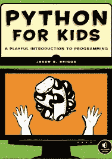

# 书评:面向儿童的 Python 有趣的编程入门

> 原文：<https://www.blog.pythonlibrary.org/2013/01/29/book-review-python-for-kids-a-playful-introduction-to-programming/>

No Starch Press 的一名代表找到我，让我评论他们的书，No Starch Press 是面向儿童的 Python 的出版商。他们给我提供了一个免费的枯树拷贝和一个电子书(PDF)版本。这本书似乎与曼宁的 

### 快速回顾

*   我选择它的原因:主要是因为我被出版商要求阅读它。然而，我发现这些极限初学者书籍本身就很有趣。我只是不想花我自己的钱。也是 Python 3 的书！
*   **为什么写完:**其实我没写完。这本书很好，但它是一本初学者的书，我读了大约一半就草草看完了。但这是一本写得很好的书，有着引人入胜的写作风格。
*   我会把这本书送给:我会把这本书送给那些有孩子的高中生，他们对编程感兴趣，尤其是对 Python 感兴趣。

### 图书格式

这本书可作为文书教科书或 PDF 电子书。

### 全面审查

《面向儿童的 Python》的作者是 Jason R. Briggs。这篇文章基于 Python 3，这很酷。我想这是我看过的第一本 Python 3 入门书。文本可读性很强，作者很好地为读者分解了语言，尤其是在书的前半部分。当我们上课的时候，它看起来更像一本普通的入门书，而不一定是给孩子们看的。这些章节简短扼要，并且在每一章的结尾都有练习。作者在一些例子中使用了 turtle 库，试图让事情变得更有趣。我觉得这是一个很有意思的做法，但是他并不是每一章都用，所以有点前后矛盾。

不过有几个奇怪的地方。例如，在第 5 页，作者声明 Python 不使用“复杂的符号，如大括号({})、散列”等，而事实上 Python 确实使用了这些符号。哈希用于注释，大括号用于字典对象。书中还有一些奇怪的命名惯例。他将字符串替换(或插入)描述为“嵌入值”。我从未在任何其他 Python 书籍中看到过这样的描述。这样描述并没有什么特别的错，但是如果你用这些关键词来搜索这个主题，你可能不会得到最好的结果。他还使用了旧的字符串插入方法:

```py

print ("My name is %s" % "Mike")
```

而我通常看到的与 Python 3 相关的新方式更像这样:

```py

print ("My name is %(name)s" % {"name":"Mike"})
# or
msg = "My name is {0}".format("Mike")
print (msg)
```

我认为我在阅读的文本中看到的最大问题是在第 39 页，其中描述了一个 Python **地图**，作者将其描述为**字典**的另一个单词。[地图命令](http://docs.python.org/3/library/functions.html#map)是一个内置的 Python 函数，它将一个函数应用于 iterable 中的每一项。我认为这一节很差，因为读它的学生会认为 map 和 dict 是同一个东西，它们甚至不接近。如果学生试图通过查找 Python 地图来找到字典的例子，他们会非常困惑！

说够了，让我们快速浏览一下章节，这样你就知道如果你决定购买，你会得到什么:

这本书有三个部分。第一部分由 12 章组成。前 3 章涵盖了变量、元组、列表和“地图”(即字典)。在第四章我们用海龟库画画。然后我们回到基础，第 5 章讨论条件句(if/else ),第 6 章讨论循环。第 7 章和第 8 章用函数、类、模块和对象探讨了面向对象的领域。第 9 章是关于 Python 的一些内置函数，但不是很多。第 10 章似乎只是作者最喜欢的内置模块的概述，如 copy、keyword、random 等。第 11 章回到使用 turtle 模块绘制图形和形状。最后，第 12 章是对 Tkinter 的一个尝试，Tkinter 是大多数 Python 发行版中包含的 GUI 工具包。看起来作者展示了如何用 Tkinter 画图，就像他用 turtle 画图一样，也展示了 Tkinter 的一些其他技巧。

在第二部分中，作者花了一些时间教读者关于使用 Tkinter 的游戏。他用了两个章节用一个弹跳球和一个球拍创造了一个游戏。第三部分也是游戏相关的。这一次作者用 GIMP 中创建的精灵创建了一个游戏，游戏本身是用 Tkinter 构建的。我不确定为什么你会使用 Tkinter 而不是 pyGame，除了 pyGame 没有包含在 Python 中。

### 结论

总的来说，我觉得这本书很有趣。如果你有一个高中生(或者一个非常聪明的中学生)，那么这本书可能是给你的孩子的！我认为这本书也可以作为大学里 Python 的入门教材，或者只是给那些想学习这门语言的人。像往常一样，它有几个粗糙的边缘(地图/字典的东西是我看到的唯一主要的一个)，但我认为这些很容易被忽视。

| [](https://www.blog.pythonlibrary.org/wp-content/uploads/2012/08/python4kids.jpg) | 

### 面向儿童的 Python

杰森·布里格斯**[亚马逊](http://www.amazon.com/gp/product/1593274076/ref=as_li_ss_tl?ie=UTF8&camp=1789&creative=390957&creativeASIN=1593274076&linkCode=as2&tag=thmovsthpy-20)** |