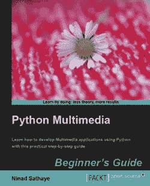

# 书评:Python 多媒体应用初学者指南

> 原文：<https://www.blog.pythonlibrary.org/2010/10/06/book-review-python-multimedia-application-beginners-guide/>

|  | 

### Python 多媒体应用初学者指南

作者 Ninad Sathaye**[亚马逊](http://www.amazon.com/gp/product/1849510164?ie=UTF8&tag=thmovsthpy-20&linkCode=as2&camp=1789&creative=390957&creativeASIN=1849510164)**[打包](http://www.packtpub.com/python-multimedia-application-beginner%27s-guide/book?utm_source=blog.pythonlibrary.org&utm_medium=bookrev&utm_content=blog&utm_campaign=mdb_004782) |

我从 Packt 出版社收到了这本书的电子书格式的书评。我喜欢免费的书，但我不会让这影响我对这本书是否值得你花血汗钱的判断。Packt Publishing 出版了比其他任何出版商更多的小众 Python 书籍，我认为这很酷。不幸的是，他们在出版之前似乎没有花足够的时间润色书籍，所以他们的书往往会被击中或错过。比如他们的 [Python 3 书](https://www.blog.pythonlibrary.org/2010/08/22/book-review-python-3-object-oriented-programming/)就相当不错。唉，这个更倾向于平庸。

别误会我的意思。这本书的内容启发了我去写这本书所涵盖的一些主题，所以它并不都是平庸的。问题主要在于作者的母语显然不是英语，以及 Packt 的编辑过程没有将“非英语”的散文平滑到有时读起来很痛苦的程度。这里有几个例子:

*   一个简单的 PyGame 应用程序，在表面(窗口)画了一个圆。
    右边的图像是在箭头键(第 17 页)的帮助下移动圆的位置
    后拍摄的截图
*   如果指定了 4 元组框，则要粘贴的图像的大小必须与区域的大小相同。(第 40 页)

这是一个 Packt 编辑错误:

*   box 参数可以是 4 元组错误:未找到引用源或 2 元组。

哎哟...他们在这篇文章中做了两次奇怪的查找和替换错误。

无论如何，我真的不想太多抨击这本书。写书很难(一直写博客也很难！).批评很容易。让我们来看看这本书的八个章节涵盖了什么:

*   第一章——Python 和多媒体:介绍你可以用来播放和编辑音乐、视频和图像文件的各种模块
*   第 2 章——使用图像:Python 图像库(PIL)的快速浏览，展示了如何调整图像的大小、旋转和翻转等
*   第三章-增强图像:更多涉及 PIL 的配方，如如何调整图像的亮度和对比度，交换颜色，混合照片，平滑效果，锐化，模糊，边缘锐化，浮雕等
*   第 4 章-动画的乐趣:皮格莱特 2D 动画介绍
*   第 5 章——处理音频:本章向您展示了如何在 Python 2.6 中使用 GStreamer 来播放音频、在不同格式之间转换音频、录制音频等等。这一章还反复使用“音频”这个词，比如“播放音频”、“提取音频”等等。
*   第 6 章——音频控制和效果:更多的 GStreamer 技巧和窍门，比如如何给你的音频文件添加回声和淡入淡出，混合音频文件和添加一些可视化效果
*   第 7 章——处理视频:如何使用 Python 2.6 + GStreamer 处理视频
*   第 8 章——使用 QT Phonon 的基于 GUI 的媒体播放器:使用 PyQt GUI 框架创建一个媒体播放器

我认为这本书最令人沮丧的部分是第 5-7 章。出于某种原因，GStreamer 的最新 Python 绑定只适用于 Python 2.6！书中的安装说明和书中提供的链接有些混乱，所以我没有尝试。我确实找到了一些 2.4 和 2.5 版本的 GStreamer 绑定，但它们是针对 GStreamer 的一个旧版本的。最新的 GStreamer 版本没有任何绑定(至少，我找不到它们)。因此，虽然这些章节很有用，但是如果你使用的是最前沿的 Python 或者需要使用旧版本，那你就完了。

我没能把最后一章读完，所以我对此没有任何评论。

PIL 分会是我最喜欢的，我计划用它们来做我自己的项目。皮格莱特这一章再次启发了我，让我重新审视这个框架...但我还没那么做。我怀疑 PyQt 声子章在技术层面上会很有趣。

到这个时候，你可能在想:结论是什么？我认为你应该试着找一个免费的章节或者在书店找到这本书，在你买之前读一读。毕竟标价几乎是 45 美元，所以明智地使用你的钱。

更新(2010 年 10 月 15 日)-这里有一个[链接](https://www.blog.pythonlibrary.org/2010/10/15/the-wxpython-demo/)到第二章，使用图像