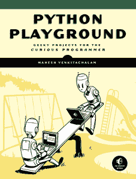

# 书评:Python Playground——好奇的程序员的极客项目

> 原文：<https://www.blog.pythonlibrary.org/2015/12/11/book-review-python-playground-geeky-projects-for-the-curious-programmer/>

没有淀粉出版社最近发给我一本由 Mahesh Venkitachalam 撰写的名为*Python Playground:Geeky Projects for the Curious Programmer*的书，供我评论。我通常不会从那家出版商那里买书，所以我不知道该期待什么，但这本书相当不错。但我不会在这里提供任何剧透，因为我们有一个快速审查要做！

* * *

### 快速回顾

*   **我为什么拿起它:**我是免费得到的，但是书上的描述让我也想得到它。
*   我完成它的原因:它写得很好，项目也很有趣。
*   **我会把它给:**一个程序员，他也是一个数学呆子，或者只是想要一个新的有趣的项目的想法。

* * *

### 图书格式

你可以得到一个电子书(PDF、EPUB 或 MOBI)版本或一个软封面。

* * *

### 书籍内容

这本书分为 5 个部分，14 章+ 3 个附录，330 页。

* * *

### 全面审查

Python Playground 是一本非常有趣的书。它有很多有趣的小项目可以学习。写作很吸引人，代码大部分时间都很容易理解。你可能会从这本书得到最多，因为你碰巧喜欢数学，因为很多项目使用 numpy 和各种方程或算法来使它们工作。换句话说，这不是一本初学者的书。让我们复习一下这本书涵盖的内容。

第一部分只有两章，但它们被认为是对未来的热身。第一章从学习如何解析 iTunes 播放列表开始。我忘记了 Python 内置了自己的 plist 解析器库，所以学习起来很有趣。在第二章，我们学习如何使用 Python 的 turtle 库来创建肺活量图。我认为这一章很有趣，尽管这个例子在我的双显示器系统上表现得有点奇怪。这个想法非常酷，非常值得学习。

第三章以康威的人生游戏开始了第二部分。基本上你在创造一个基本的生活模拟器。接下来是第四章，我们学习如何用卡普勒斯-斯特朗算法创造音乐泛音。在本章中，您将使用 numpy、matplotlib 和 pygame。作者很好地解释了算法是如何工作的，所以你不应该迷路(或者不会迷路)。第五章以另一个模拟器结束了第二部分。在这个游戏中，我们学习如何使用所谓的 *Boids* 模型来模拟一群鸟。我发现这一章非常有趣。

第三部分是关于处理图像的。因此，在第六章中，我们学习了如何使用 Python 从一个常规图像创建 ASCII 艺术。这真是有趣的一章。看到它是如何工作的真的很有趣。然后在第七章中，我们学习如何创建照片拼版，也就是你拍摄数百张不同的照片来重新创建另一张照片。这里可以看到几个例子[。本节的最后一章讨论了如何创建自动立体图。我不像前两章那样喜欢这一章的唯一原因是我很难看到自动立体图中隐藏的 3D 图像，所以你的里程可能会随着这一章而变化。](https://en.wikipedia.org/wiki/Photographic_mosaic)

在第四部分，我们学习 3D。所以在第九章中，我们学习如何用 Python 中的 OpenGL 绘制 3D 物体。第十章深入探讨了粒子系统，这是用于动画火，烟和头发。本章在最后一章的基础上继续使用 PyOpenGL 和 numpy。在第十一章中，我们将学习如何使用 Python 进行体绘制。想象一下显示 3D 体积横截面的 2D 图像(即 MRI 或 CT 扫描做到这一点)。本章还使用 PyOpenGL 和 numpy。

最后，我们到了第五部分，它涵盖了硬件黑客。第十二章向我们介绍了 Arduino 以及使用 Python 与 Arduino 交互的基础知识。在第十三章中，你将使用 Arduino 和 Python 创建一个“激光音频显示器”。本书的最后一章详细介绍了如何使用 Python 创建基于 raspberry-pi 的天气监视器。

这本书的最后一部分是三个附录。附录 A 只是讲了 Python 的安装步骤和书中用到的各种包。附录 B 介绍了实用电子学的基础知识(术语、元件、工具等)。最后，附录 C 是树莓 Pi 提示和技巧。

总的来说，我很喜欢这本书。数学有时可能有点难以理解，但作者很擅长解释它的作用和原因，所以我通常不会因此而陷入困境。这些项目都非常有趣，我总是很好奇作者将如何使用 Python 来创造奇迹。我很乐意把这本书推荐给那些想找点不一样的东西来读的人，但是我也必须警告他们，作者不会指导他们学习 Python。如果你想学 Python，还有很多其他的书可以去看看。这本书是为那些已经学习了 Python 并且想要了解 Python 的能力的人或者那些需要让他们的创造力流动起来的人准备的。

|  | 

### python Playground——好奇的程序员的极客项目

马赫什·文基塔查拉姆**[亚马逊](http://www.amazon.com/gp/product/1593276044/ref=as_li_tl?ie=UTF8&camp=1789&creative=390957&creativeASIN=1593276044&linkCode=as2&tag=thmovsthpy-20&linkId=MULGHOFF6ATZTVVU)**

**[无淀粉出版社](https://www.nostarch.com/pythonplayground)** |

* * *

### 其他书评

*   [中级蟒蛇皮](https://www.blog.pythonlibrary.org/2015/09/02/ebook-review-intermediate-python/)作者:Muhammad Yasoob Ullah Khalid
*   L. Felipe Martins 著
*   达斯丁·菲利普斯用 Kivy 语言创建应用程序
*   Roberto Ulloa 的 Python 交互式应用
*   Ron DuPlain 开发的
*   弗莱彻·海斯勒的《真正的蟒蛇》
*   达斯丁·菲利普斯的 Python 3 面向对象编程