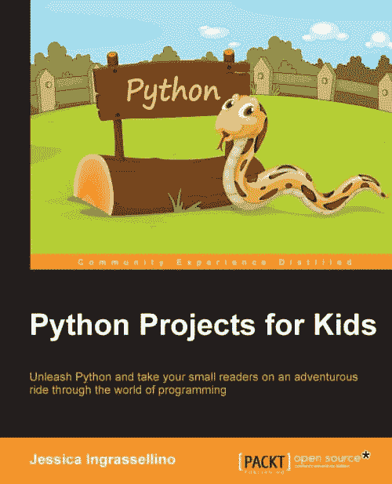

# 书评:面向儿童的 Python 项目

> 原文：<https://www.blog.pythonlibrary.org/2016/06/24/book-review-python-projects-for-kids/>

出版商不时要求我对书籍进行评论。上个月，Packt 问我是否愿意评论他们的书，Jessica Ingrassellino 的《Python 儿童项目》。坦白地说，我倾向于避免现在开始读 Python 书籍，因为它们往往非常相似，但我认为这本书可能会很有趣。

* * *

### 快速回顾

*   **我选择它的原因:**在这种情况下，因为 Packt Publishing 要求我这样做
*   我完成它的原因:主要是因为包装公司的人缠着我这样做
*   我想给:不太确定。有更好、更深入的 Python 初学者书籍

* * *

### 图书格式

你可以得到一个电子书(PDF、EPUB 或 MOBI)版本或一个软封面。

* * *

### 书籍内容

这本书只有 10 章，长达 193 页。

* * *

### 全面审查

首先，我并没有真正读完这本书里的每一个字。我称之为略读复习法。就我个人而言，我更喜欢以自己的节奏阅读一本书，并相应地进行评论，然而我被反复要求完成这篇评论，所以这就是你所得到的。我的第一印象是，这本书将通过创建迷你游戏来教年轻人如何用 Python 编程。然而直到第五章我们才真正进入游戏。直到第八章我们才了解到 pygame。在我真正深入研究之前，让我们先看一下每一章，看看它们是关于什么的

第一章是对 Python 是什么以及如何安装它的基本介绍。作者选择用 Python 2.7 而不是 Python 3 来写这本书。本章的其余部分是关于创建一个“Hello World”应用程序和一个工作文件夹。

第二章是关于变量和函数。这一章非常简短，但我认为它已经足够好地涵盖了主题。它所做的最大的事情是向读者解释如何创建一个函数并将其保存到一个文件中。

在第三章中，我们实际上要创建一个计算器。它只是基于文本的，并不真正处理用户的错误输入。事实上，这本书的一大缺点是它根本没有谈到异常处理。我对这一章也有几个问题。我认为第 34 页显示的是错误的截图，因为附带的文字是关于从一种类型到另一种类型的转换，而截图没有显示任何类型的转换。另一个问题是，在第 41 页，文本声明您可以按照书中所写的运行脚本。然而，我在实际调用任何函数的代码中看不到任何东西，所以如果您运行这段代码，您将不会在终端上得到任何输出。

第四章是关于条件语句和循环的。本章的目的是增强你在前一章中编写的计算器应用程序，使它一直运行，直到用户要求它退出。

在第五章，我们学习如何为我们的游戏创建简单和困难的水平。这个游戏就是“更高或更低”的游戏。您将了解什么是布尔值，如何导入库，以及全局变量。

第六章深入到 Python 的一些更有趣的数据类型，列表和字典。本章的前提是教读者如何存储数据。虽然我同意列表和字典是一种好的格式，但我想知道在这里学习 pickle、json 或 yaml 是否也有好处。诚然，我不认为这本书谈到了文件 I/O，所以那些主题可能被认为超出了范围。

对于第七章，读者学习如何创建一个两人游戏，作者称之为“你的背包里有什么？”本章帮助读者设计一个可以记分、重新开始游戏或停止游戏的游戏。您还将学习如何创建一个球员档案，这是一个字典格式。对我来说，这似乎是一个使用类的好地方，尤其是如果我们将在下一章使用 pygame，但是我意识到目标受众应该是孩子。无论如何，你也可以在虚拟背包中添加物品，这对于学习作者的实现是一种乐趣。

在第八章中我们最终到达了 pygame，在那里你将学习如何安装 pygame。您还将学习如何设置屏幕大小和颜色，以及创建静止和移动的对象。

第九章在第八章的基础上，教读者如何创建一个网球游戏(如 pong)。它向读者介绍了游戏编程的概念，以及如何在编码之前概述你的项目。这一章实际上在这一点之后被分成四个部分。第一部分基本上创建了你需要的游戏的所有部分。第二部分将教你如何移动球拍，第三部分将教你如何移动球。第四部分是关于如何运行游戏和保持分数。

最后一章鼓励读者继续编码！这篇文章告诉读者从这里该何去何从。例如，它谈到他们将如何需要学习类和对象来促进代码重用。还提到可以用 pygame 添加音乐和图形。然后，它谈到重新设计你的游戏或试图创造你自己的经典游戏版本。最后，它谈到了 Python 的其他用途和库，比如 SciPy、iPython 和 MatPlotLib。

当我第一次听说这本书时，我立即想到了杰森·布里格斯的书， [Python for Kids](http://amzn.to/293Q6Ye) 和桑德的书， [Hello World！:儿童和其他初学者的计算机编程](http://amzn.to/291PDHo)。这两本书都比“面向儿童的 Python 项目”更长，包含的信息也更多。我个人认为，在这三本书中，我会选择桑德的书，因为它最容易让孩子们进入。布里格斯涵盖了更多有趣的话题，但他可能会根据孩子的情况讲得有点快。至于“面向儿童的 Python 项目”，我觉得有太多的项目没有被涵盖(类、异常、许多 Python 数据构造等)。也感觉 pygame 本身并没有真正覆盖。似乎有一个很大的建设，以达到 pygame，然后就没有太多的内容，当我们终于到了那里。

如果我要为孩子们制定学习 Python 的策略，我会从 Sande 开始，然后如果孩子想学习游戏，我会继续阅读 Sweigart 关于用 Python 创作游戏的书籍([用 Python 发明你自己的电脑游戏](http://amzn.to/28RS7pa)和[用 Python 制作游戏& Pygame](http://amzn.to/293SL46) )。然后我可能会转向其他东西，比如《我的世界》的 Python 书籍。

至于这本书，我只是不知道它适合放在哪里。我认为它写得很好，但需要一些额外的润色才能登上榜首。

|  | 

### 面向儿童的 Python 项目

杰西卡·英格拉塞利诺**[亚马逊](http://amzn.to/28U274x)** |

* * *

### 其他书评

*   Erik Westra 的 Python 模块编程
*   [Python Playground——好奇的程序员的极客项目](https://www.blog.pythonlibrary.org/2015/12/11/book-review-python-playground-geeky-projects-for-the-curious-programmer/)Mahesh Venkitachalam 著
*   L. Felipe Martins 著
*   达斯丁·菲利普斯用 Kivy 语言创建应用程序
*   Roberto Ulloa 的 Python 交互式应用
*   Ron DuPlain 开发的
*   弗莱彻·海斯勒的《真正的蟒蛇》
*   达斯丁·菲利普斯的 Python 3 面向对象编程