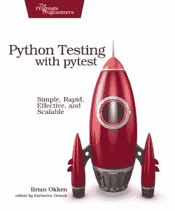

# 书评:用 pytest 测试 Python

> 原文：<https://www.blog.pythonlibrary.org/2017/11/14/book-review-python-testing-with-pytest/>

几个月前，Brian Okken 问我是否有兴趣阅读他的书《用 pytest 进行 Python 测试》。我有兴趣了解更多关于 pytest 包的信息已经有一段时间了，所以我同意看一看。我也喜欢出版商是务实的程序员，这一点我在过去有过很好的体验。我们将从快速回顾开始，然后深入到具体操作中。

* * *

### 快速回顾

*   我为什么拿起它:这本书的作者请我读他的书
*   我为什么要完成它:我主要是浏览了一下这本书，看看它是怎么写的，并检查一下例子
*   **我想把它给:**任何对 Python 测试感兴趣的人，尤其是对 pytest 包感兴趣的人

* * *

### 图书格式

你可以通过 practical Programming 的网站获得这种物理软封面、亚马逊上的 Kindle 或其他各种电子书格式。

* * *

### 书籍内容

这本书有 7 章，5 个附录，长达 222 页。

* * *

### 全面审查

这本书直接从第一章的一个例子开始。实际上，我发现这有点不和谐，因为通常每一章的开头都有一个介绍，说明这一章的内容。但是第一章只是用一个 Python 测试的例子来说明。不是不好，只是不一样。本章解释了如何开始使用 pytest，并介绍了一些可以传递给 pytest 的常见命令行选项。

第二章介绍如何用 pytest 编写测试函数。它还讨论了 pytest 如何使用 Python 的 **assert** 关键字，而不是像 Python 的 **unittest** 库那样使用 assert 方法。我发现这是 pytest 的一个吸引人的特性。您还将学习如何跳过测试，如何标记我们预计会失败的测试，以及其他一些事情。

如果你想知道 pytest 中的 fixtures，那么你会很兴奋地知道这本书有两章是关于这个主题的；特别是第三章和第四章。这些章节涵盖了大量的材料，所以我将只提到重点。您将了解如何为安装和拆卸创建夹具，如何跟踪夹具执行、夹具范围、参数化夹具和内置夹具。

第五章是关于如何给 pytest 添加插件。您还将学习如何编写自己的插件，如何安装插件以及如何测试插件。在本章中，您还将获得如何使用 *conftest.py* 的良好基础。

在第六章中，我们学习了所有关于配置 pytest 的知识。本章涵盖的主要主题涉及 pytest.ini、conftest.py 和 __init__。py 以及您可能使用 setup.cfg 做什么。这一章还有很多有趣的话题，比如注册标记或改变测试发现位置。我鼓励你看一下这本书的目录来了解更多！

最后，在第 7 章(最后一章)，我们将学习 pytest 与其他测试工具的结合使用。在这种情况下，该书涵盖了、pdb、coverage.py、mock、tox、Jenkins 甚至 unittest。

这本书的其余部分由五个附录和一个索引组成。附录包括虚拟环境、pip、插件采样器、打包/分发 Python 项目和 xUnit 设备。

我认为这本书写得很好，很好地抓住了主题。这些例子简明扼要。当我想在自己的代码中使用 pytest 包时，我期待着更深入地阅读这本书。我会向任何对 pytest 软件包感兴趣的人推荐这本书。

|  | 

### 用 pytest 进行 Python 测试

布莱恩 okken**[亚马逊](http://amzn.to/2i9EGHq)，[图书网站](http://pythontesting.net/books/pytest/)，** |

* * *

### 其他书评

*   Erik Westra 的 Python 模块编程
*   [Python Playground——好奇的程序员的极客项目](https://www.blog.pythonlibrary.org/2015/12/11/book-review-python-playground-geeky-projects-for-the-curious-programmer/)Mahesh Venkitachalam 著
*   L. Felipe Martins 著
*   达斯丁·菲利普斯用 Kivy 语言创建应用程序
*   Roberto Ulloa 的 Python 交互式应用
*   Ron DuPlain 开发的
*   弗莱彻·海斯勒的《真正的蟒蛇》
*   达斯丁·菲利普斯的 Python 3 面向对象编程