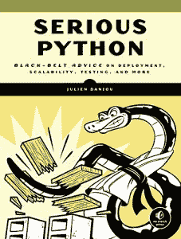

# 书评:严肃的 Python

> 原文：<https://www.blog.pythonlibrary.org/2019/03/06/book-review-serious-python/>

没有淀粉出版社要求我对他们即将出版的一本书做一个技术评论，这本书是 Julien Danjou 去年写的**严肃的 Python:关于部署、可伸缩性、测试等的黑带建议。我以前从未使用过淀粉，但我决定尝试一下，看看它们与 Packt Publishing 有什么不同。我最终喜欢上了他们的过程，这本书读起来也很有趣。需要说明的是，无淀粉没有请我做书评。他们只是想让我在这本书出版前为他们做一个技术审查。**

我写这篇评论是因为我认为这本书应该得到更多的关注。另外，几年前我采访了它的作者，所以你可能也想看看。

* * *

### 快速回顾

*   **我为什么拿起它:**最初，出版商让我做一个技术审查
*   我为什么要完成它:这本书涵盖了中级水平的材料，有着引人入胜的写作风格
*   **我想把它给:**希望超越仅仅了解 Python 语法的初学者

* * *

### 图书格式

你可以得到这本书的平装本、PDF、Mobi 或 ePub。

* * *

### 书籍内容

这本书包含 13 章，共 240 页。这本书涵盖了 Python 2 和 3。

* * *

### 全面审查

《认真的 Python》是一本有趣的书。让我们从第一章开始，这是关于开始你的项目。这一章涵盖了布局你的代码项目的注意事项。您将了解版本编号和自动检查。每章都以采访 Python 社区中的某个人结束。第一章采访了约书亚·哈洛。

第 2 章深入探讨了模块、库和框架。在这里，您可以大致了解 Python 的导入系统是如何工作的。作者花了几页列出了有用的标准库，也谈到了使用外部库。他甚至提到了从外部资源下载时的安全实践，您将了解到 pip。

对于第 3 章，您将学习如何用 Sphinx 编写好的文档和 API。本章几乎只关注 Sphinx 框架，这是 Python 团队用来记录 Python 本身的。您将在这里学习 Sphinx 模块和编写自己的 Sphinx 扩展。

第 4 章的主题是时间戳和时区。您将学习如何使用 Python 的 datetime 库以及超级酷的 dateutil 模块，它是 Python 的一个外部模块。作者还花了一些时间讨论序列化 datetime 对象和解决不明确的时间。

在第五章中，分发软件的主题是最重要的。在这里，您将了解如何使用 **setup.py** 、 **setup.cfg** 和滚轮格式。您还将发现入口点是如何工作的！

在第 6 章中，你将深入研究 Python 的**单元测试**模块的单元测试。Julien 讨论了常规的单元测试以及模拟，然后深入讨论了如何使用 tox 自动化项目。

如果你对装饰器、静态方法或类方法感兴趣，那么第 7 章适合你。整个章节都致力于这些类型的代码构造，并且还谈到了抽象方法！

在第八章中，Julien 向读者讲述了 Python 对于函数式编程是多么有用。他专注于生成器、列表理解和 Python 的内置，比如 map()、filter()和 enumerate()等等。

抽象语法树是第九章的主题。您将学习如何使用 AST 和 Hy 编写程序，Hy 是嵌入在 Python 中的 Lisp 的一种方言。你可以在这里了解更多关于这个项目的信息。还有一节是关于用 AST 扩展 [flake8](http://flake8.pycqa.org/en/latest/) 的。

对于第 10 章，你将学习性能和优化。这里作者使用 Python 的 **cProfile** 和 **dis** 模块来理解你的程序的行为。本章的其余部分涵盖了各种优化技术，如使用内存化、PyPy、缓冲区等。

在第 11 章中，你将学习到伸缩和架构。在我看来，这一章的标题有点晦涩，因为实际的主题是并发性。在这里，您将了解 Python 线程、流程和 asyncio。他也谈了一点关于 ZeroMQ 的内容。

如果你碰巧对学习 Python 如何处理关系数据库感兴趣，那么你会想看看第 12 章。在这里，作者讨论了各种数据库后端，并展示了一个结合 PostgreSQL 使用 Flask 的例子。

最后，在第 13 章中，Julien 介绍了如何使用六个模块来支持为 Python 2 和 3 编写代码。他还在这一章中介绍了单个调度和上下文管理器，然后通过讨论 [attrs 包](http://www.attrs.org/en/stable/)结束了这一章。

虽然其中涉及的一些主题看起来很明显，但实际上我并没有看到很多作者或博客经常谈论它们。例如，我只在极少数情况下听说过伸缩，甚至并发文章也不经常出现。我能想到的唯一真正的错误是，我可能把这些章节的顺序安排得与它们结束的方式略有不同。我会给这本书一个机会，看看它，如果你想了解更多关于上述任何主题！

|  | 

### 严肃的 Python:关于部署、可伸缩性、测试等的黑带建议

朱利安·丹茹**[亚马逊](https://amzn.to/2ERKUs7)，[无淀粉](https://nostarch.com/seriouspython)** ，原创正经 Python [网站](https://serious-python.com/) |

* * *

### 其他书评

*   Brian Okken 的 pytestPython 测试
*   Erik Westra 的 Python 模块编程
*   [Python Playground——好奇的程序员的极客项目](https://www.blog.pythonlibrary.org/2015/12/11/book-review-python-playground-geeky-projects-for-the-curious-programmer/)Mahesh Venkitachalam 著
*   L. Felipe Martins 著
*   达斯丁·菲利普斯用 Kivy 语言创建应用程序
*   Roberto Ulloa 的 Python 交互式应用
*   Ron DuPlain 开发的
*   弗莱彻·海斯勒的《真正的蟒蛇》