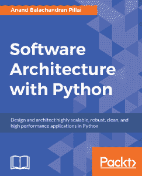

# 书评:使用 Python 的软件架构

> 原文：<https://www.blog.pythonlibrary.org/2017/06/22/book-review-software-architecture-with-python/>

Packt Publishing 找到我，让我担任 Anand Balachandran Pillai 所著的《使用 Python 的软件架构》一书的技术评论员。这听起来很有趣，所以我最终为 Packt 做了评论。他们最终在 2017 年 4 月发布了这本书。

* * *

### 快速回顾

*   我选择它的原因:帕克特出版社让我对这本书做一个技术审查
*   我为什么要完成它:坦白地说，因为这是一本涵盖广泛主题的好书
*   **我想把它给:**一个正在学习如何组装一个基于 Python 的大型项目或应用程序的人

* * *

### 图书格式

你可以通过 Packt Publishing 的网站获得这本书的物理软封面、亚马逊上的 Kindle 或其他各种电子书格式。

* * *

### 书籍内容

这本书有 10 章，长达 556 页。

* * *

### 全面审查

这本书的重点是教育读者如何用 Python 设计和构建一个高度可伸缩的、健壮的应用程序。第一章首先回顾了作者关于“软件架构原则”的观点以及它们是什么。这一章没有任何代码示例。它基本上都是理论，并基本上建立了本书其余部分将涵盖的内容。

第二章是关于编写易于修改的可读代码。它教授了一些编写可读代码的技巧，并涉及了关于文档、PEP8、重构等方面的建议。它还教授编写可修改代码的基础知识。本章演示的一些技术包括抽象公共服务、使用继承和后期绑定。它还讨论了代码气味的主题。

第三章差不多有 50 页，重点是编写可测试的代码。虽然你不可能只用一章来教授测试，但它确实谈到了诸如单元测试、使用 nose2 和 py.test、代码覆盖率、模仿和文档测试之类的东西。还有一个关于测试驱动开发的部分。

在第四章中，我们学习如何从代码中获得良好的性能。本章是关于 Python 中的计时代码、代码剖析和高性能容器。它涵盖了相当多的模块/包，如 cProfile、line profiler、memory profiler、objgraph 和 Pympler。

对于第五章，我们深入探讨编写可伸缩的应用程序的主题。本章有一些很好的例子，并讨论了并发性、并行性、多线程与多处理以及 Python 新的 asyncio 模块之间的区别。它还讨论了全局解释器锁(GIL)以及它在某些情况下如何影响 Python 的性能。最后，读者将了解 web 的伸缩和队列的使用，比如 Celery。

如果你碰巧对 Python 中的安全性感兴趣，那么第 6 章适合你。它涵盖了软件中各种类型的安全漏洞，然后讨论了作者所认为的 Python 本身的安全问题。它还讨论了帮助开发人员编写安全代码的各种编码策略。

第七章深入探讨了设计模式的主题，长达 70 多页。您将了解到诸如单例、工厂、原型、适配器、门面、代理、迭代器、观察者和状态模式之类的东西。这一章很好地给出了设计模式的概述，但是我认为一本每一种设计模式都有一章的书将会非常有趣，并且真正有助于把重点放在家里。

继续，我们到了第 8 章，它谈到了“架构模式”。在这里，我们学习模型视图控制器(MVC)，它在 web 编程领域非常流行。我们还学习了一些使用 twisted、eventlet、greenlet 和 Gevent 的事件驱动编程。当我想到事件驱动编程时，我通常会想到使用 PyQt 或 wxPython 之类的用户界面，但无论哪种方式，概念都是相同的。本章还有一节是关于微服务的。

第九章的重点是部署你的 Python 应用程序。在这里，您将了解如何使用 pip、virtualenv、PyPI 和 PyPA。在本章中，你还会学到一些关于织物和 Ansible 的知识。

最后一章介绍了调试应用程序的技术。他从基本的打印语句开始，然后使用模拟和日志模块。他还谈到了使用 pdb 和类似的工具，如 iPdb 和 pdb++。本章还包括跟踪模块、lptrace 包和 strace 包。

这本书与你通常的 Python 书籍有一点不同，因为它不是真正针对初学者的。相反，我们有拥有近 20 年经验的专业软件开发人员来概述他在大公司创建自己的应用程序时使用的一些技术。虽然这里和那里有一些小的语法问题，但总的来说，我觉得这是一本非常有趣的书。我这么说并不是因为我是这本书的技术评论家。我已经批评了一些我过去作为技术评论家的书。这本书实际上非常好，我想把它推荐给任何想学习更多真实世界软件开发的人。对于想学习并发性或设计模式的人来说，这也是一个好消息。

|  | 

### 使用 Python 的软件架构

阿南德·巴拉钱德朗·皮莱**[亚马逊](http://amzn.to/2tbgE3s)， [Packt 出版](https://www.packtpub.com/application-development/software-architecture-python)，** |

* * *

### 其他书评

*   Erik Westra 的 Python 模块编程
*   [Python Playground——好奇的程序员的极客项目](https://www.blog.pythonlibrary.org/2015/12/11/book-review-python-playground-geeky-projects-for-the-curious-programmer/)Mahesh Venkitachalam 著
*   L. Felipe Martins 著
*   达斯丁·菲利普斯用 Kivy 语言创建应用程序
*   Roberto Ulloa 的 Python 交互式应用
*   Ron DuPlain 开发的
*   弗莱彻·海斯勒的《真正的蟒蛇》
*   达斯丁·菲利普斯的 Python 3 面向对象编程