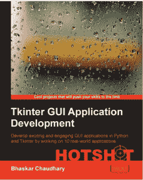

# 书评:Tkinter GUI 应用程序开发高手

> 原文：<https://www.blog.pythonlibrary.org/2013/11/11/book-review-tkinter-gui-application-development-hotshot/>

现有的 Tkinter 书籍并不多，这是我一直觉得有点奇怪的地方，因为它是 Python 中包含的 GUI 工具包。基本上你可以从 2000 年的 Grayson 的 [Python 和 Tkinter 编程](http://www.amazon.com/gp/product/1884777813/ref=as_li_ss_tl?ie=UTF8&camp=1789&creative=390957&creativeASIN=1884777813&linkCode=as2&tag=thmovsthpy-20)或者从 2012 年的 Roseman 的[现代 Tkinter 为忙碌的 Python 开发者准备的](http://www.amazon.com/gp/product/B0071QDNLO/ref=as_li_ss_tl?ie=UTF8&camp=1789&creative=390957&creativeASIN=B0071QDNLO&linkCode=as2&tag=thmovsthpy-20)。如果你感兴趣的话，我在这里回顾了后者。还有其他包含 Tkinter 编程的书籍(如 Core Python 或 Programming Python)，但这些文本不是以 Tkinter 为中心的书籍。这让我们看到了 Bhaskar Chaudhary 在 2013 年发布的 [Tkinter GUI 应用程序开发热点](http://www.amazon.com/gp/product/B00G8YAUX4/ref=as_li_ss_tl?ie=UTF8&camp=1789&creative=390957&creativeASIN=B00G8YAUX4&linkCode=as2&tag=thmovsthpy-20)，这是过去 13 年中关于 Tkinter 的第三本书！今天，你可以看看我对这本有趣的书的评论。

**充分披露:Packt Publishing 让我担任这本书的技术评审，所以在评审过程结束后，我收到了一份免费的副本。**

如果没有太多时间，下面是对你们的快速回顾:

### 快速回顾

*   我选择它的原因:从技术上来说，我没有把它作为帮助编辑这本书的“报酬”，但我会选择它，只是因为 Tkinter 的书很少，而且我发现 GUI 编程是一门迷人的学科。
*   我为什么要读完它:这本书有很多有趣的全功能应用程序，所以我一直读下去，只是想看看作者接下来会想出什么。
*   **我想把它给:**想先进入 GUI 应用程序开发的程序员——这本书有很多没有复杂代码的应用程序的好例子！

### 图书格式

你可以得到这本书的平装本、epub、mobi 或 PDF。

### 书籍内容

这本书被分成项目而不是章节。共有 7 个项目和两个附录。第一个项目基本上是对 Tkinter 的介绍。第二个是创建一个简单的文本编辑器，比如记事本。项目 3 涵盖了一个可编程鼓机。在项目 4 中，您将学习如何创建一个象棋游戏。对于项目 5，您创建一个音频播放应用程序。Project 6 是一个类似于 Paint 的绘图应用程序。最后一个项目章节实际上涵盖了几个迷你项目，从创建一个屏幕保护程序，到建立一个游戏，到绘图和其他几个有趣的活动。

### 全面审查

作为这本书的技术评论者，然后从读者的角度来评论这本书是很困难的。Packt 喜欢雇佣国际程序员来写他们的书，结果往往是喜忧参半。一些书最终变得非常好，而另一些则因为语言上的差距而变得摇摇欲坠或彻底失败。在这种情况下，虽然英语显然不是作者的第一语言，但他总体上做得相当不错。这本书通过例子教读者如何使用 Tkinter。这不是一本针对 Python 初学者的书，但对于 Tkinter 初学者和 Tkinter 中级者来说是一本好书。

我个人非常喜欢学习如何制作各种应用程序和游戏。多样性和创造性是显而易见的，我很惊讶这些节目最终变得如此之短。我想我最喜欢鼓机项目，因为它是如此独特，也因为我是电子音乐的忠实粉丝已经很长时间了。象棋游戏在作者如何构建程序和设置逻辑方面也非常有趣。

即使我不是帮助作者完成这本书的人之一，我相信我也会对我的购买感到满意。这里有太多好主意了。当我阅读这几章的时候，我总是在想我会如何在 wxPython 或 PySide 中尝试这个或那个想法，看看他们会如何比较。因此，如果你正在为你的第一个 GUI 项目寻找一些想法，不管你通常使用哪个工具包，我都会推荐这本书。我也会推荐给任何想学 Tkinter 的人。

|  | 

### Tkinter GUI 应用程序开发热点

巴斯卡尔·乔德里**[亚马逊](http://www.amazon.com/gp/product/B00G8YAUX4/ref=as_li_ss_tl?ie=UTF8&camp=1789&creative=390957&creativeASIN=B00G8YAUX4&linkCode=as2&tag=thmovsthpy-20)**[打包发布](http://www.packtpub.com/tkinter-gui-application-development-hotshot/book) |

### 其他书评

*   Ron DuPlain 开发的
*   弗莱彻·海斯勒的《真正的蟒蛇》
*   马特·哈里森著《踩 Python 第二卷:中级 Python》
*   约翰·罗兰的《快速学习 Python》