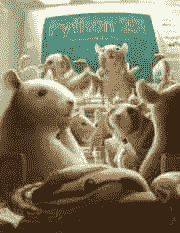
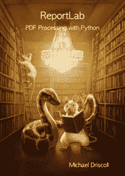

# PyCon 2019 销售的书籍

> 原文：<https://www.blog.pythonlibrary.org/2019/05/01/books-on-sale-for-pycon-2019/>

为了纪念本周开始的 PyCon 2019，我将出售我的三本书。从**5 月 6 日**到 **$9.99** 你可以通过点击链接获得以下任何一本书:

*   [Python 201:中级 Python](http://leanpub.com/python201/c/pycon19)
*   [用 Python 处理 report lab-PDF](http://leanpub.com/reportlab/c/pycon19)
*   [Jupyter 笔记本 101](http://leanpub.com/jupyternotebook101/c/pycon19)

对于那些对学习 Python 中级和高级主题感兴趣的人来说，Python 201 是一本有趣的书。

我的 **ReportLab** 书讲述了如何使用 Python 和 ReportLab 创建 pdf。它还涵盖了许多其他与 pdf 相关的主题，例如分割、合并和叠加 pdf 等。

最后，我的 Jupyter Notebook 101 这本书是你了解 Jupyter 笔记本和它的许多功能的好方法。