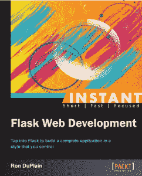

# 竞赛:赢得一份即时烧瓶网络开发

> 原文：<https://www.blog.pythonlibrary.org/2013/11/08/contest-win-a-copy-of-instant-flask-web-development/>

# 这场比赛现在结束了！

Packt Publishing 让我为他们举办一场竞赛，分发他们的新书:Ron DuPlain 的《即时烧瓶网络开发》。它在[亚马逊](http://www.amazon.com/gp/product/1782169628/ref=as_li_ss_tl?ie=UTF8&camp=1789&creative=390957&creativeASIN=1782169628&linkCode=as2&tag=thmovsthpy-20)上受到好评，我计划很快发布这本书的评论。

我有这本书的 3 本电子版要赠送。这里有一些关于这本书内容的信息:

*   使用 virtualenv 管理项目依赖关系
*   了解 Flask 如何提供 URL 路由和 web 请求处理
*   了解 Flask 如何在磁盘上提供静态文件
*   了解如何使用 SQLAlchemy 建模、存储和查询数据
*   呈现 HTML 表单并用 WTForms 验证输入
*   使用一个基本的 Jinja 模板，用 Twitter Bootstrap 构建一个页面布局
*   创建、调用、更新、删除和列出数据库记录
*   在 Jinja 中构建自定义模板过滤器来格式化数据
*   验证用户身份并维护会话

### 如何进入？

你所需要做的就是前往[书的页面](http://www.packtpub.com/flask-web-development/book)，浏览这本书的产品描述，并在这篇文章下面的评论中留言，让我们知道你对这本书最感兴趣的是什么。就这么简单。

获胜者将获得该书的电子版。

### 最后期限

比赛将于 2013 年 11 月 15 日**美国中部时间**下午 12:01 结束。获奖者将通过他们在评论时使用的电子邮件联系！别担心，我是这个博客上唯一能看到你的电子邮件地址的人。