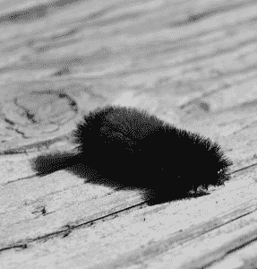
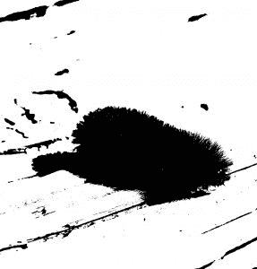
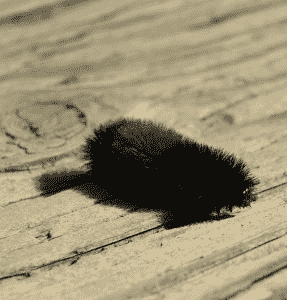

# 用 Python 将照片转换成黑白

> 原文：<https://www.blog.pythonlibrary.org/2017/10/11/convert-a-photo-to-black-and-white-in-python/>

黑白图像并不适合所有人。我个人喜欢和他们一起玩，因为你有时可以拍一张无聊的照片，然后把它变成一些戏剧性的东西。我还拯救了一张单调的照片，把它变成黑白的。如果您想通过编程将自己拍摄的照片转换成黑白照片，枕头套装可以满足您的需求。在这篇文章中，我们将看看两个简单的方法来转换成黑白照片，然后我们也将学习如何制作一张棕褐色调的照片。

* * *

### 让它变成黑色和白色

第一个障碍是找到一张你想编辑的照片。对于这个例子，我们将使用下面的模糊毛虫:


现在我们只需要创建一个简单的函数，可以将我们的彩色照片转换成黑白照片:

```py

from PIL import Image

def black_and_white(input_image_path,
    output_image_path):
   color_image = Image.open(input_image_path)
   bw = color_image.convert('L')
   bw.save(output_image_path)

if __name__ == '__main__':  
    black_and_white('caterpillar.jpg',
        'bw_caterpillar.jpg')

```

上面的函数有两个参数:输入图像的文件路径和我们想要保存输出的路径。在这个脚本中，我们真正关心的是这个函数。它包含一个打开图像的调用，该调用将返回一个**图像**对象。然后，我们使用该对象的**转换**方法，通过向其传递字符串**‘L’**，将图像转换为黑白。这可能看起来有点奇怪，所以让我们看看[文档](https://pillow.readthedocs.io/en/4.3.x/reference/Image.html#PIL.Image.Image.convert)。

这里您会发现 convert()方法的第一个参数是模式。枕头支持多种模式，包括:“P”、“L”和“1”。我们目前关心的模式是‘L’。文档说明*“当将彩色图像转换为黑白图像时(模式 L ),库使用 ITU-R 601-2 亮度变换:L = R * 299/1000+G * 587/1000+B * 114/1000”*其中 RGB 映射为红色、绿色和蓝色。让我们看看我们的代码生成了什么样的输出:



如果我自己这么说，那看起来很不错。Pillow 项目还支持创建带有抖动的黑白图像，这基本上是给图像添加噪声。让我们看看这是如何改变代码的:

```py

from PIL import Image

def black_and_white_dithering(input_image_path,
    output_image_path,
    dithering=True):
    color_image = Image.open(input_image_path)
    if dithering:
        bw = color_image.convert('1')  
    else:
        bw = color_image.convert('1', dither=Image.NONE)
    bw.save(output_image_path)

if __name__ == '__main__':
    black_and_white_dithering(
        'caterpillar.jpg',
        'bw_caterpillar_dithering.jpg')

```

这个函数与前一个函数的唯一区别是，我们添加了一个**抖动**参数，并且我们还使用“1”(one)而不是“L”来调用 convert()方法。你可以用“L”模式做抖动，但是我想展示一下当你用“1”时会发生什么。让我们来看看输出:


当你有完整尺寸的图像时，这张看起来很不一样，因为你可以更容易地看到白噪音。然而，由于我在这里使用的是一个小版本，变化是相当微妙的。

现在让我们调用抖动设置为 **False** 的函数。如果这样做，您将看到下图:



这个看起来有点抽象，但也有点意思。这几乎是一个墨迹！正如你所看到的，在创建黑白图像时，“L”可能是你想要关注的模式。

* * *

### 创建棕褐色调图像

既然我们已经学会了如何使我们的图像黑白化，我想谈谈如何给你的图像添加棕褐色调色。深褐色调的图像非常受欢迎，让你的图像看起来像老式的黄色。我在网上搜索了一下，在 Fredrik Lundh 的[网站](http://effbot.org/zone/pil-sepia.htm)上找到了一篇关于如何做到这一点的文章。

让我们看一下代码:

```py

from PIL import Image

def make_sepia_palette(color):
    palette = []
    r, g, b = color
    for i in range(255):
        palette.extend((r*i/255, g*i/255, b*i/255))

    return palette

def create_sepia(input_image_path,
    output_image_path):
    whitish = (255, 240, 192)
    sepia = make_sepia_palette(whitish)

    color_image = Image.open(input_image_path)

    # convert our image to gray scale
    bw = color_image.convert('L')

    # add the sepia toning
    bw.putpalette(sepia)

    # convert to RGB for easier saving
    sepia_image = bw.convert('RGB')

    sepia_image.save(output_image_path)

if __name__ == '__main__':
    create_sepia('caterpillar.jpg',
                 'sepia_caterpillar.jpg')

```

这里我们创建了两个函数。一个用于创建棕褐色调色板，另一个用于应用它。为了创建调色板，我们需要创建一个灰白色，所以我们通过迭代一个灰白色的元组，然后迭代 RGB 色谱的所有 255 种变化来实现。这就创建了一个大小合适的代表棕褐色调色板的各种 RGB 值的元组。

接下来，我们将图像转换成黑白(或者灰度，取决于你怎么看)。然后我们使用 image 对象的 **putpalette()** 方法应用我们的棕褐色调色板。最后，我们将图像转换回“RGB ”,根据 Lundh 的说法，这允许我们将图像保存为 Jpeg。我没有做任何挖掘，看看这是否仍然需要在枕头或没有。最后，我们保存图像，这是我得到的:



相当整洁，代码运行速度也相当快！

* * *

### 包扎

现在你知道如何使用枕头包来创建黑白照片的几种变化。您还发现了将调色板应用到黑白图像来添加棕褐色色调是多么容易。你可以尝试其他颜色，让你的黑白照片看起来有很大的变化。开心快乐编码！

* * *

### 相关阅读

*   [PIL 和棕褐色](http://effbot.org/zone/pil-sepia.htm)
*   自动化无聊的东西的[章](https://automatetheboringstuff.com/chapter17/)
*   [如何用 Python 旋转/镜像照片](https://www.blog.pythonlibrary.org/2017/10/05/how-to-rotate-mirror-photos-with-python/)
*   [如何用 Python 裁剪照片](https://www.blog.pythonlibrary.org/2017/10/03/how-to-crop-a-photo-with-python/)