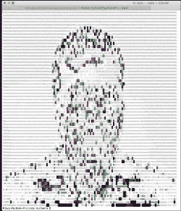

# 用 Python 将图像转换成 ASCII 码

> 原文：<https://www.blog.pythonlibrary.org/2021/05/11/converting-an-image-to-ascii-with-python/>

有很多有趣的 Python 片段可以用来将你的照片转换成 ASCII 艺术。Anthony Shaw 是 Real Python 的作者和撰稿人，他在 GitHub 上有自己的片段。这些小程序大多使用[枕包](https://pillow.readthedocs.io/en/stable/)。

这些程序最适合处理简单的图像，尤其是没有背景的图像。Shaw 的程序使用 [ansicolors](https://pypi.org/project/ansicolors/) 包为你的 ASCII 艺术增添一些色彩。

以下是肖的完整计划:

```py
"""
image2ansi.py
usage: image2ansi.py [-h] [--no-color] [--width WIDTH] path
Display an image in ASCII with ANSI colors
positional arguments:
  path           the path to the image file
optional arguments:
  -h, --help     show this help message and exit
  --no-color     no ANSI colors
  --width WIDTH  output width in characters (Default 120)
Features:
 - Converts ALPHA channel to whitespace (transparency)
 - Uses a sharpness filter to improve the output
Requires:
 - Python 3
 - Pillow 
 - ansicolors

Install:
 - pip3 install pillow ansicolors
"""

import argparse
from PIL import Image, ImageEnhance

from colors import color

def render(image_file, width=120, height_scale=0.55, colorize=True):
    img = Image.open(image_file)

    org_width, orig_height = img.size
    aspect_ratio = orig_height / org_width
    new_height = aspect_ratio * width * height_scale
    img = img.resize((width, int(new_height)))
    img = img.convert('RGBA')
    img = ImageEnhance.Sharpness(img).enhance(2.0)
    pixels = img.getdata()

    def mapto(r, g, b, alpha):
        if alpha == 0.:
            return ' '
        chars = ["B", "S", "#", "&", "@", "$", "%", "*", "!", ".", " "]
        pixel = (r * 19595 + g * 38470 + b * 7471 + 0x8000) >> 16
        if colorize:
            return color(chars[pixel // 25], (r, g, b))
        else:
            return chars[pixel // 25]

    new_pixels = [mapto(r, g, b, alpha) for r, g, b, alpha in pixels]
    new_pixels_count = len(new_pixels)
    ascii_image = [''.join(new_pixels[index:index + width]) for index in range(0, new_pixels_count, width)]
    ascii_image = "\n".join(ascii_image)
    return ascii_image

if __name__ == "__main__":
    parser = argparse.ArgumentParser(description='Display an image in ASCII with ANSI colors')

    parser.add_argument('path',
                       metavar='path',
                       type=str,
                       help='the path to the image file ')
    parser.add_argument('--no-color',
                       action='store_true',
                       help='no ANSI colors')
    parser.add_argument('--width',
                       action='store',
                       type=int,
                       default=120,
                       help='output width in characters (Default 120)')
    parser.add_argument('--height-scale',
                        action='store',
                        default=.55,
                        type=float,
                        help='scale ratio for height (default .55')
    args = parser.parse_args()
    print(render(
        args.path, 
        args.width, 
        height_scale=args.height_scale,
        colorize=not args.no_color))

```

你可以在你拥有的任何图像上使用这个程序。要了解如何使用该程序，您可以使用本文作者的这张照片:


迈克尔·德里斯科尔

要运行该程序，您需要打开一个终端并更改目录，直到您进入保存该程序的同一文件夹。然后，您将运行以下命令:

```py
python3 image2ansi.py my_photo.jpg
```

当您对上图运行这个程序时，您将得到以下输出:



您可以看到，转换删除了图像的许多细节，这是意料之中的。

现在让我们用一个更简单的图像来试试这个程序，比如企鹅 Tux:


当您对此映像运行 **image2ansi.py** 时，您的输出将如下所示:

与之前的转换相比，这次转换看起来更像原始图像。

像 **image2ansi.py** 这样的程序玩起来很有趣。去试试吧，或者看看你能不能想出一个更好的。开心快乐编码！