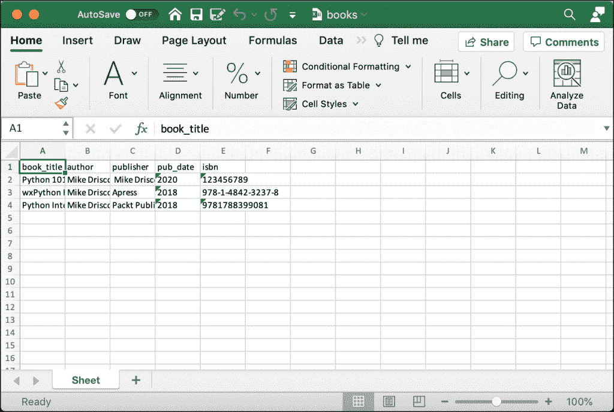

# 用 Python 将 CSV 转换为 Excel

> 原文：<https://www.blog.pythonlibrary.org/2021/09/25/converting-csv-to-excel-with-python/>

作为软件开发人员，您需要使用许多常见的文件类型。CSV 文件就是这样一种格式。CSV 代表“逗号分隔值”,是一种文本文件格式，使用逗号作为分隔符来分隔值。每行是它自己的记录，每个值是它自己的字段。大多数 CSV 文件都有相同长度的记录。

Microsoft Excel 打开 CSV 文件没有问题。可以自己用 Excel 打开一个，然后自己保存成 Excel 格式。这篇文章的目的是教你以下概念:

*   将 CSV 文件转换为 Excel
*   将 Excel 电子表格转换为 CSV

您将使用 Python 和 [OpenPyXL](https://openpyxl.readthedocs.io/en/stable/) 来完成从一种文件类型到另一种文件类型的转换。

## 入门指南

您需要安装 OpenPyXL 才能使用本文中的示例。您可以使用 pip 来安装 OpenPyXL:

```py
python3 -m pip install openpyxl
```

现在您已经有了 OpenPyXL，您已经准备好学习如何将 CSV 文件转换成 Excel 电子表格了！

## 将 CSV 文件转换为 Excel

您很快就会发现，将 CSV 文件转换为 Excel 电子表格并不需要太多代码。但是，您需要有一个 CSV 文件才能开始。记住这一点，打开您最喜欢的文本编辑器(记事本、SublimeText 或其他东西)并添加以下内容:

```py
book_title,author,publisher,pub_date,isbn
Python 101,Mike Driscoll, Mike Driscoll,2020,123456789
wxPython Recipes,Mike Driscoll,Apress,2018,978-1-4842-3237-8
Python Interviews,Mike Driscoll,Packt Publishing,2018,9781788399081

```

将此文件另存为 **books.txt** 。你也可以从这本书的 [GitHub 代码库](https://github.com/driscollis/automating_excel_with_python)下载 CSV 文件。

现在您已经有了 CSV 文件，您还需要创建一个新的 Python 文件。打开 Python IDE 并创建一个名为`csv_to_excel.py`的新文件。然后输入以下代码:

```py
# csv_to_excel.py

import csv
import openpyxl

def csv_to_excel(csv_file, excel_file):
    csv_data = []
    with open(csv_file) as file_obj:
        reader = csv.reader(file_obj)
        for row in reader:
            csv_data.append(row)

    workbook = openpyxl.Workbook()
    sheet = workbook.active
    for row in csv_data:
        sheet.append(row)
    workbook.save(excel_file)

if __name__ == "__main__":
    csv_to_excel("books.csv", "books.xlsx")

```

除了 OpenPyXL，您的代码还使用了 Python 的`csv`模块。您创建一个函数`csv_to_excel()`，然后接受两个参数:

*   `csv_file` -输入 CSV 文件的路径
*   `excel_file` -您想要创建的 Excel 文件的路径

您希望从 CSV 中提取每一行数据。为了提取数据，您创建一个`csv.reader()`对象，然后一次迭代一行。对于每次迭代，您将该行追加到`csv_data`。一个`row`是一个字符串列表。

流程的下一步是创建 Excel 电子表格。要将数据添加到您的`Workbook`中，您需要迭代`csv_data`中的每一行，并将它们`append()`到您的工作表中。最后，保存 Excel 电子表格。

当您运行这段代码时，您将得到一个如下所示的 Excel 电子表格:



CSV 到 Excel 电子表格

现在，您可以用不到 25 行代码将 CSV 文件转换为 Excel 电子表格！

现在您已经准备好学习如何将 Excel 电子表格转换为 CSV 文件了！

## 将 Excel 电子表格转换为 CSV

如果您需要其他过程来使用数据，将 Excel 电子表格转换为 CSV 文件会很有用。CSV 文件的另一个潜在需求是当您需要与没有电子表格程序打开它的人共享您的 Excel 电子表格时。虽然很少，但这种情况可能会发生。

您可以使用 Python 将 Excel 电子表格转换为 CSV 文件。创建一个名为`excel_to_csv.py`的新文件，并添加以下代码:

```py
# excel_to_csv.py

import csv
import openpyxl

from openpyxl import load_workbook

def excel_to_csv(excel_file, csv_file):
    workbook = load_workbook(filename=excel_file)
    sheet = workbook.active
    csv_data = []

    # Read data from Excel
    for value in sheet.iter_rows(values_only=True):
        csv_data.append(list(value))

    # Write to CSV
    with open(csv_file, 'w') as csv_file_obj:
        writer = csv.writer(csv_file_obj, delimiter=',')
        for line in csv_data:
            writer.writerow(line)

if __name__ == "__main__":
    excel_to_csv("books.xlsx", "new_books.csv")

```

同样，您只需要`csv`和`openpyxl`模块来进行转换。这一次，首先加载 Excel 电子表格，并使用`iter_rows`方法迭代工作表。在`iter_tools`的每次迭代中，您收到的`value`是一个字符串列表。您将字符串列表附加到`csv_data`。

下一步是创建一个`csv.writer()`。然后遍历`csv_data`中的每个字符串列表，并调用`writerow()`将其添加到您的 CSV 文件中。

一旦你的代码完成，你将有一个全新的 CSV 文件！

## 包扎

使用 Python 很容易将 CSV 文件转换成 Excel 电子表格。这是一个有用的工具，您可以用它从客户或其他数据源获取数据，并将其转换为您可以向公司展示的内容。

您也可以在将数据写入工作表时对其应用单元格样式。通过应用单元格样式，您可以用不同的字体或背景行颜色突出您的数据。

在您自己的 Excel 或 CSV 文件上尝试这段代码，看看您能做些什么。

## 相关阅读

您想了解有关使用 Python 处理 Excel 电子表格的更多信息吗？然后查看这些教程:

*   OpenPyXL–[使用 Python 使用 Microsoft Excel】](https://www.blog.pythonlibrary.org/2020/11/03/openpyxl-working-with-microsoft-excel-using-python/)

*   [用 OpenPyXL 和 Python 设计 Excel 单元格样式](https://www.blog.pythonlibrary.org/2021/08/11/styling-excel-cells-with-openpyxl-and-python/)
*   [用 Python 和 xlrd 读取 Excel 电子表格](https://www.blog.pythonlibrary.org/2014/04/30/reading-excel-spreadsheets-with-python-and-xlrd/)