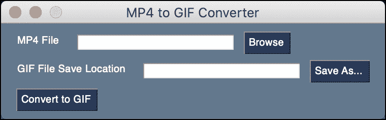

# 用 Python 将 MP4 转换成动画 gif

> 原文：<https://www.blog.pythonlibrary.org/2021/06/29/converting-mp4-to-animated-gifs-with-python/>

Python 可以用来读取常见的 MP4 视频格式，并将其转换为动画 GIF。当然，如果你愿意的话，你可以使用一个预建的软件，但是自己动手也很有趣(也是一个很好的学习体验)。

在本教程中，您将学习以下内容:

*   如何从 MP4 视频中提取帧
*   将帧转换成 GIF
*   创建一个 MP4 到 GIF 的图形用户界面

我们开始吧！

## 你需要什么

您需要为 Python 安装 OpenCV 绑定来读取 MP4 文件，并将视频中的每一帧转换为 JPG 文件。您可以使用 pip 进行安装，如下所示:

```py
python3 -m pip install opencv-python
```

你还需要 [Pillow](https://pypi.org/project/Pillow/) 来从视频中提取的 jpg 创建动画 GIF。它也可以与 pip 一起安装:

```py
python3 -m pip install Pillow
```

要创建一个 GUI，您将使用 [PySimpleGUI](https://pypi.org/project/PySimpleGUI/) 。要安装该软件包，请使用以下命令:

```py
python3 -m pip install PySimpleGUI
```

如果你使用的是 Anaconda，opencv-python 和 Pillow 都包括在内。您只需要单独安装 PySimpleGUI。

## 如何从 MP4 视频中提取帧

从 MP4 视频中提取帧的第一步是找到您想要转换为 GIF 的视频。对于这个例子，您将使用这个简短的视频来演示如何使用 Python 安装 [Flask web 框架:](https://www.blog.pythonlibrary.org/wp-content/uploads/2021/06/flask_demo.mp4)

[https://www.blog.pythonlibrary.org/wp-content/uploads/2021/06/flask_demo.mp4](https://www.blog.pythonlibrary.org/wp-content/uploads/2021/06/flask_demo.mp4)

为了从上面的视频中提取单独的帧，你需要写一些 Python。创建一个新文件，命名为 **mp4_converter.py** 。然后输入以下代码:

```py
import cv2

def convert_mp4_to_jpgs(path):
    video_capture = cv2.VideoCapture(path)
    still_reading, image = video_capture.read()
    frame_count = 0
    while still_reading:
        cv2.imwrite(f"output/frame_{frame_count:03d}.jpg", image)

        # read next image
        still_reading, image = video_capture.read()
        frame_count += 1

if __name__ == "__main__":
    convert_mp4_to_jpgs("flask_demo.mp4")
```

这段代码获取一个 MP4 视频文件的路径。然后它使用 **cv2 打开视频。视频捕捉(路径)**。您可以使用此方法通读整个视频并提取每一帧。当你提取一个帧时，你可以使用 **cv2.imwrite()** 把它写出来。

当你运行这段代码时，你会发现这段 7 秒的视频产生了 235 帧！

现在，您已经准备好将这些帧转换成动画 GIF。

## 将帧转换成 GIF

该过程的下一步是将使用 OpenCV 从 MP4 文件中提取的帧转换成动画 GIF。

这就是枕头包装的由来。你可以用它来获取一个图像文件夹，并创建你的 GIF。打开一个新文件，命名为 **gif_maker.py** 。然后输入以下代码:

```py
import glob

from PIL import Image

def make_gif(frame_folder):
    images = glob.glob(f"{frame_folder}/*.jpg")
    images.sort()
    frames = [Image.open(image) for image in images]
    frame_one = frames[0]
    frame_one.save("flask_demo.gif", format="GIF", append_images=frames,
                   save_all=True, duration=50, loop=0)

if __name__ == "__main__":
    make_gif("output")

```

这里您使用 Python 的 **glob** 模块在输出文件夹中搜索 JPG 文件。然后，您对这些帧进行排序，使它们处于正确的顺序。最后，你将它们保存为 GIF 格式。如果你有兴趣了解更多关于 Pillow 如何保存 GIF 的信息，你应该看看下面的文章:[用 Python 制作动画 GIF](https://www.blog.pythonlibrary.org/2021/06/23/creating-an-animated-gif-with-python/)。

现在，您已经准备好创建一个 GUI 来简化将 MP4 转换为 GIF 的过程。

## 创建一个 MP4 到 GIF 的图形用户界面

PySimpleGUI 是一个跨平台的 GUI 框架，可以在 Linux、Mac 和 Windows 上运行。它包装了 Tkinter、wxPython、PyQt 和其他几个 GUI 工具包，为它们提供了一个公共接口。

当您在本文前面安装 PySimpleGUI 时，您安装了包装 Tkinter 的默认版本。

打开一个新的 Python 文件，将其命名为 **mp4_converter_gui.py.** 然后将以下代码添加到您的文件中:

```py
# mp4_converter_gui.py

import cv2
import glob
import os
import shutil
import PySimpleGUI as sg

from PIL import Image

file_types = [("MP4 (*.mp4)", "*.mp4"), ("All files (*.*)", "*.*")]

def convert_mp4_to_jpgs(path):
    video_capture = cv2.VideoCapture(path)
    still_reading, image = video_capture.read()
    frame_count = 0
    if os.path.exists("output"):
        # remove previous GIF frame files
        shutil.rmtree("output")
    try:
        os.mkdir("output")
    except IOError:
        sg.popup("Error occurred creating output folder")
        return

    while still_reading:
        cv2.imwrite(f"output/frame_{frame_count:05d}.jpg", image)

        # read next image
        still_reading, image = video_capture.read()
        frame_count += 1

def make_gif(gif_path, frame_folder="output"):
    images = glob.glob(f"{frame_folder}/*.jpg")
    images.sort()
    frames = [Image.open(image) for image in images]
    frame_one = frames[0]
    frame_one.save(gif_path, format="GIF", append_images=frames,
                   save_all=True, duration=50, loop=0)

def main():
    layout = [
        [
            sg.Text("MP4 File"),
            sg.Input(size=(25, 1), key="-FILENAME-", disabled=True),
            sg.FileBrowse(file_types=file_types),
        ],
        [
            sg.Text("GIF File Save Location"),
            sg.Input(size=(25, 1), key="-OUTPUTFILE-", disabled=True),
            sg.SaveAs(file_types=file_types),

        ],
        [sg.Button("Convert to GIF")],
    ]

    window = sg.Window("MP4 to GIF Converter", layout)

    while True:
        event, values = window.read()
        mp4_path = values["-FILENAME-"]
        gif_path = values["-OUTPUTFILE-"]
        if event == "Exit" or event == sg.WIN_CLOSED:
            break
        if event in ["Convert to GIF"]:
            if mp4_path and gif_path:
                convert_mp4_to_jpgs(mp4_path)
                make_gif(gif_path)
                sg.popup(f"GIF created: {gif_path}")

    window.close()

if __name__ == "__main__":
    main()

```

这是一段相当长的代码。为了使事情变得简单，您将单独了解每个块。

首先，看一下导入部分:

```py
# mp4_converter_gui.py

import cv2
import glob
import os
import shutil
import PySimpleGUI as sg

from PIL import Image

file_types = [("MP4 (*.mp4)", "*.mp4"), ("All files (*.*)", "*.*")]
```

在这里，您可以导入创建 GUI 应用程序所需的所有模块和包。这包括 OpenCV (cv2)、Pillow 的 Image clas 和 PySimpleGUI，以及许多 Python 自己的模块。

您还可以创建一个变量来保存可以加载到 GUI 中的文件类型。这是一个元组列表。

现在是时候将注意力转向程序中的第一个函数了:

```py
def convert_mp4_to_jpgs(path):
    video_capture = cv2.VideoCapture(path)
    still_reading, image = video_capture.read()
    frame_count = 0
    if os.path.exists("output"):
        # remove previous GIF frame files
        shutil.rmtree("output")
    try:
        os.mkdir("output")
    except IOError:
        sg.popup("Error occurred creating output folder")
        return

    while still_reading:
        cv2.imwrite(f"output/frame_{frame_count:05d}.jpg", image)

        # read next image
        still_reading, image = video_capture.read()
        frame_count += 1
```

这是您之前创建的 MP4 转换器代码的修改版本。在这个版本中，你仍然使用 **VideoCapture()** 来读取 MP4 文件，并将其转换为单独的帧。

但是，您还添加了一些额外的代码来删除“输出”文件夹(如果它存在的话)。这可以防止您意外地将两个 MP4 文件合并在一个输出文件中，这将导致混乱的 GIF。

您还添加了一些代码，试图在删除“output”文件夹后创建它。如果创建文件夹时出现错误，将显示一个错误对话框。

剩下的代码和以前一样。

现在，您已经准备好检查下一个函数了:

```py
def make_gif(gif_path, frame_folder="output"):
    images = glob.glob(f"{frame_folder}/*.jpg")
    images.sort()
    frames = [Image.open(image) for image in images]
    frame_one = frames[0]
    frame_one.save(gif_path, format="GIF", append_images=frames,
                   save_all=True, duration=50, loop=0)
```

您使用 **make_gif()** 将您的框架文件夹转换为 gif 文件。这段代码与原始代码几乎相同，只是您传递了 GIF 文件的路径，这样它就可以是惟一的。

最后一段代码是您的 GUI 代码:

```py
def main():
    layout = [
        [
            sg.Text("MP4 File"),
            sg.Input(size=(25, 1), key="-FILENAME-", disabled=True),
            sg.FileBrowse(file_types=file_types),
        ],
        [
            sg.Text("GIF File Save Location"),
            sg.Input(size=(25, 1), key="-OUTPUTFILE-", disabled=True),
            sg.SaveAs(file_types=file_types),

        ],
        [sg.Button("Convert to GIF")],
    ]

    window = sg.Window("MP4 to GIF Converter", layout)

    while True:
        event, values = window.read()
        mp4_path = values["-FILENAME-"]
        gif_path = values["-OUTPUTFILE-"]
        if event == "Exit" or event == sg.WIN_CLOSED:
            break
        if event in ["Convert to GIF"]:
            if mp4_path and gif_path:
                convert_mp4_to_jpgs(mp4_path)
                make_gif(gif_path)
                sg.popup(f"GIF created: {gif_path}")

    window.close()

if __name__ == "__main__":
    main()
```

在 PySimpleGUI 中，当您想要“布局”用户界面中的元素时，您可以将项目添加到 Python 列表中。对于此示例，您将添加以下元素:

*   sg。text——这个元素有两个实例。它们被用作输入(文本框)的标签
*   sg。input——这个元素有两个实例，是一个文本框类型的元素。一个用来保存 MP4 文件的位置，另一个用来保存 GIF 文件
*   sg。文件浏览-打开文件浏览对话框的按钮
*   sg。另存为-打开文件另存为对话框的按钮
*   sg。按钮-一个可以做任何你想让它做的事情的按钮

接下来，获取元素列表并将其传递给 **sg。窗口**，它代表包含所有其他元素的窗口。您的窗口还有一个退出按钮、一个最小化按钮和一个标题栏。

要启动 GUI 的事件循环，您需要创建一个 while 循环并从 Window 对象中读取。这允许您提取两个 **sg 的值。Input()** 对象，包含 MP4 和 GIF 文件的路径。

当用户按下标记为“Convert to GIF”的按钮时，您捕捉到该事件并调用 **convert_mp4_to_jpgs()** ，然后调用 **make_gif()** 。如果一切顺利，视频将被转换，您将看到一个弹出对话框，说明新创建的 GIF 保存在哪里。

尝试运行这段代码。您应该会看到类似这样的内容:



很漂亮，是吧？

## 包扎

现在你已经有了将 MP4 视频文件转换成 gif 文件所需的所有部分。有几种不同的方法可以让你的代码变得更好。例如，您可以在代码中添加更多的错误处理，这样就不会意外地覆盖 gif 文件。

您还可以添加一些新的 UI 元素，告诉您的代码向下调整单个框架的大小，以帮助 gif 变得更小。你可以在[如何用 Python](https://www.blog.pythonlibrary.org/2017/10/12/how-to-resize-a-photo-with-python/) 调整照片大小中读到。另一个选择是改变每个单独 JPG 的压缩，这也将减少 GIF 的大小。

还有很多其他有趣的方法可以让代码变得更好。想想看，你一定会自己想出一些新功能！