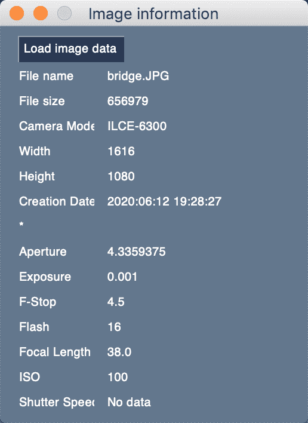

# 用 PySimpleGUI 创建 Exif 查看器

> 原文：<https://www.blog.pythonlibrary.org/2021/01/26/create-an-exif-viewer-with-pysimplegui/>

[Pillow package](https://pillow.readthedocs.io/en/stable/) 让你能够从图像中提取 Exif(可交换图像文件格式)元数据。你可以通过 Exif 数据获得很多关于你的图片的信息。然而，有一些关键数据点比其他数据点更有用。

对于这些数据，最好创建一个 GUI，以便您可以轻松查看。对于本教程，您将使用 [PySimpleGUI](https://pysimplegui.readthedocs.io/en/latest/) 。

#### 入门指南

Pillow 和 PySimpleGUI 都需要安装，以便能够遵循本教程。您可以使用 pip 安装它们:

```py
python -m pip install pillow PySimpleGUI
```

您可能希望在 Python 虚拟环境中安装这些包。可以使用 [virtualenv](https://www.blog.pythonlibrary.org/2012/07/17/getting-started-with-virtualenv/) 或者 Python 内置的 [venv 模块](https://docs.python.org/3/tutorial/venv.html)。

无论您最终选择哪种方式，您现在都已经准备好编写 GUI 代码了！

#### 创建简单的 Exif 查看器

第一步是找到一个包含 Exif 数据的图像。如果你愿意，你可以用这个:


当您写完代码后，您的 Exif 查看器将如下所示:



首先，创建一个名为 **exif_viewer.py** 的新文件，并添加以下代码:

```py
# exif_viewer.py

import PySimpleGUI as sg

from pathlib import Path
from PIL import Image
from PIL.ExifTags import TAGS

file_types = [("(JPEG (*.jpg)", "*.jpg"),
              ("All files (*.*)", "*.*")]

fields = {
    "File name": "File name",
    "File size": "File size",
    "Model": "Camera Model",
    "ExifImageWidth": "Width",
    "ExifImageHeight": "Height",
    "DateTime": "Creation Date",
    "static_line": "*",
    "MaxApertureValue": "Aperture",
    "ExposureTime": "Exposure",
    "FNumber": "F-Stop",
    "Flash": "Flash",
    "FocalLength": "Focal Length",
    "ISOSpeedRatings": "ISO",
    "ShutterSpeedValue": "Shutter Speed",
}

def get_exif_data(path):
    """
    Extracts the Exif information from the provided photo
    """
    exif_data = {}
    try:
        image = Image.open(path)
        info = image._getexif()
    except OSError:
        info = {}

    if info is None:
        info = {}

    for tag, value in info.items():
        decoded = TAGS.get(tag, tag)
        exif_data[decoded] = value

    return exif_data

def main():
    elements = [
        [
            sg.FileBrowse(
                "Load image data", file_types=file_types, key="load",
                enable_events=True
            )
        ]
    ]
    for field in fields:
        elements += [
            [sg.Text(fields[field], size=(10, 1)),
             sg.Text("", size=(25, 1), key=field)]
        ]
    window = sg.Window("Image information", elements)

    while True:
        event, values = window.read()
        if event == "Exit" or event == sg.WIN_CLOSED:
            break
        if event == "load":
            image_path = Path(values["load"])
            exif_data = get_exif_data(image_path.absolute())
            for field in fields:
                if field == "File name":
                    window[field].update(image_path.name)
                elif field == "File size":
                    window[field].update(image_path.stat().st_size)
                else:
                    window[field].update(exif_data.get(field, "No data"))

if __name__ == "__main__":
    main()

```

这是一大段代码！试图一次解释所有内容会令人困惑，所以为了使事情变得简单，你将一段一段地检查代码。

下面是前几行代码:

```py
# exif_viewer.py

import PySimpleGUI as sg

from pathlib import Path
from PIL import Image
from PIL.ExifTags import TAGS

file_types = [("(JPEG (*.jpg)", "*.jpg"),
              ("All files (*.*)", "*.*")]

fields = {
    "File name": "File name",
    "File size": "File size",
    "Model": "Camera Model",
    "ExifImageWidth": "Width",
    "ExifImageHeight": "Height",
    "DateTime": "Creation Date",
    "static_line": "*",
    "MaxApertureValue": "Aperture",
    "ExposureTime": "Exposure",
    "FNumber": "F-Stop",
    "Flash": "Flash",
    "FocalLength": "Focal Length",
    "ISOSpeedRatings": "ISO",
    "ShutterSpeedValue": "Shutter Speed",
}
```

这段代码的前半部分是使应用程序正常运行所需的导入。接下来，创建一个`file_types`变量。这在您稍后将创建的文件对话框中使用，以允许用户选择要加载的图像。

然后创建一个 Python 字典，保存所有想要显示的 Exif 字段。这个字典将 Exif 名称映射到一个更易读的名称。

现在您已经准备好学习`get_exif_data()`功能了:

```py
def get_exif_data(path):
    """
    Extracts the EXIF information from the provided photo
    """
    exif_data = {}
    try:
        image = Image.open(path)
        info = image._getexif()
    except OSError:
        info = {}

    if info is None:
        info = {}

    for tag, value in info.items():
        decoded = TAGS.get(tag, tag)
        exif_data[decoded] = value

    return exif_data
```

这个函数接收图像路径，并试图从中提取 Exif 数据。如果失败，它将`info`设置为一个空字典。如果`_getexif()`返回`None`，那么你也将`info`设置为一个空字典。如果填充了`info`,那么在返回之前，循环遍历它，解码 Exif 数据并填充您的`exif_data`字典。

接下来您可以进入`main()`功能:

```py
def main():
    elements = [
        [
            sg.FileBrowse(
                "Load image data", file_types=file_types, key="load",
                enable_events=True
            )
        ]
    ]
    for field in fields:
        elements += [
            [sg.Text(fields[field], size=(10, 1)),
             sg.Text("", size=(25, 1), key=field)]
        ]
    window = sg.Window("Image information", elements)
```

在这里，您可以创建创建用户界面所需的所有元素。循环遍历在程序开始时定义的字段字典，并添加几个文本控件，这些控件将显示从图像中提取的 Exif 数据。

PySimpleGUI 使这变得很容易，因为您可以将新元素连接到您的`elements`列表中。

一旦这些都完成了，你就把`elements`加到你的`Window`上。

接下来是拼图的最后一块:

```py
    while True:
        event, values = window.read()
        if event == "Exit" or event == sg.WIN_CLOSED:
            break
        if event == "load":
            image_path = Path(values["load"])
            exif_data = get_exif_data(image_path.absolute())
            for field in fields:
                if field == "File name":
                    window[field].update(image_path.name)
                elif field == "File size":
                    window[field].update(image_path.stat().st_size)
                else:
                    window[field].update(exif_data.get(field, "No data"))

if __name__ == "__main__":
    main()
```

这是您的事件循环。当用户按下“加载图像数据”按钮时，事件被设置为“加载”。在这里，您将选择的图像路径加载到 Python 的`pathlib`中。这允许您使用`Path`对象的功能和属性提取文件名、绝对路径和文件大小。

您使用字典的`get()`方法来获取字段。如果该字段不在字典中，则显示该字段“无数据”。

如果您想要一个小的挑战，尝试在这个 GUI 中添加一个`sg.Image()`元素，这样您就可以查看照片及其元数据了！

#### 包扎

现在你知道如何从图像中解析出 EXIF 标签了。您还学习了如何使用 PySimpleGUI 创建一个简单的 GUI。这个 GUI 的总行数只有 84 行！您可以创建功能性 GUI，而无需编写数百行代码。

Pillow 能做的不仅仅是提取 EXIF 数据。检查一下，看看你还能做什么！

#### 相关阅读

*   使用 Python 获取 GPS Exif [数据](https://www.blog.pythonlibrary.org/2021/01/13/getting-gps-exif-data-with-python/)
*   [使用 Python 获取照片元数据(EXIF)](https://www.blog.pythonlibrary.org/2010/03/28/getting-photo-metadata-exif-using-python/)