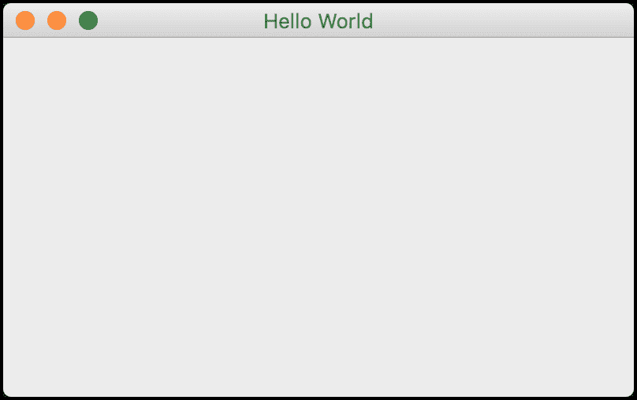
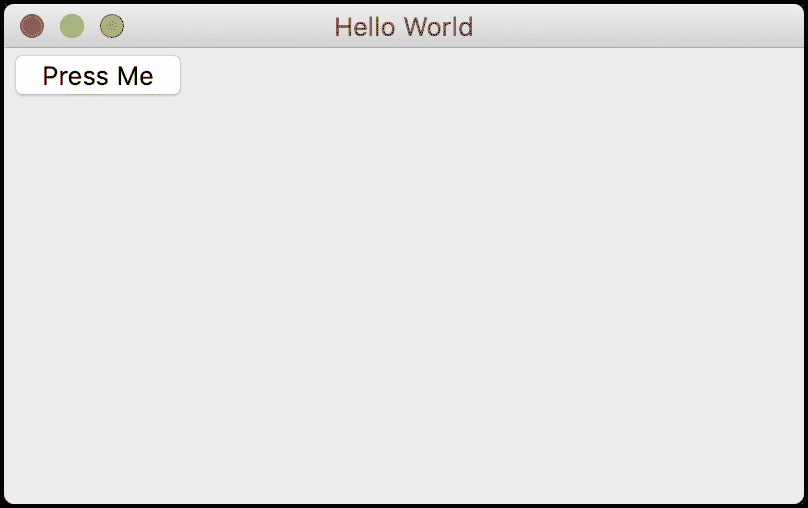
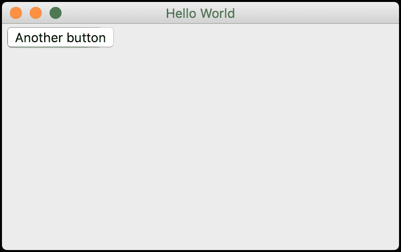
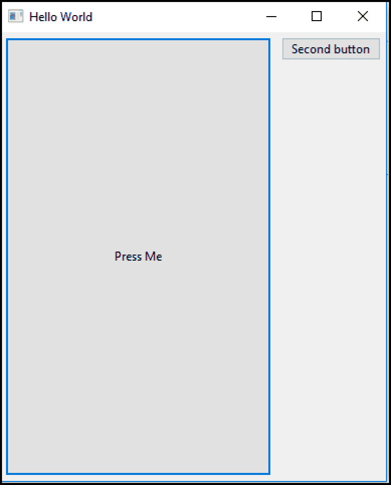
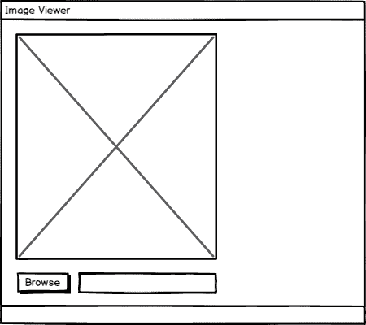
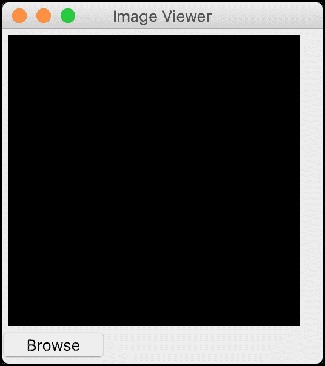
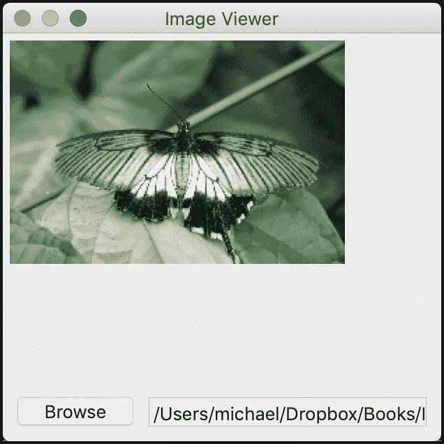

# Python 101 - How to Create a Graphical User Interface

> 原文：<https://www.blog.pythonlibrary.org/2021/09/29/create-gui/>

When you first get started as a programmer or software developer, you usually start by writing code that prints to your console or standard out. A lot of students are also starting out by writing front-end programs, which are typically websites written with HTML, JavaScript and CSS. However, most beginners do not learn how to create a graphical user interface until much later in their classwork.

Graphical user interfaces (GUI) are programs that are usually defined as created for the desktop. The desktop refers to Windows, Linux and MacOS. It could be argued that GUIs are also created for mobile and web as well though. For the purposes of this article, you will learn about creating desktop GUIs. The concepts you learn in this article can be applied to mobile and web development to some degree as well.

A graphical user interface is made up of some kind of window that the user interacts with. The window holds other shapes inside it. These consist of buttons, text, pictures, tables, and more. Collectively, these items are known as "widgets".

There are many different GUI toolkits for Python. Here is a list of some of the most popular:

*   Tkinter
*   wxPython
*   PyQt
*   Kivy

You will be learning about wxPython in this article. The reason that wxPython was chosen is that the author has more experience with it than any other and wxPython has a very friendly and helpful community.

In this article, you will be learning:

*   Learning About Event Loops
*   How to Create Widgets
*   How to Lay Out Your Application
*   How to Add Events
*   How to Create an Application

This article does not attempt to cover everything there is to know about wxPython. However, you will learn enough to see the power of wxPython as well as discover how much fun it is to create a desktop GUI of your very own.

**Note:** Some of the examples in this chapter come from my book, **Creating GUI Applications with wxPython**.

Let's get started!

## Installing wxPython

Installing wxPython is usually done with pip. If you are installing on Linux, you may need to install some prerequisites before installing wxPython. You can see the most up-to-date set of requirements on the [wxPython Github page](https://github.com/wxWidgets/Phoenix#prerequisites).

On Mac OSX, you may need the XCode compiler to install wxPython.

Here is the command you would use to install wxPython using pip:

```py
python3 -m pip install wxpython
```

Assuming everything worked, you should now be able to use wxPython!

## Learning About Event Loops

Before you get started, there is one other item that you need to know about. In the introduction, you learned what widgets are. But when it comes to creating GUI programs, you need to understand that they use **events** to tell the GUI what to do. Unlike a command-line application, a GUI is basically an infinite loop, waiting for the user to do something, like click a button or press a key on the keyboard.

When the user does something like that, the GUI receives an event. Button events are usually connected to `wx.EVT_BUTTON`, for example. Some books call this **event-driven programming**. The overarching process is called the **event loop**.

You can think of it like this:

1.  The GUI waits for the user to do something
2.  The user does something (clicks a button, etc)
3.  The GUI responds somehow
4.  Go back to step 1

The user can stop the event loop by exiting the program.

Now that you have a basic understanding of event loops, it's time to learn how to write a simple prototype application!

## How to Create Widgets

Widgets are the building blocks of your application. You start out with top-level widgets, such as a `wx.Frame` or a `wx.Dialog`. These widgets can contain other widgets, like buttons and labels. When you create a frame or dialog, it includes a title bar and the minimize, maximize, and exit buttons. Note that when using wxPython, most widgets and attributes are pre-fixed with `wx`.

To see how this all works, you should create a little "Hello World" application. Go ahead and create a new file named `hello_wx.py` and add this code to it:

```py
# hello_wx.py

import wx

app = wx.App(False)
frame = wx.Frame(parent=None, title='Hello World')
frame.Show()
app.MainLoop()

```

Here you import `wx`, which is how you access wxPython in your code. Then you create an instance of `wx.App()`, which is your Application object. There can only be one of these in your application. It creates and manages your event loop for you. You pass in `False` to tell it not to redirect standard out. If you set that to `True`, then standard out is redirected to a new window. This can be useful when debugging, but should be disabled in production applications.

Next, you create a `wx.Frame()` where you set its `parent` to `None`. This tells wxPython that this frame is a top-level window. If you create all your frames without a parent, then you will need to close all the frames to end the program. The other parameter that you set is the `title`, which will appear along the top of your application's window.

The next step is to `Show()` the frame, which makes it visible to the user. Finally, you call `MainLoop()` which starts the event loop and makes your application work. When you run this code, you should see something like this:



Hello World in wxPython

When working with wxPython, you will actually be sub-classing `wx.Frame` and quite a few of the other widgets. Create a new file named `hello_wx_class.py` and put this code into it:

```py
# hello_wx_class.py

import wx

class MyFrame(wx.Frame):

    def __init__(self):
        super().__init__(None, title='Hello World')
        self.Show()

if __name__ == '__main__':
    app = wx.App(False)
    frame = MyFrame()
    frame.Show()
    app.MainLoop()

```

This code does the same thing as the previous example, but this time you are creating your own version of the `wx.Frame` class.

When you create an application with multiple widgets in it, you will almost always have a `wx.Panel` as the sole child widget of the `wx.Frame`. Then the `wx.Panel` widget is used to contain the other widgets. The reason for this is that `wx.Panel` provides the ability to tab between the widgets, which is something that does not work if you make all the widget children of `wx.Frame`.

So, for a final "Hello World" example, you can add a `wx.Panel` to the mix. Create a file named `hello_with_panel.py` and add this code:

```py
# hello_with_panel.py

import wx

class MyPanel(wx.Panel):

    def __init__(self, parent):
        super().__init__(parent)
        button = wx.Button(self, label='Press Me')

class MyFrame(wx.Frame):

    def __init__(self):
        super().__init__(None, title='Hello World')
        panel = MyPanel(self)
        self.Show()

if __name__ == '__main__':
    app = wx.App(redirect=False)
    frame = MyFrame()
    app.MainLoop()

```

In this code, you create two classes. One sub-classes `wx.Panel` and adds a button to it using `wx.Button`. The `MyFrame()` class is almost the same as the previous example except that you now create an instance of `MyPanel()` in it. Note that you are passing `self` to `MyPanel()`, which is telling wxPython that the frame is now the parent of the panel widget.

When you run this code, you will see the following application appear:



Hello World with a wxPython Panel

This example shows that when you add a child widget, like a button, it will automatically appear at the top left of the application. The `wx.Panel` is an exception when it is the only child widget of a `wx.Frame`. In that case, the `wx.Panel` will automatically expand to fill the `wx.Frame`.

What do you think happens if you add multiple widgets to the panel though? Let's find out! Create a new file named `stacked_buttons.py` and add this code:

```py
# stacked_buttons.py

import wx

class MyPanel(wx.Panel):

    def __init__(self, parent):
        super().__init__(parent)
        button = wx.Button(self, label='Press Me')
        button2 = wx.Button(self, label='Press Me too')
        button3 = wx.Button(self, label='Another button')

class MyFrame(wx.Frame):

    def __init__(self):
        super().__init__(None, title='Hello World')
        panel = MyPanel(self)
        self.Show()

if __name__ == '__main__':
    app = wx.App(redirect=False)
    frame = MyFrame()
    app.MainLoop()

```

Now you have three buttons as children of the panel. Try running this code to see what happens:



Oops! You only see one button, which happens to be the last one you created. What happened here? You didn't tell the buttons where to go, so they all went to the default location, which is the upper left corner of the widget. In essence, the widgets are now stacked on top of each other.

Let's find out how you can fix that issue in the next section!

## How to Lay Out Your Application

You have two options when it comes to laying out your application:

*   Absolute positioning
*   Sizers

In almost all cases, you will want to use **Sizers**. If you want to use absolute positioning, you can use the widget's `pos` parameter and give it a tuple that specifies the x and y coordinate in which to place the widget. Absolute positioning can be useful when you need pixel perfect positioning of widgets. However, when you use absolute positioning, your widgets cannot resize or move when the window they are in is resized. They are static at that point.

The solution to those issues is to use Sizers. They can handle how your widgets should resize and adjust when the application size is changed. There are several different sizers that you can use, such as `wx.BoxSizer`, `wx.GridSizer`, and more.

The [wxPython documentation](https://docs.wxpython.org/sizers_overview.html) explains how sizers work in detail. Check it out when you have a chance.

Let's take that code from before and reduce it down to two buttons and add a Sizer. Create a new file named `sizer_with_two_widgets.py` and put this code into it:

```py
# sizer_with_two_widgets.py

import wx

class MyPanel(wx.Panel):

    def __init__(self, parent):
        super().__init__(parent)

        button = wx.Button(self, label='Press Me')
        button2 = wx.Button(self, label='Second button')

        main_sizer = wx.BoxSizer(wx.HORIZONTAL)
        main_sizer.Add(button, proportion=1,
                       flag=wx.ALL | wx.CENTER | wx.EXPAND,
                       border=5)
        main_sizer.Add(button2, 0, wx.ALL, 5)
        self.SetSizer(main_sizer)

class MyFrame(wx.Frame):

    def __init__(self):
        super().__init__(None, title='Hello World')
        panel = MyPanel(self)
        self.Show()

if __name__ == '__main__':
    app = wx.App(redirect=False)
    frame = MyFrame()
    app.MainLoop()

```

In this example, you create a `wx.BoxSizer`. A `wx.BoxSizer` can be set to add widgets horizontally (left-to-right) or vertically (top-to-bottom). For your code, you set the sizer to add widgets horizontally by using the `wx.HORIZONTAL` constant. To add a widget to a sizer, you use the `Add()` method.

The `Add()` method takes up to five arguments:

*   `window` - the widget to add
*   `proportion` - tells wxPython if the widget can change its size in the same orientation as the sizer
*   `flag` - one or more flags that affect the sizer's behavior
*   `border` - the border width, in pixels
*   `userData` - allows adding an extra object to the sizer item, which is used for subclasses of sizers.

The first button that you add to the sizer is set to a `proportion` of 1, which will make it expand to fill as much space in the sizer as it can. You also give it three flags:

*   `wx.ALL` - add a border on all sides
*   `wx.CENTER` - center the widget within the sizer
*   `wx.EXPAND` - the item will be expanded as much as possible while also maintaining its aspect ratio

Finally, you add a border of five pixels. These pixels are added to the top, bottom, left, and right of the widget because you set the `wx.ALL` flag.

The second button has a `proportion` of 0, which means it wont expand at all. Then you tell it to add a five pixel border all around it as well. To apply the sizer to the panel, you need to call the panel's `SetSizer()` method.

When you run this code, you will see the following applications:



Buttons in Sizers

You can see how the various flags have affected the appearance of the buttons. Note that on MacOS, `wx.Button` cannot be stretched, so if you want to do that on a Mac, you would need to use a generic button from `wx.lib.buttons` instead. Generic buttons are usually made with Python and do not wrap the native widget.

Now let's move on and learn how events work!

## How to Add Events

So far you have created a couple of neat little applications with buttons, but the buttons don't do anything when you click on them. Why is that? Well, when you are writing a GUI application, you need to tell it what to do when something happens. That "something" that happens is known as an **event**.

To hook an event to a widget, you will need to use the `Bind()` method. Some widgets have multiple events that can be bound to them while others have only one or two. The `wx.Button` can be bound to `wx.EVT_BUTTON` only.

Let's copy the code from the previous example and paste it into a new file named `button_events.py`. Then update it to add events like this:

```py
# button_events.py

import wx

class MyPanel(wx.Panel):

    def __init__(self, parent):
        super().__init__(parent)

        button = wx.Button(self, label='Press Me')
        button.Bind(wx.EVT_BUTTON, self.on_button1)
        button2 = wx.Button(self, label='Second button')
        button2.Bind(wx.EVT_BUTTON, self.on_button2)

        main_sizer = wx.BoxSizer(wx.HORIZONTAL)
        main_sizer.Add(button, proportion=1,
                       flag=wx.ALL | wx.CENTER | wx.EXPAND,
                       border=5)
        main_sizer.Add(button2, 0, wx.ALL, 5)
        self.SetSizer(main_sizer)

    def on_button1(self, event):
        print('You clicked the first button')

    def on_button2(self, event):
        print('You clicked the second button')

class MyFrame(wx.Frame):

    def __init__(self):
        super().__init__(None, title='Hello World')
        panel = MyPanel(self)
        self.Show()

if __name__ == '__main__':
    app = wx.App(redirect=False)
    frame = MyFrame()
    app.MainLoop()

```

Here you call `Bind()` for each of the buttons in turn. You bind the button to `wx.EVT_BUTTON`, which will fire when the user presses a button. The second argument to `Bind()` is the method that should be called when you click the button.

If you run this code, the GUI will still look the same. However, when you press the buttons, you should see different messages printed to stdout (i.e. your terminal or console window). Give it a try and see how it works.

Now let's go ahead and write a simple application!

## How to Create an Application

The first step in creating an application is to come up with an idea. You could try to copy something simple like Microsoft Paint or Notepad. You will quickly find that they aren't so easy to emulate as you would think, though! So instead, you will create a simple application that can load and display a photo.

When it comes to creating a GUI application, it is a good idea to think about what it will look like. If you enjoy working with pencil and paper, you could draw a sketch of what your application will look like. There are many software applications you can use to draw with or create simple mock-ups. To simulate a Sizer, you can draw a box.

Here is a mockup of what the finished application should look like:



Image Viewer Mockup

Now you have a goal in mind. This allows you to think about how you might lay out the widgets. Go ahead and create a new file named `image_viewer.py` and add the following code to it:

```py
# image_viewer.py

import wx

class ImagePanel(wx.Panel):

    def __init__(self, parent, image_size):
        super().__init__(parent)

        img = wx.Image(*image_size)
        self.image_ctrl = wx.StaticBitmap(self, 
                                          bitmap=wx.Bitmap(img))
        browse_btn = wx.Button(self, label='Browse')

        main_sizer = wx.BoxSizer(wx.VERTICAL)
        main_sizer.Add(self.image_ctrl, 0, wx.ALL, 5)
        main_sizer.Add(browse_btn)
        self.SetSizer(main_sizer)
        main_sizer.Fit(parent)
        self.Layout()

class MainFrame(wx.Frame):

    def __init__(self):
        super().__init__(None, title='Image Viewer')
        panel = ImagePanel(self, image_size=(240,240))
        self.Show()

if __name__ == '__main__':
    app = wx.App(redirect=False)
    frame = MainFrame()
    app.MainLoop()

```

Here you create a new class named `ImagePanel()` that will hold all your widgets. Inside it, you have a `wx.Image`, which you will use to hold the photo in memory in an object that wxPython can work with. To display that photo to the user, you use `wx.StaticBitmap`. The other widget you need is the familiar `wx.Button`, which you will use to browse to the photo to load.

The rest of the code lays out the widgets using a vertically oriented `wx.BoxSizer`. You use the sizer's `Fit()` method to try to make the frame "fit" the widgets. What that means is that you want the application to not have a lot of white space around the widgets.

When you run this code, you will end up with the following user interface:



Initial Image Viewer GUI

That looks almost right. It looks like you forgot to add the text entry widget to the right of the browse button, but that's okay. The objective was to try and get a close approximation to what the application would look like in the end, and this looks pretty good. Of course, none of the widgets actually do anything yet.

Your next step is to update the code so it works. Copy the code from the previous example and make a new file named `image_viewer_working.py`. There will be significant updates to the code, which you will learn about soon. But first, here is the full change in its entirety:

```py
# image_viewer_working.py

import wx

class ImagePanel(wx.Panel):

    def __init__(self, parent, image_size):
        super().__init__(parent)
        self.max_size = 240

        img = wx.Image(*image_size)
        self.image_ctrl = wx.StaticBitmap(self, 
                                          bitmap=wx.Bitmap(img))

        browse_btn = wx.Button(self, label='Browse')
        browse_btn.Bind(wx.EVT_BUTTON, self.on_browse)

        self.photo_txt = wx.TextCtrl(self, size=(200, -1))

        main_sizer = wx.BoxSizer(wx.VERTICAL)
        hsizer = wx.BoxSizer(wx.HORIZONTAL)

        main_sizer.Add(self.image_ctrl, 0, wx.ALL, 5)
        hsizer.Add(browse_btn, 0, wx.ALL, 5)
        hsizer.Add(self.photo_txt, 0, wx.ALL, 5)
        main_sizer.Add(hsizer, 0, wx.ALL, 5)

        self.SetSizer(main_sizer)
        main_sizer.Fit(parent)
        self.Layout()

    def on_browse(self, event):
        """
        Browse for an image file
        @param event: The event object
        """
        wildcard = "JPEG files (*.jpg)|*.jpg"
        with wx.FileDialog(None, "Choose a file",
                           wildcard=wildcard,
                           style=wx.ID_OPEN) as dialog:
            if dialog.ShowModal() == wx.ID_OK:
                self.photo_txt.SetValue(dialog.GetPath())
                self.load_image()

    def load_image(self):
        """
        Load the image and display it to the user
        """
        filepath = self.photo_txt.GetValue()
        img = wx.Image(filepath, wx.BITMAP_TYPE_ANY)

        # scale the image, preserving the aspect ratio
        W = img.GetWidth()
        H = img.GetHeight()
        if W > H:
            NewW = self.max_size
            NewH = self.max_size * H / W
        else:
            NewH = self.max_size
            NewW = self.max_size * W / H
        img = img.Scale(NewW,NewH)

        self.image_ctrl.SetBitmap(wx.Bitmap(img))
        self.Refresh()

class MainFrame(wx.Frame):

    def __init__(self):
        super().__init__(None, title='Image Viewer')
        panel = ImagePanel(self, image_size=(240,240))
        self.Show()

if __name__ == '__main__':
    app = wx.App(redirect=False)
    frame = MainFrame()
    app.MainLoop()

```

This change is pretty long. To make things easier, you will go over each change in its own little chunk. The changes all occurred in the `ImagePanel` class, so you will go over the changes in each of the methods in turn, starting with the constructor below:

```py
def __init__(self, parent, image_size):
    super().__init__(parent)
    self.max_size = 240

    img = wx.Image(*image_size)
    self.image_ctrl = wx.StaticBitmap(self, 
                                      bitmap=wx.Bitmap(img))

    browse_btn = wx.Button(self, label='Browse')
    browse_btn.Bind(wx.EVT_BUTTON, self.on_browse)

    self.photo_txt = wx.TextCtrl(self, size=(200, -1))

    main_sizer = wx.BoxSizer(wx.VERTICAL)
    hsizer = wx.BoxSizer(wx.HORIZONTAL)

    main_sizer.Add(self.image_ctrl, 0, wx.ALL, 5)
    hsizer.Add(browse_btn, 0, wx.ALL, 5)
    hsizer.Add(self.photo_txt, 0, wx.ALL, 5)
    main_sizer.Add(hsizer, 0, wx.ALL, 5)

    self.SetSizer(main_sizer)
    main_sizer.Fit(parent)
    self.Layout()

```

There are a few minor changes here. The first one is that you added a `max_size` for the image. Then you hooked up an event to the the browse button. This button will now call `on_browse()` when it is clicked.

The next change is that you added a new widget, a `wx.TextCtrl` to be precise. You stored a reference to that widget in `self.photo_txt`, which will allow you to extract the path to the photo later.

The final change is that you now have two sizers. One is horizontal and the other remains vertical. The horizontal sizer is for holding the browse button and your new text control widgets. This allows your to place them next to each other, left-to-right. Then you add the horizontal sizer itself to the vertical `main_sizer`.

Now let's see how `on_browse()` works:

```py
def on_browse(self, event):
    """
    Browse for an image file
    @param event: The event object
    """
    wildcard = "JPEG files (*.jpg)|*.jpg"
    with wx.FileDialog(None, "Choose a file",
                       wildcard=wildcard,
                       style=wx.ID_OPEN) as dialog:
        if dialog.ShowModal() == wx.ID_OK:
            self.photo_txt.SetValue(dialog.GetPath())
            self.load_image()

```

Here you create a `wildcard` which is used by the `wx.FileDialog` to filter out all the other files types except the JPEG format. Next, you create the `wx.FileDialog`. When you do that, you set its parent to `None` and give it a simple title. You also set the `wildcard` and the `style`. `style` is an open file dialog instead of a save file dialog.

Then you show your dialog modally. What that means is that the dialog will appear over your main application and prevent you from interacting with the main application until you have accepted or dismissed the file dialog. If the user presses the OK button, then you will use `GetPath()` to get the path of the selected file and set the text control to that path. This effectively saves off the photo's path so you can use it later.

Lastly, you call `load_image()` which will load the image into wxPython and attempt to show it. You can find out how by reading the following code:

```py
def load_image(self):
    """
    Load the image and display it to the user
    """
    filepath = self.photo_txt.GetValue()
    img = wx.Image(filepath, wx.BITMAP_TYPE_ANY)

    # scale the image, preserving the aspect ratio
    W = img.GetWidth()
    H = img.GetHeight()
    if W > H:
        NewW = self.max_size
        NewH = self.max_size * H / W
    else:
        NewH = self.max_size
        NewW = self.max_size * W / H
    img = img.Scale(NewW,NewH)

    self.image_ctrl.SetBitmap(wx.Bitmap(img))
    self.Refresh()

```

The first step in this method is to extract the `filepath` from the text control widget. Then you pass that path along to a new instance of `wx.Image`. This will load the image into wxPython for you. Next, you get the width and height from the `wx.Image` object and use the `max_size` value to resize the image while maintaining its aspect ratio. You do this for two reasons. The first is because if you don't, the image will get stretched out or warped. The second is that most images at full resolution won't fit on-screen, so they need to be resized.

Once you have the new width and height, you `Scale()` the image down appropriately. Then you call your `wx.StaticBitmap` control's `SetBitmap()` method to update it to the new image that you loaded. Finally, you call `Refresh()`, which will force the bitmap widget to redraw with the new image in it.

Here it is with a butterfly photo loaded in it:



Viewing an Image in wxPython

Now you have a fully-functional application that can load JPEG photos. You can update the application to load other image types if you'd like. The wxPython toolkit uses Pillow, so it will load the same types of image file types that Pillow itself can load.

## Wrapping Up

The wxPython toolkit is extremely versatile. It comes with many, many widgets built-in and also includes a wonderful demo package. The demo package will help you learn how to use the widgets in your own code. You are only limited by your imagination.

In this chapter, you learned about the following topics:

*   Learning About Event Loops
*   How to Create Widgets
*   How to Lay Out Your Application
*   How to Add Events
*   How to Create an Application

You can take the code and the concepts in this code and add new features or create brand new applications. If you need ideas, you can check out some of the applications on your own computer or phone. You can also check out my book, **Creating GUI Applications with wxPython**, which has lots of fun little applications you can create and expand upon.