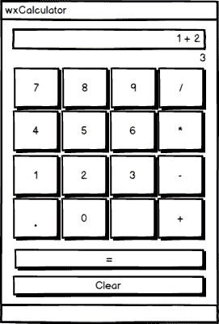
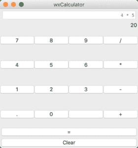
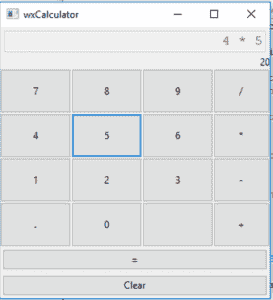

# 用 wxPython 创建计算器

> 原文：<https://www.blog.pythonlibrary.org/2019/02/12/creating-a-calculator-with-wxpython/>

很多初学者教程都是从“Hello World”的例子开始的。有很多网站将计算器应用程序作为 GUI 初学者的一种“Hello World”。计算器是一个很好的学习方法，因为它有一组你需要有序排列的部件。它们还需要一定的逻辑才能正常工作。对于该计算器，让我们关注能够做到以下几点:

*   添加
*   减法
*   增加
*   分开

我认为支持这四个功能是一个很好的起点，也给你足够的空间来增强你自己的应用程序。

* * *

### 弄清楚逻辑

你需要解决的第一件事就是如何实际执行你建立的方程。例如，假设您有以下等式:

 `1 + 2 * 5` 

解决方法是什么？如果你从左向右读，答案似乎是 3 * 5 或 15。但是乘法的优先级高于加法，所以它实际上是 10 + 1 或 11。你如何在代码中找出优先级？你可以花很多时间创建一个字符串解析器，通过操作数对数字进行分组，或者你可以使用 Python 的内置“eval”函数。 **eval()** 函数是 evaluate 的缩写，它将计算一个字符串，就像它是 Python 代码一样。

许多 Python 程序员实际上不鼓励使用 eval()。让我们找出原因。

* * *

### eval()邪恶吗？

**eval()** 函数在过去被称为“邪恶的”,因为它允许你将字符串作为代码运行，这可能会将你的应用程序暴露给邪恶的作恶者。你可能听说过 SQL 注入的一些网站没有正确地对字符串进行转义，并意外地允许不诚实的人通过字符串运行 SQL 命令来编辑他们的数据库表。使用 eval()函数时，Python 中也会出现同样的概念。eval 如何被用于邪恶的一个常见示例如下:

```py

eval("__import__('os').remove('file')")

```

这段代码将导入 Python 的 **os** 模块，并调用其 **remove()** 函数，这将允许您的用户删除您可能不想让他们删除的文件。有几种方法可以避免这个问题:

*   不要使用 eval()
*   控制允许哪些字符进入 eval()

因为您将为这个应用程序创建用户界面，所以您还将完全控制用户如何输入字符。这实际上可以以一种直截了当的方式保护您免受 eval 的阴险。您将学习使用 wxPython 来控制传递给 eval()的内容的两种方法，然后在本文的最后，您将学习如何创建一个定制的 eval()函数。

* * *

### 设计计算器

让我们花一点时间，尝试使用本章开头提到的约束条件来设计一个计算器。这是我想出的草图:



计算器模型

注意，这里只关心基本的算术。你不必创建一个科学计算器，尽管这可能是挑战自我的一个有趣的增强。相反，您将创建一个漂亮的基本计算器。

我们开始吧！

* * *

### 创建初始计算器

每当你创建一个新的应用程序时，你都必须考虑代码的去向。它在 **wx 里吗？架**级， **wx 级。面板**类，其他类还是什么？谈到 wxPython，几乎总是不同类的混合。与大多数 wxPython 应用程序一样，您可能希望从为应用程序起一个名字开始。为了简单起见，我们暂时称它为 **wxcalculator.py** 。

第一步是添加一些导入，并子类化**框架**小部件。让我们来看看:

```py

import wx

class CalcFrame(wx.Frame):

    def __init__(self):
        super().__init__(
            None, title="wxCalculator",
            size=(350, 375))
        panel = CalcPanel(self)
        self.SetSizeHints(350, 375, 350, 375)
        self.Show()

if __name__ == '__main__':
    app = wx.App(False)
    frame = CalcFrame()
    app.MainLoop()

```

这段代码与您过去看到的非常相似。你子类化 **wx。框架**并给它一个标题和初始大小。然后实例化面板类， **CalcPanel** (未显示)并调用 **SetSizeHints()** 方法。该方法取框架允许的最小(宽度，高度)和最大(宽度，高度)。你可以用这个来控制你的框架可以调整多少大小，或者在这种情况下，防止任何大小调整。您还可以修改框架的样式标志，使其无法调整大小。

方法如下:

```py

class CalcFrame(wx.Frame):

    def __init__(self):
        no_resize = wx.DEFAULT_FRAME_STYLE & ~ (wx.RESIZE_BORDER | 
                                                wx.MAXIMIZE_BOX)
        super().__init__(
            None, title="wxCalculator",
            size=(350, 375), style=no_resize)
        panel = CalcPanel(self)
        self.Show()

```

看一下 **no_resize** 变量。它正在创造一个 **wx。DEFAULT_FRAME_STYLE** 然后使用按位运算符从框架中移除可调整大小的边框和最大化按钮。

让我们继续创建 **CalcPanel** :

```py

class CalcPanel(wx.Panel):

    def __init__(self, parent):
        super().__init__(parent)
        self.last_button_pressed = None
        self.create_ui()

```

我在前面一章中提到过这一点，但我认为这里值得重复一遍。您不需要将所有的接口创建代码放在 **init** 方法中。这是这个概念的一个例子。在这里实例化该类，将 **last_button_pressed** 属性设置为 **None** ，然后调用 **create_ui()** 。这就是你在这里需要做的一切。

当然，这引出了一个问题。create_ui()方法中有什么？好吧，让我们来看看！

```py

def create_ui(self):
    main_sizer = wx.BoxSizer(wx.VERTICAL)
    font = wx.Font(12, wx.MODERN, wx.NORMAL, wx.NORMAL)

    self.solution = wx.TextCtrl(self, style=wx.TE_RIGHT)
    self.solution.SetFont(font)
    self.solution.Disable()
    main_sizer.Add(self.solution, 0, wx.EXPAND|wx.ALL, 5)
    self.running_total = wx.StaticText(self)
    main_sizer.Add(self.running_total, 0, wx.ALIGN_RIGHT)

    buttons = [['7', '8', '9', '/'],
               ['4', '5', '6', '*'],
               ['1', '2', '3', '-'],
               ['.', '0', '', '+']]
    for label_list in buttons:
        btn_sizer = wx.BoxSizer()
        for label in label_list:
            button = wx.Button(self, label=label)
            btn_sizer.Add(button, 1, wx.ALIGN_CENTER|wx.EXPAND, 0)
            button.Bind(wx.EVT_BUTTON, self.update_equation)
        main_sizer.Add(btn_sizer, 1, wx.ALIGN_CENTER|wx.EXPAND)

    equals_btn = wx.Button(self, label='=')
    equals_btn.Bind(wx.EVT_BUTTON, self.on_total)
    main_sizer.Add(equals_btn, 0, wx.EXPAND|wx.ALL, 3)

    clear_btn = wx.Button(self, label='Clear')
    clear_btn.Bind(wx.EVT_BUTTON, self.on_clear)
    main_sizer.Add(clear_btn, 0, wx.EXPAND|wx.ALL, 3)

    self.SetSizer(main_sizer)

```

这是一大段相当不错的代码，所以让我们把它分解一下:

```py

def create_ui(self):
    main_sizer = wx.BoxSizer(wx.VERTICAL)
    font = wx.Font(12, wx.MODERN, wx.NORMAL, wx.NORMAL)

```

在这里，您可以创建帮助组织用户界面所需的 sizer。您还将创建一个 **wx。字体**对象，用于修改 **wx 等小工具的默认字体。文本控制**或 **wx。静态文本**。当你想要一个更大的字体或者一个不同于默认字体的字体时，这是很有用的。

```py

self.solution = wx.TextCtrl(self, style=wx.TE_RIGHT)
self.solution.SetFont(font)
self.solution.Disable()
main_sizer.Add(self.solution, 0, wx.EXPAND|wx.ALL, 5)

```

接下来的三行创建了 **wx。TextCtrl** ，设置为右对齐(wx。TE_RIGHT)，设置字体并` Disable()`小工具。您想要禁用小部件的原因是因为您不希望用户能够在控件中键入任何文本字符串。

您可能还记得，您将使用 **eval()** 来评估小部件中的字符串，因此您不能允许用户滥用它。相反，您希望对用户可以输入到该小部件中的内容进行细粒度控制。

```py

self.running_total = wx.StaticText(self)
main_sizer.Add(self.running_total, 0, wx.ALIGN_RIGHT)

```

一些计算器应用程序在实际的“显示”下面有一个运行总数小部件。添加这个小部件的一个简单方法是通过 **wx。StaticText** 小部件。

现在让我们添加有效使用计算器所需的主要按钮:

```py

buttons = [['7', '8', '9', '/'],
           ['4', '5', '6', '*'],
           ['1', '2', '3', '-'],
           ['.', '0', '', '+']]
for label_list in buttons:
    btn_sizer = wx.BoxSizer()
    for label in label_list:
        button = wx.Button(self, label=label)
        btn_sizer.Add(button, 1, wx.ALIGN_CENTER|wx.EXPAND, 0)
        button.Bind(wx.EVT_BUTTON, self.update_equation)
    main_sizer.Add(btn_sizer, 1, wx.ALIGN_CENTER|wx.EXPAND)

```

在这里你创建了一个列表列表。在这个数据结构中，有计算器使用的主要按钮。你会注意到在最后一个列表中有一个空白字符串，它将被用来创建一个按钮，这个按钮不做任何事情。这是为了保持布局正确。理论上，你可以更新这个计算器，这样这个按钮就可以是百分比或者其他功能。

下一步是创建一个按钮，可以通过遍历列表来完成。每个嵌套列表代表一行按钮。因此，对于每一行按钮，您将创建一个水平方向的 **wx。BoxSizer** ，然后遍历一行小部件，将它们添加到那个 Sizer 中。一旦每个按钮被添加到行尺寸，您将添加到您的主尺寸。请注意，这些按钮中的每一个都绑定到“update_equation”事件处理程序。

现在您需要添加等号按钮和可以用来清空计算器的按钮:

```py

equals_btn = wx.Button(self, label='=')
equals_btn.Bind(wx.EVT_BUTTON, self.on_total)
main_sizer.Add(equals_btn, 0, wx.EXPAND|wx.ALL, 3)

clear_btn = wx.Button(self, label='Clear')
clear_btn.Bind(wx.EVT_BUTTON, self.on_clear)
main_sizer.Add(clear_btn, 0, wx.EXPAND|wx.ALL, 3)

self.SetSizer(main_sizer)

```

在这段代码中，您创建了“equals”按钮，然后将它绑定到 **on_total** 事件处理程序方法。您还创建了“清除”按钮，用于清除计算器并重新开始。最后一行设置面板的 sizer。

让我们继续，了解一下您的计算器中的大多数按钮都绑定了什么:

```py

def update_equation(self, event):
    operators = ['/', '*', '-', '+']
    btn = event.GetEventObject()
    label = btn.GetLabel()
    current_equation = self.solution.GetValue()

    if label not in operators:
        if self.last_button_pressed in operators:
            self.solution.SetValue(current_equation + ' ' + label)
        else:
            self.solution.SetValue(current_equation + label)
    elif label in operators and current_equation is not '' \
         and self.last_button_pressed not in operators:
        self.solution.SetValue(current_equation + ' ' + label)

    self.last_button_pressed = label

    for item in operators:
        if item in self.solution.GetValue():
            self.update_solution()
            break

```

这是一个将多个小部件绑定到同一个事件处理程序的例子。要获得哪个小部件调用了事件处理程序的信息，可以调用` event `对象的 **GetEventObject()** 方法。这将返回调用事件处理程序的小部件。在这种情况下，你知道你用 wx 调用它。按钮实例，所以你知道 **wx。按钮**有一个“GetLabel()”方法，该方法将返回按钮上的标签。然后，您将获得解决方案文本控件的当前值。

接下来，您要检查按钮的标签是否是一个操作符(例如/、*、-、+)。如果是，您将把文本控件的值更改为当前文本控件中的值加上标签。另一方面，如果标签是**而不是**操作符，那么你需要在当前文本框和新标签之间放置一个空格。这是为了演示的目的。如果你愿意，技术上可以跳过字符串格式。

最后一步是循环操作数，并检查它们中是否有任何一个当前在方程式字符串中。如果是，那么您将调用 **update_solution()** 方法并退出循环。

现在您需要编写 **update_solution()** 方法:

```py

def update_solution(self):
    try:
        current_solution = str(eval(self.solution.GetValue()))
        self.running_total.SetLabel(current_solution)
        self.Layout()
        return current_solution
    except ZeroDivisionError:
        self.solution.SetValue('ZeroDivisionError')
    except:
        pass

```

这里是“邪恶” **eval()** 出现的地方。您将从文本控件中提取方程的当前值，并将该字符串传递给 **eval()** 。然后将结果转换回字符串，这样就可以将文本控件设置为新计算的解。你想用一个 try/except 语句来捕捉错误，比如**zerodisdivisionerror**。最后一个 **except** 语句被称为 **bare except** 语句，在大多数情况下应该避免使用。为了简单起见，我把它放在那里，但是如果最后两行冒犯了你，请随意删除。

下一个您想要了解的方法是 **on_clear()** 方法:

```py

def on_clear(self, event):
    self.solution.Clear()
    self.running_total.SetLabel('')

```

这段代码非常简单。你需要做的就是调用你的解决方案文本控件的 **Clear()** 方法来清空它。您还需要清除“running_total”小部件，它是 **wx 的一个实例。静态文本**。该小部件没有 **Clear()** 方法，因此您将调用 **SetLabel()** 并传入一个空字符串。

您需要创建的最后一个方法是 **on_total()** 事件处理程序，它将计算总数并清除您的运行总数小部件:

```py

def on_total(self, event):
    solution = self.update_solution()
    if solution:
        self.running_total.SetLabel('')

```

这里可以调用 **update_solution()** 方法，得到结果。假设一切顺利，解决方案将出现在主文本区，运行总数将被清空。

下面是我在 Mac 上运行计算器时的样子:



Mac OS 上的 wxPython 计算器

这是计算器在 Windows 10 上的样子:



Windows 10 上的 wxPython 计算器

让我们继续学习如何让用户除了使用小部件之外还可以使用键盘来输入公式。

* * *

### 使用角色事件

大多数计算器允许用户在输入数值时使用键盘。在这一节中，我将向您展示如何开始将这种能力添加到您的代码中。最简单的方法是绑定 **wx。文本 Ctrl** 到 **wx。EVT _ 正文**事件。我将在这个例子中使用这个方法。然而，你可以这样做的另一种方式是抓住 **wx。EVT _ 按键 _ 按下**然后分析键码。不过这种方法有点复杂。

我们需要更改的第一项是我们的 **CalcPanel** 的构造函数:

```py

# wxcalculator_key_events.py

import wx

class CalcPanel(wx.Panel):

    def __init__(self, parent):
        super().__init__(parent)
        self.last_button_pressed = None
        self.whitelist = ['0', '1', '2', '3', '4',
                          '5', '6', '7', '8', '9',
                          '-', '+', '/', '*', '.']
        self.on_key_called = False
        self.empty = True
        self.create_ui()

```

这里您添加了一个**白名单**属性和几个简单的标志， **self.on_key_called** 和 **self.empty** 。白名单是您允许用户在您的文本控件中键入的唯一字符。当我们实际到达使用这些标志的代码时，您将会了解到这些标志。

但是首先，您需要修改 panel 类的 **create_ui()** 方法。为了简洁起见，我将只复制这个方法的前几行:

```py

def create_ui(self):
    main_sizer = wx.BoxSizer(wx.VERTICAL)
    font = wx.Font(12, wx.MODERN, wx.NORMAL, wx.NORMAL)

    self.solution = wx.TextCtrl(self, style=wx.TE_RIGHT)
    self.solution.SetFont(font)
    self.solution.Bind(wx.EVT_TEXT, self.on_key)
    main_sizer.Add(self.solution, 0, wx.EXPAND|wx.ALL, 5)
    self.running_total = wx.StaticText(self)
    main_sizer.Add(self.running_total, 0, wx.ALIGN_RIGHT) 

```

请随意从 [Github](https://github.com/driscollis/applications_with_wxpython/tree/master/chapter6_calculator) 下载完整的源代码，或者参考上一节中的代码。这里关于文本控件的主要区别是你不再禁用它，而是将它绑定到一个事件: **wx。EVT _ 正文**。

让我们继续编写 **on_key()** 方法:

```py

def on_key(self, event):
    if self.on_key_called:
        self.on_key_called = False
        return

    key = event.GetString()
    self.on_key_called = True

    if key in self.whitelist:
        self.update_equation(key)

```

这里你检查一下 **self.on_key_called** 标志是否为*真*。如果是，我们将其设置回 False 并提前“返回”。这样做的原因是当你用鼠标点击一个按钮时，它会导致 **EVT_TEXT** 开火。“update_equation()”方法将获取文本控件的内容，这将是我们刚刚按下的键，并将该键添加回自身，从而产生一个双精度值。这是解决该问题的一种方法。

您还会注意到，要获得被按下的键，您可以调用**事件**对象的 **GetString()** 方法。然后，您将检查该键是否在白名单中。如果是，您将更新等式。

您需要更新的下一个方法是 **update_equation()** :

```py

def update_equation(self, text):
    operators = ['/', '*', '-', '+']
    current_equation = self.solution.GetValue()

    if text not in operators:
        if self.last_button_pressed in operators:
            self.solution.SetValue(current_equation + ' ' + text)
        elif self.empty and current_equation:
            # The solution is not empty
            self.empty = False
        else:
            self.solution.SetValue(current_equation + text)
    elif text in operators and current_equation is not '' \
         and self.last_button_pressed not in operators:
        self.solution.SetValue(current_equation + ' ' + text)

    self.last_button_pressed = text
    self.solution.SetInsertionPoint(-1)

    for item in operators:
        if item in self.solution.GetValue():
            self.update_solution()
            break

```

这里你添加一个新的 **elif** 来检查 **self.empty** 标志是否被置位，以及 **current_equation** 中是否有任何内容。换句话说，如果它应该是空的，而不是空的，那么我们将标志设置为 **False** ，因为它不是空的。这可以防止按下键盘键时出现重复值。所以基本上你需要两个标志来处理因为你决定允许用户使用他们的键盘而导致的重复值。

该方法的另一个变化是在文本控件上添加对 **SetInsertionPoint()** 的调用，这将在每次更新后将插入点放在文本控件的末尾。

对 panel 类的最后一个必需的更改发生在 **on_clear()** 方法中:

```py

def on_clear(self, event):
    self.solution.Clear()
    self.running_total.SetLabel('')
    self.empty = True
    self.solution.SetFocus()

```

这种改变是通过在方法的末尾添加两行新行来完成的。首先是将 **self.empty** 复位为 *True* 。第二个是调用文本控件的 **SetFocus()** 方法，以便在文本控件被清除后，焦点被重置到文本控件。

您还可以将这个 **SetFocus()** 调用添加到 **on_calculate()** 和 **on_total()** 方法的末尾。这将使文本控件始终保持焦点。你可以自己随意摆弄它。

* * *

### 创建更好的评估()

既然您已经了解了控制“邪恶”eval() 的几种不同方法，那么让我们花一些时间来学习如何自己创建一个定制版本的 **eval()** 。Python 附带了几个方便的内置模块，称为 **ast** 和**操作符**。根据文档, **ast** 模块是代表“抽象语法树”的首字母缩写，用于“处理 Python 抽象语法语法的树”。你可以把它想象成一个代表代码的数据结构。您可以使用 **ast** 模块在 Python 中创建一个编译器。

**操作符**模块是一组与 Python 的操作符相对应的函数。一个很好的例子就是**运算符。add(x，y)** 等价于表达式 **x+y** 。您可以将此模块与' ast '模块一起使用，创建一个受限版本的 **eval()** 。

让我们来看看如何实现:

```py

import ast
import operator

allowed_operators = {ast.Add: operator.add, ast.Sub: operator.sub, 
                     ast.Mult: operator.mul, ast.Div: operator.truediv}

def noeval(expression):
    if isinstance(expression, ast.Num):
        return expression.n
    elif isinstance(expression, ast.BinOp):
        print('Operator: {}'.format(expression.op))
        print('Left operand: {}'.format(expression.left))
        print('Right operand: {}'.format(expression.right))
        op = allowed_operators.get(type(expression.op))
        if op:
            return op(noeval(expression.left), 
                      noeval(expression.right))
    else:
        print('This statement will be ignored')

if __name__ == '__main__':
    print(ast.parse('1+4', mode='eval').body)
    print(noeval(ast.parse('1+4', mode='eval').body))
    print(noeval(ast.parse('1**4', mode='eval').body))
    print(noeval(ast.parse("__import__('os').remove('path/to/file')", mode='eval').body))

```

在这里，您创建了一个允许操作符的字典。你映射 **ast。添加**到**操作符，添加**等等。然后创建一个名为“noeval”的函数，它接受一个“ast”对象。如果表达式只是一个数字，就返回它。然而，如果它是一个 **BinOp** 实例，那么你打印出表达式的片段。一个 **BinOp** 由三部分组成:

*   表达式的左边部分
*   接线员
*   表达式的右边

当这段代码找到一个 **BinOp** 对象时，它会尝试获取 **ast** 操作的类型。如果它在我们的 **allowed_operators** 字典中，那么用表达式的左右部分调用映射的函数并返回结果。

最后，如果表达式不是一个数字或者一个被认可的操作符，那么你可以忽略它。试着用不同的字符串和表达式来试验一下这个例子，看看它是如何工作的。

一旦你玩完了这个例子，让我们把它集成到你的计算器代码中。对于这个版本的代码，可以调用 Python 脚本 **wxcalculator_no_eval.py** 。新文件的顶部应该如下所示:

```py

# wxcalculator_no_eval.py

import ast
import operator

import wx

class CalcPanel(wx.Panel):

    def __init__(self, parent):
        super().__init__(parent)
        self.last_button_pressed = None
        self.create_ui()

        self.allowed_operators = {
            ast.Add: operator.add, ast.Sub: operator.sub, 
            ast.Mult: operator.mul, ast.Div: operator.truediv}

```

这里的主要区别在于，您现在有了几个新的导入(即 ast 和 operator)，您需要添加一个名为 **self.allowed_operators** 的 Python 字典。接下来，您将想要创建一个名为 **noeval()** 的新方法:

```py

def noeval(self, expression):
    if isinstance(expression, ast.Num):
        return expression.n
    elif isinstance(expression, ast.BinOp):
        return self.allowed_operators[
            type(expression.op)](self.noeval(expression.left), 
                                 self.noeval(expression.right))
    return ''

```

这个方法与您在另一个脚本中创建的函数几乎完全相同。不过，它已被稍微修改以调用正确的类方法和属性。您需要做的另一个更改是在 **update_solution()** 方法中:

```py

def update_solution(self):
    try:
        expression = ast.parse(self.solution.GetValue(),
                               mode='eval').body
        current_solution = str(self.noeval(expression))
        self.running_total.SetLabel(current_solution)
        self.Layout()
        return current_solution
    except ZeroDivisionError:
        self.solution.SetValue('ZeroDivisionError')
    except:
        pass

```

现在，计算器代码将使用您自定义的 **eval()** 方法，并保护您免受 **eval()** 的潜在危害。Github 中的代码具有额外的保护，只允许用户使用屏幕 UI 来修改文本控件的内容。然而，你可以很容易地改变它来启用文本控制，并尝试这段代码，而不用担心 **eval()** 会对你造成任何伤害。

* * *

### 包扎

在本章中，你学习了几种使用 wxPython 创建计算器的不同方法。您还了解了使用 Python 内置的 **eval()** 函数的优缺点。最后，您了解到可以使用 Python 的 **ast** 和 **operator** 模块来创建一个细粒度版本的 **eval()** 供您安全使用。当然，因为您正在控制所有进入 **eval()** 的输入，所以您也可以通过您用 wxPython 生成的 UI 很容易地控制真正的版本。

花些时间，用这篇文章中的例子做些试验。有许多改进可以使这个应用程序变得更好。当你发现错误或缺失的特性时，挑战自己，尝试修复或添加它们。

* * *

### 下载源代码

本文的源代码可以在 [Github](https://github.com/driscollis/applications_with_wxpython/tree/master/chapter6_calculator) 上找到。本文基于我的书《用 wxPython 创建 GUI 应用程序》中的一章。